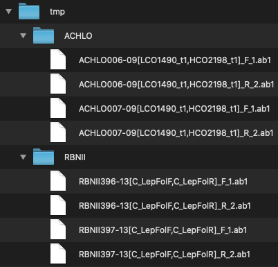

Advanced User Guide - *SangerAlignment*
=======================================

*SangerAlignment* is the highest level in sangeranalyseR. 

**Step 1**: Input files preparation
-----------------------------------
sangeranalyseR takes **ab1** files as input and constructs contigs for those with the same contig name. Then, all the contigs will be aligned and a phylogenetic tree will be generated. We first explain how users should organize their files before running sangeranalyseR.

First, users need to prepare a directory and put all their **ab1** files inside it. As for the file naming convention, all the input files must have **ab1** as its file extension; the reads that belong to the same contig should have the same contig name; forward or reverse direction also needs to be specified in the filename.

There are three parameters, :code:`parentDirectory`, :code:`suffixForwardRegExp`, and :code:`suffixReverseRegExp`, that users need to provide so that program can automatically group all **ab1** files. To be clearer, let's have an example.

.. _Figure_1:

   Figure 1. Input ab1 files inside the parent directory, :code:`./tmp/`.

Figure_1_ shows the directory that users need to prepare and the file naming convention. Here, we explain the three parameters in this example.

* :code:`parentDirectory`: It is the directory that contains all the **ab1** files. In this example, it is :code:`./tmp/`

* :code:`suffixForwardRegExp`: All the reads that are in forward direction have to contain this in their filename suffix. In this example, its value is :code:`_F.ab1`.

* :code:`suffixReverseRegExp`: Same as forward read, all the reads that are in reverse direction have to contain this in their filename suffix. In this example, its value is :code:`_R.ab1`.

All files inside the :code:`parentDirectory` do not need to be in the same layer. sangeranalyseR will recursively search all the directories inside :code:`parentDirectory` and find all files that end with **ab1** and match the forward or reverse suffix. Files with the same contig name will be categorized in the same group and be aligned into a contig. Therefore, it is very important to make sure that filenames are correctly and systematically named.

In this example, there are four contigs that will be detected: :code:`ACHLO006-09[LCO1490_t1,HCO2198_t1]`, :code:`ACHLO007-09[LCO1490_t1,HCO2198_t1]`, :code:`RBNII396-13[C_LepFolF,C_LepFolR]` and :code:`RBNII397-13[C_LepFolF,C_LepFolR]`. In this example, :code:`_1` and :code:`_2` in the filenames are not necessary because there are only two reads, one forward and one reverse, in each contig. However, it is a good habit to index the reads by order because in a contig, there might be more than one read in the same direction.

|

**Step 2**: *SangerAlignment* creation
--------------------------------------
After preparing the input directory, we can now create a *SangerAlignment* S4 instance by running one-line function below.

.. code-block:: R

   sangerAlignment <- SangerAlignment(parentDirectory     = "./tmp/",
                                      suffixForwardRegExp = "_F.ab1",
                                      suffixReverseRegExp = "_R.ab1")

One thing to pay attention to is that your current working directory need to be at the same level of :code:`tmp` directory so that you can directly use "./tmp/". Or otherwise, you need to use the absolute directory which might look like :code:`/path/to/your/tmp`.

|

**Step 3**: Launch Shiny App
----------------------------
You can launch an interactive Shiny app in your local computer by running :code:`launchAppSA` function.

.. code-block:: R

   launchAppSA(sangerAlignment)

.. _Figure_2:
.. figure::  ../image/figure_2.png
   :align:   center

   Figure 2. *SangerAlignment* Shiny app user interface.

Figure_2_ shows how the Shiny app looks like. On the left-hand side of Figure_2_, there is a navigation menu that users can click inside to each contig and each single read to get more details.

|

**Step 4**: Writing FASTA file
------------------------------
The following function can write the *SangerAlignment* S4 instance to a FASTA file.

.. code-block:: R

   writeFastaSA(sangerAlignment)

|

**Step 5**: Generating report
-----------------------------
Last but not least, it is important to store all results in a report for future reference. A detailed report will be generated by running the following one-line function. Figure_3_ and Figure_4_ show the main results of *SangerAlignment*.

.. code-block:: R

   generateReportSA(sangerAlignment)

.. _Figure_3:
.. figure::  ../image/figure_3.png
   :align:   center

   Figure 3. Alignment result of all contigs in the *SangerAlignment* instance.

.. _Figure_4:
.. figure::  ../image/figure_4.png
   :align:   center
   :scale:   30 %

   Figure 4. Phylogenetic trees with contigs as the leaf nodes.
