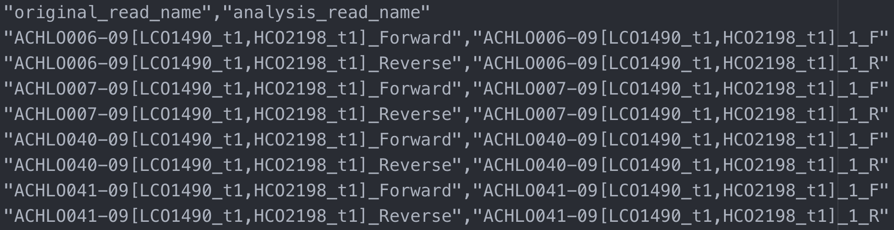

Advanced User Guide - *SangerAlignment* (**FASTA**)
===================================================

*SangerAlignment* is the highest class level in sangeranalyseR showed in :ref:`Figure_1<SangerAlignment_hierachy_fasta>`. It contains *SangerContig* list and the contigs alignment result. Users can access to *SangerContig* and *SangerRead* instance inside *SangerAlignment* instance. In this section, we are going to go through detailed sangeranalyseR data analysis steps in *SangerAlignment* level from **FASTA** file input.

.. _SangerAlignment_hierachy_fasta:
.. figure::  ../image/SangerAlignment_hierachy.png
   :align:   center
   :scale:   20 %

   Figure 1. Classes hierarchy in sangeranalyseR, *SangerAlignment* level.

|

Preparing *SangerAlignment* **FASTA** input
-------------------------------------------
We design the **FASTA** file input for those who do not want to do quality trimming and base calling for each *SangerRead* in *SangerAlignment*; therefore, it does not contain quality trimming and chromatogram input parameters and results in *SangerRead* slots.

Before starting the analysis, users need to prepare one **FASTA** file containing sequence of all reads. Inside the **FASTA** file, there are strings starting with ">" before each read which are the read names. Because sangeranalyseR will group reads into "Forward Read List" and "Reverse Read List", users have to follow the naming regulations for the read names. Below are some regulations:

.. note::

  *  Reads that are in the same contig have to share the same contig name.
  *  Forward or reverse direction also has to be specified in the read names.

There are three parameters, :code:`fastaFileName`, :code:`suffixForwardRegExp`, and :code:`suffixReverseRegExp`, that users need to provide so that program can automatically group all **FASTA** files.

.. note::

  * :code:`fastaFileName`: The **FASTA** file that contains sequence of all reads. The read names have to follow the naming regulation.
  * :code:`suffixForwardRegExp`: The value of this parameter is a regular expression that matches all filenames in forward direction. :code:`grepl` function in R is used to select forward reads from all **FASTA** files.
  * :code:`suffixReverseRegExp`: The value of this parameter is a regular expression that matches all filenames in reverse direction. :code:`grepl` function in R is used to select reverse reads from all **FASTA** files.

No doubt read names in the original **FASTA** file will not follow the naming regulation; however, it is highly not recommended to change the name directly in the raw **FASTA** file. Therefore, we provide a feature to let users do read names mapping conversion by a **CSV** file showed in :ref:`Figure_2<SangerAlignment_read_names_conversion>`. The first column is "original_read_name" which are the read names in the raw **FASTA** file, and the second column is "analysis_read_name" which are the read names that follow the naming regulation. The read names will be mapped onto the names in "original_read_name" without changing the raw **FASTA** file. :code:`namesConversionCSV` is the parameter that stores the path to this **CSV** file.

.. _SangerAlignment_read_names_conversion:

   Figure 2. *SangerAlignment* **CSV** file - read names conversion.

Here, we have another more complicated example.

.. _SangerAlignment_fasta_input:
.. figure::  ../image/SangerAlignment_fasta_input.png
   :align:   center
   :scale:   40 %

   Figure 3. *SangerAlignment* **FASTA** input file.

:ref:`Figure_3<SangerAlignment_fasta_input>` shows the **FASTA** input file and the read names in it will be mapping conversed by **CSV** file showed in :ref:`Figure_2<SangerAlignment_read_names_conversion>` (Only two reads are showed). sangeranalyseR will first match the :code:`contigName` to exclude unrelated reads. The direction of reads in each contig will be grouped by matching :code:`suffixForwardRegExp` and :code:`suffixReverseRegExp` with read names. Therefore, it is important to carefully select :code:`suffixForwardRegExp` and :code:`suffixReverseRegExp`. The bad file naming and wrong regex matching might accidentally include reverse reads into the forward read list or vice versa, which will make the program generate totally wrong results. Therefore, users should have a consistent naming strategy. In this example, ":code:`_[0-9]*_F.ab1$`", ":code:`_[0-9]*_R.ab1$`" for matching forward and reverse reads are highly suggested and are used as default. It is a good habit to index your reads in the same contig group because there might be more than one read that are in the forward or reverse direction.

.. _sangeranalyseR_filename_convention_SangerAlignment_fasta:
.. figure::  ../image/sangeranalyseR_filename_convention_fasta.png
   :align:   center
   :scale:   25 %

   Figure 4. Suggested read naming regulation in **FASTA** file - *SangerAlignment*.

:ref:`Figure_4<sangeranalyseR_filename_convention_SangerAlignment_fasta>` shows the suggested reads naming regulation. Users are strongly recommended to follow this reads naming regulation and use the default :code:`suffixForwardRegExp` : ":code:`_[0-9]*_F.ab1$`" and :code:`suffixReverseRegExp` : ":code:`_[0-9]*_R.ab1$`" to reduce any chance of error.

|

Creating *SangerAlignment* instance from **FASTA**
--------------------------------------------------
After preparing the input directory, we can create the *SangerAlignment* S4 instance by running :code:`SangerAlignment` constructor function or :code:`new` method. The constructor function is a wrapper for :code:`new` method and it makes instance creation more intuitive. Most parameters in the constructor have their own default values. In the constructor below, we list important parameters.

.. code-block:: R

   sangerAlignmentFa <- SangerAlignment(inputSource           = "FASTA",
                                        fastaFileName         = "Sanger_all_reads.fa",
                                        namesConversionCSV    = "names_conversion.csv",
                                        suffixForwardRegExp   = "[0-9]*_F$",
                                        suffixReverseRegExp   = "[0-9]*_R$",
                                        refAminoAcidSeq       = "SRQWLFSTNHKDIGTLYFIFGAWAGMVGTSLSILIRAELGHPGALIGDDQIYNVIVTAHAFIMIFFMVMPIMIGGFGNWLVPLMLGAPDMAFPRMNNMSFWLLPPALSLLLVSSMVENGAGTGWTVYPPLSAGIAHGGASVDLAIFSLHLAGISSILGAVNFITTVINMRSTGISLDRMPLFVWSVVITALLLLLSLPVLAGAITMLLTDRNLNTSFFDPAGGGDPILYQHLFWFFGHPEVYILILPGFGMISHIISQESGKKETFGSLGMIYAMLAIGLLGFIVWAHHMFTVGMDVDTRAYFTSATMIIAVPTGIKIFSWLATLHGTQLSYSPAILWALGFVFLFTVGGLTGVVLANSSVDIILHDTYYVVAHFHYVLSMGAVFAIMAGFIHWYPLFTGLTLNNKWLKSHFIIMFIGVNLTFFPQHFLGLAGMPRRYSDYPDAYTTWNIVSTIGSTISLLGILFFFFIIWESLVSQRQVIYPIQLNSSIEWYQNTPPAEHSYSELPLLTN"
                                        )

The inputs of :code:`SangerAlignment` constructor function and :code:`new` method are same. For more details about *SangerAlignment* inputs and slots definition, please refer to `sangeranalyseR reference manual (need update) <http://packages.python.org/an_example_pypi_project/>`_.

|

Writing *SangerAlignment* FASTA files :sub:`(FASTA)`
----------------------------------------------------
Users can write the *SangerAlignment* instance to **FASTA** files. There are four options for users to choose from in :code:`selection` parameter.

* :code:`contigs_unalignment`: Writing contigs into a single **FASTA** file.
* :code:`contigs_alignment`: Writing contigs alignment and contigs consensus read to a single **FASTA** file.
* :code:`all_reads`: Writing all reads to a single **FASTA** file.
* :code:`all`: Writing contigs, contigs alignment, and all reads into three different files.

Below is the one-line function that users need to run. This function mainly depends on :code:`writeXStringSet` function in `Biostrings <https://bioconductor.org/packages/release/bioc/html/Biostrings.html>`_ R package. Users can set the compression level through :code:`writeFastaSA` function.

.. code-block:: R

   writeFastaSA(sangerAlignmentFa,
                outputDir         = tempdir(),
                compress          = FALSE,
                compression_level = NA,
                selection         = "all")

Users can download the output FASTA file of this example through the following three links:

* `contigs_unalignment FASTA file <https://howardchao.github.io/sangeranalyseR_report/SangerAlignment/FASTA/Sanger_contigs_unalignment.fa>`_
* `contigs_alignment FASTA file <https://howardchao.github.io/sangeranalyseR_report/SangerAlignment/FASTA/Sanger_contigs_alignment.fa>`_
* `all_reads FASTA file <https://howardchao.github.io/sangeranalyseR_report/SangerAlignment/FASTA/Sanger_all_trimmed_reads.fa>`_

|

Generating *SangerAlignment* report :sub:`(FASTA)`
--------------------------------------------------
Last but not least, users can save *SangerAlignment* instance into a report after the analysis. The report will be generated in **HTML** by knitting **Rmd** files. There are two parameters, :code:`includeSangerContig` and :code:`includeSangerRead`, for users to decide to which level the *SangerAlignment* report will go. Moreover, after the reports are generated, users can easily navigate through reports in different levels within the **HTML** file.

* :code:`includeSangerContig`: Whether users want to generate the report of each *SangerContig* in *SangerAlignment*.
* :code:`includeSangerRead`: If :code:`includeSangerContig` is :code:`TRUE`, then users can set this value to decide whether they want to include *SangerRead* reports in each *SangerContig*.

One thing to pay attention to is that if users have many reads, it will take quite a long time to write out all reports. If users only want to generate the *SangerAlignment* level (contigs alignment), remember to set :code:`includeSangerContig` and :code:`includeSangerRead` to :code:`FALSE` in order to save time.

.. code-block:: R

   generateReportSA(sangerAlignmentFa,
                    outputDir           = tempdir(),
                    includeSangerContig = TRUE,
                    includeSangerRead   = TRUE)

Users can access to '*Basic Information*', '*Contigs Consensus*', '*Contigs Alignment*' and '*Contigs Tree*' sections inside the generated `SangerContig html report of this example <https://howardchao.github.io/sangeranalyseR_report/SangerAlignment/FASTA/SangerAlignment/SangerAlignment_Report.html>`_. Furthermore, users can also navigate through html reports of all forward and reverse *SangerRead* in this *SangerContig* report.
