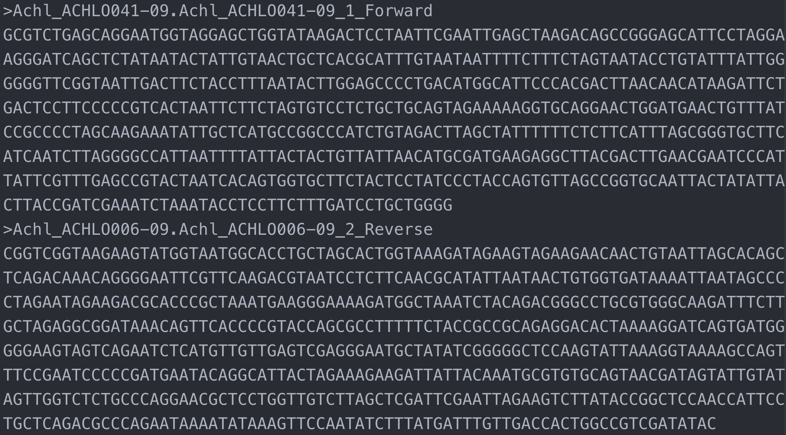

Advanced User Guide - *SangerAlignment* (**FASTA**)
===================================================

*SangerAlignment* is in the toppest level of sangeranalyseR (:ref:`Figure_1<SangerAlignment_hierachy_fasta>`), and each **SangerAlignment** instance corresponds to an alignment of contigs in a Sanger sequencing experiment. Among its slots, there is a *SangerContig* list which will be aligned into a consensus contig. Users can access to each *SangerContig* and *SangerRead* inside a *SangerAlignment* instance. 

In this section, we are going to go through details about a reproducible *SangerAlignment* analysis example with the **FASTA** file input in sangeranalyseR. By running the following example codes, you will get an end-to-end *SangerAlignment* analysis result.

.. _SangerAlignment_hierachy_fasta:
.. figure::  ../image/SangerAlignment_hierachy.png
   :align:   center
   :scale:   20 %

   Figure 1. Classes hierarchy in sangeranalyseR, *SangerAlignment* level.

|

Preparing *SangerAlignment* **FASTA** input
+++++++++++++++++++++++++++++++++++++++++++++++++++++
In :ref:`Advanced User Guide - *SangerAlignment* (**AB1**)`, we demonstrated how to use **AB1** input files to create *SangerAlignment* instance. Here, we explain another input format - the **FASTA** input. Before starting the analysis, users need to prepare one **FASTA** file, which must end with **.fa** or **.fasta**, containing sequences of all reads. In this example, the **FASTA** file is in the sangeranalyseR package, and you can simply get its path by running the following codes:

.. code-block:: R

   rawDataDir <- system.file("extdata", package = "sangeranalyseR")
   fastaFN <- file.path(rawDataDir, "fasta", "SangerAlignment", "Sanger_all_reads.fa")

The value of :code:`fastaFN` is where the **FASTA** file is placed. If your operating system is macOS, then its value should look like this:

.. code-block:: 

      /Library/Frameworks/R.framework/Versions/4.0/Resources/library/sangeranalyseR/extdata/fasta/SangerAlignment/Sanger_all_reads.fa

And we showed the reads in :code:`fastaFN` in Figure_2 (:download:`example FASTA file <../files/SangerAlignment_fasta/Sanger_all_reads.fa>`):

.. _SangerAlignment_fasta_input:

   Figure 2. *SangerAlignment* **FASTA** input file (4 out of 8 reads are showed).

Inside the **FASTA** file (:ref:`Figure_2<SangerAlignment_fasta_input>`; :download:`Sanger_all_reads.fa <../files/SangerAlignment_fasta/Sanger_all_reads.fa>`), the strings starting with ">" before each read are the read names. There are two ways of grouping reads which are **"regular expression matching"** and **"CSV file matching"**, and following are instructions of how to prepare your **FASTA** input file.

(1) "regular expression matching" *SangerAlignment* inputs (**FASTA**)
-----------------------------------------------------------------------

For regular expression matching method, sangeranalyseR will group reads based on their contig name and read direction in their names automatically; therefore, users have to follow the read-naming regulations below:

.. note::

    *  All reads in the same contig group must include the same contig name in their read names.
    *  Forward or reverse direction also has to be specified in their read names.

There are three parameters, :code:`FASTA_File`, :code:`REGEX_SuffixForward` and :code:`REGEX_SuffixReverse`, that define the grouping rule to let sangeranalyseR automatically match correct reads in **FASTA** file and divide them into forward and reverse directions.

.. note::

  * :code:`FASTA_File`: this is the path to **FASTA** file that contains all sequences of reads, and it can be either an absolute or relative path. We suggest users to include only target reads inside this **FASTA** file and do not include any other unrelated reads.
  * :code:`REGEX_SuffixForward`: this is a regular expression that matches all read names in forward direction. :code:`grepl` function in R is used.
  * :code:`REGEX_SuffixReverse`: this is a regular expression that matches all read names in reverse direction. :code:`grepl` function in R is used.

If you don't know what regular expression is, don't panic - it's just a way of recognising text. Please refer to :ref:`What is a regular expression?` for more details. Here is an example of how it works in sangeranalseR:

So how sangeranalyseR works is that it first matches the forward and reverse reads by matching :code:`REGEX_SuffixForward` and :code:`REGEX_SuffixReverse`. Then, sangeranalyseR uses the :code:`str_split` function to split and vectorize their read names into "contig name" and "direction-suffix" two parts. For those having the same "contig name" will be grouped into the same contig. 

Therefore, it is important to have a consistent naming strategy. You need to make sure that reads in the **FASTA** file that are in the same contig group share the same contig name and carefully select your :code:`REGEX_SuffixForward` and :code:`REGEX_SuffixReverse`. The bad file-naming and wrong regex matching might accidentally include reverse reads into the forward read list or vice versa, which will make the program generate wrong results. So, how should we systematically name the reads? We suggest users to follow the file-naming regulation in :ref:`Figure_3<sangeranalyseR_filename_convention_SangerAlignment_fasta>`. 

.. _sangeranalyseR_filename_convention_SangerAlignment_fasta:
.. figure::  ../image/sangeranalyseR_filename_convention_fasta.png
   :align:   center
   :scale:   25 %

   Figure 3. Suggested read naming regulation in **FASTA** file - *SangerAlignment*.

As you can see, the first part of the regulation is a consensus read name (or contig name), which helps sangeranalseR to identify which reads should be grouped into the same contig automatically. The second part of the regulation is an index; since there might be more than one read that is in the forward or reverse direction, we recommend you to number your reads in the same contig group. The Last part is a direction which is either 'F' (forward) or 'R' (reverse).

To make it more specific, let's go back to the true example. In :ref:`Figure_2<SangerAlignment_fasta_input>`, there are eight reads in the :code:`FASTA` file (:code:`fasta_FN`; :download:`Sanger_all_reads.fa <../files/SangerAlignment_fasta/Sanger_all_reads.fa>`). First, we set :code:`REGEX_SuffixForward` to :code:`"_[0-9]*_F$"` and :code:`REGEX_SuffixReverse` to :code:`"_[0-9]*_R$"` to let sangeranalyseR match and group forward and reverse reads automatically. By the regular expression rule, :code:`Achl_ACHLO006-09_1_F`, :code:`Achl_ACHLO007-09_1_F`, :code:`Achl_ACHLO040-09_1_F`, and :code:`Achl_ACHLO041-09_1_F`, are categorized into forward reads, and :code:`Achl_ACHLO006-09_1_R`, :code:`Achl_ACHLO007-09_1_R`, :code:`Achl_ACHLO040-09_1_R`, and :code:`Achl_ACHLO041-09_1_R` are categorized into reverse reads. Then, :code:`str_split` function is used to split each filename above into "contig name" and "direction-suffix". Four contig names are detected in this example which are :code:`Achl_ACHLO006-09`, :code:`Achl_ACHLO007-09`, :code:`Achl_ACHLO040-09`, and :code:`Achl_ACHLO041-09`. Last, a loop iterates through all contigs, and sangeranalseR creates each of them into a **SangerContig** instance. You can check :ref:`Advanced User Guide - *SangerContig* (**FASTA**)` to see how sangeranalyseR works into **SangerContig** level.

The reason why we strongly recommend you to follow this file-naming regulation is that by doing so, you can directly adopt the example regular expression matching values, :code:`"_[0-9]*_F$"` and :code:`"_[0-9]*_R$"` to group reads and reduce chances of error. Everything mentioned above will be done automatically. 

After understanding how parameters work, please refer to :ref:`Creating *SangerAlignment* instance from **FASTA**` below to see how to create *SangerAlignment* instance.

(2) "CSV file matching" *SangerAlignment* inputs (**FASTA**)
-------------------------------------------------------------
No doubt that read names in the original **FASTA** file do not follow the naming regulation, and you do not want to change the original **FASTA** file; thus, we provide a second grouping approach, CSV file matching method. sangeranalyseR will group reads in the **FASTA** file based on the information in a CSV file automatically, and users do not need to alter the read names in the **FASTA** file; therefore, users have to follow the regulations below:

.. note::

    Here is an :download:`example CSV file <../files/SangerAlignment_fasta/names_conversion.csv>` (:ref:`Figure 4<sangeranalyseR_csv_file_SangerAlignment_fasta>`)

      .. _sangeranalyseR_csv_file_SangerAlignment_fasta:
      .. figure::  ../image/sangeranalyseR_csv_file_sangeralignment_fasta.png
         :align:   center
         :scale:   80 %

         Figure 4. Example CSV file for *SangerAlignment* instance creation.  

    *  There must be three columns, "**reads**", "**direction**", and "**contig**", in the CSV file.
    *  The "**reads**" column stores the filename of **AB1** files that are going to be included in the analysis.
    *  The "**direction**" column stores the direction of the reads. It must be "F" (forward) or "R" (reverse).
    *  The "**contig**" column stores the contig name that each read blongs. Reads in the same contig have to have the same contig name, and they will be grouped into the same contig.

There are two parameters, :code:`FASTA_File` and :code:`CSV_NamesConversion`,that define the grouping rule to help sangeranalseR to automatically match correct reads in the **FASTA** file and divide them into forward and reverse directions.

.. note::

  * :code:`FASTA_File`: this is the path to **FASTA** file that contains all sequences of reads, and it can be either an absolute or relative path. We suggest users to include only target reads inside this **FASTA** file and do not include any other unrelated reads.
  * :code:`CSV_NamesConversion`: this is the path to the **CSV** file. It can be either an absolute or relative path.

The main difference between "CSV file matching" and "regular expression matching" is where the grouping rule is written. For "regular expression matching", rules are writtein in filenames, and thus there are more naming requirements for users to follow. In contrast, rules of "CSV file matching" are written in an additional **CSV** file so it is more flexible on **AB1** file-naming.

So how sangeranalyseR works is that it first reads in the **CSV** file (with *"reads"*, *"direction"*, and *"contig"* columns), filter out rows whose *"contig"* is not the value of :code:`contigName` parameter, find the read names in the **FASTA** file listed in *"reads"*, and assign directions to them based on *"direction"*.

To make it more specific, let's go back to the true example. First, we prepare a :download:`CSV file <../files/SangerAlignment_fasta/names_conversion.csv>` (:code:`CSV_NamesConversion`) and a :download:`fasta file <../files/SangerAlignment_fasta/Sanger_all_reads.fa>` (:code:`FASTA_File`). In the **CSV** file, there are 8 rows and 4 distinct contig names. sangeranalyseR matches *"reads"* of these 8 rows to read names in the **FASTA** file. Then sangeranalyseR groups all matched reads, :code:`Achl_ACHLO006-09_1_F`, :code:`Achl_ACHLO007-09_1_F`, :code:`Achl_ACHLO040-09_1_F`, :code:`Achl_ACHLO041-09_1_F`,   :code:`Achl_ACHLO006-09_1_R`, :code:`Achl_ACHLO007-09_1_R`, :code:`Achl_ACHLO040-09_1_R`, and :code:`Achl_ACHLO041-09_1_R`, into 4 distinct contig names which are :code:`Achl_ACHLO006-09`, :code:`Achl_ACHLO007-09`, :code:`Achl_ACHLO040-09`, and :code:`Achl_ACHLO041-09`, by the *"contig"* column. Last, the directions of reads in each contig are assigned by the *"direction"* column. Take :code:`Achl_ACHLO041-09` contig as an example. Its "forward read list" will include :code:`Achl_ACHLO041-09_1_F`, and its "reverse read list" will include :code:`Achl_ACHLO041-09_1_R`.

After understanding how parameters work, please refer to :ref:`Creating *SangerAlignment* instance from **FASTA**` below to see how to create *SangerAlignment* instance.

|

Creating *SangerAlignment* instance from **FASTA**
+++++++++++++++++++++++++++++++++++++++++++++++++++++
After preparing the input directory, we can create a *SangerAlignment* instance by running :code:`SangerAlignment` constructor function or :code:`new` method. The constructor function is a wrapper for :code:`new` method and it makes instance creation more intuitive. Their input parameters are same, and all of them have their default values. For more details about *SangerAlignment* inputs and slots definition, please refer to `sangeranalyseR reference manual <https://bioconductor.org/packages/release/bioc/manuals/sangeranalyseR/man/sangeranalyseR.pdf>`_. We will explain two *SangerAlignment* instance creation methods, "regular expression matching" and "CSV file matching".

(1) "regular expression matching" *SangerAlignment* creation (**FASTA**)
-------------------------------------------------------------------------
The consturctor function and :code:`new` method below contain three parameters, :code:`FASTA_File`, :code:`REGEX_SuffixForward`, and :code:`REGEX_SuffixReverse`, that we mentioned in the previous section. In contrast to **AB1** input method, it does not include quality trimming and chromatogram visualization parameters. Run the following code and create :code:`my_sangerAlignmentFa` instance. 

.. code-block:: R
                     
   # using `constructor` function to create SangerAlignment instance
   my_sangerAlignmentFa <- SangerAlignment(inputSource          = "FASTA",
                                           processMethod        = "REGEX",
                                           FASTA_File           = fastaFN,
                                           REGEX_SuffixForward  = "_[0-9]*_F$",
                                           REGEX_SuffixReverse  = "_[0-9]*_R$",
                                           refAminoAcidSeq      = "SRQWLFSTNHKDIGTLYFIFGAWAGMVGTSLSILIRAELGHPGALIGDDQIYNVIVTAHAFIMIFFMVMPIMIGGFGNWLVPLMLGAPDMAFPRMNNMSFWLLPPALSLLLVSSMVENGAGTGWTVYPPLSAGIAHGGASVDLAIFSLHLAGISSILGAVNFITTVINMRSTGISLDRMPLFVWSVVITALLLLLSLPVLAGAITMLLTDRNLNTSFFDPAGGGDPILYQHLFWFFGHPEVYILILPGFGMISHIISQESGKKETFGSLGMIYAMLAIGLLGFIVWAHHMFTVGMDVDTRAYFTSATMIIAVPTGIKIFSWLATLHGTQLSYSPAILWALGFVFLFTVGGLTGVVLANSSVDIILHDTYYVVAHFHYVLSMGAVFAIMAGFIHWYPLFTGLTLNNKWLKSHFIIMFIGVNLTFFPQHFLGLAGMPRRYSDYPDAYTTWNIVSTIGSTISLLGILFFFFIIWESLVSQRQVIYPIQLNSSIEWYQNTPPAEHSYSELPLLTN",
                                           minReadsNum           = 2,
                                           minReadLength         = 20,
                                           minFractionCall       = 0.5,
                                           maxFractionLost       = 0.5,
                                           geneticCode           = GENETIC_CODE,
                                           acceptStopCodons      = TRUE,
                                           readingFrame          = 1,
                                           processorsNum         = 1)

   my_sangerAlignmentFa <- new("SangerAlignment",
                               inputSource          = "FASTA",
                               processMethod        = "REGEX",
                               FASTA_File           = fastaFN,
                               REGEX_SuffixForward  = "_[0-9]*_F$",
                               REGEX_SuffixReverse  = "_[0-9]*_R$",
                               refAminoAcidSeq      = "SRQWLFSTNHKDIGTLYFIFGAWAGMVGTSLSILIRAELGHPGALIGDDQIYNVIVTAHAFIMIFFMVMPIMIGGFGNWLVPLMLGAPDMAFPRMNNMSFWLLPPALSLLLVSSMVENGAGTGWTVYPPLSAGIAHGGASVDLAIFSLHLAGISSILGAVNFITTVINMRSTGISLDRMPLFVWSVVITALLLLLSLPVLAGAITMLLTDRNLNTSFFDPAGGGDPILYQHLFWFFGHPEVYILILPGFGMISHIISQESGKKETFGSLGMIYAMLAIGLLGFIVWAHHMFTVGMDVDTRAYFTSATMIIAVPTGIKIFSWLATLHGTQLSYSPAILWALGFVFLFTVGGLTGVVLANSSVDIILHDTYYVVAHFHYVLSMGAVFAIMAGFIHWYPLFTGLTLNNKWLKSHFIIMFIGVNLTFFPQHFLGLAGMPRRYSDYPDAYTTWNIVSTIGSTISLLGILFFFFIIWESLVSQRQVIYPIQLNSSIEWYQNTPPAEHSYSELPLLTN",
                               minReadsNum           = 2,
                               minReadLength         = 20,
                               minFractionCall       = 0.5,
                               maxFractionLost       = 0.5,
                               geneticCode           = GENETIC_CODE,
                               acceptStopCodons      = TRUE,
                               readingFrame          = 1,
                               processorsNum         = 1)

In this example, 8 reads are detected and 4 distinct **SangerContig** instances are created. These **SangerContig** instances are stored in a "contig list" in :code:`my_sangerAlignmentFa`, which will be used as the input for the following functions.

Inside the R shell, you can run :code:`my_sangerAlignmentFa` to get basic information of the instance or run :code:`my_sangerAlignmentFa@objectResults@readResultTable` to check the creation result of every Sanger read after :code:`my_sangerAlignmentFa` is successfully created.

Here is the output of :code:`my_sangerAlignmentFa`::

   SangerAlignment S4 instance
            Input Source :  FASTA 
            Process Method :  REGEX 
         Fasta File Name :  /Library/Frameworks/R.framework/Versions/4.0/Resources/library/sangeranalyseR/extdata/fasta/SangerAlignment/Sanger_all_reads.fa 
      REGEX Suffix Forward :  _[0-9]*_F$ 
      REGEX Suffix Reverse :  _[0-9]*_R$ 
         Contigs Consensus :  TTATAYTTTATTYTRGGCGTCTGAGCAGGAATGGTTGGAGCYGGTATAAGACTYCTAATTCGAATYGAGCTAAGACARCCRGGAGCRTTCCTRGGMAGRGAYCAACTMTAYAATACTATYGTWACTGCWCACGCATTTGTAATAATYTTCTTTCTAGTAATRCCTGTATTYATYGGGGGRTTCGGWAAYTGRCTTYTACCTTTAATACTTGGAGCCCCYGAYATRGCATTCCCWCGACTYAACAACATRAGATTCTGACTMCTTCCCCCATCACTRATCCTTYTAGTGTCCTCTGCKGCRGTAGAAAAAGGCGCTGGWACKGGRTGAACTGTTTATCCGCCYCTAGCAAGAAATMTTGCYCAYGCMGGCCCRTCTGTAGAYTTAGCYATYTTTTCYCTTCATTTAGCGGGTGCKTCWTCWATYYTAGGGGCYATTAATTTTATYACYACWGTTATTAAYATGCGWTGAAGAGGMTTACGWCTTGAACGAATYCCMYTRTTYGTYTGAGCYGTRCTAATTACAGTKGTTCTTCTACTYCTATCYTTACCAGTGYTAGCMGGTGCMATTACYATACTWCTTACCGAYCGAAAYCTCAATACYTCMTTCTTTGATCCTGCYGGTGGTGGAGAYCCCATCCTCTACCAACACTTATTCTGATTTTTTGGTCACCCTGAG 
   SUCCESS [2021-14-07 04:33:57] 'SangerAlignment' is successfully created!

Here is the output of :code:`my_sangerAlignmentFa@objectResults@readResultTable`::

               readName creationResult errorType errorMessage inputSource    direction
   1 Achl_ACHLO006-09_1_F           TRUE      None         None       FASTA Forward Read
   2 Achl_ACHLO006-09_2_R           TRUE      None         None       FASTA Reverse Read
   3 Achl_ACHLO007-09_1_F           TRUE      None         None       FASTA Forward Read
   4 Achl_ACHLO007-09_2_R           TRUE      None         None       FASTA Reverse Read
   5 Achl_ACHLO040-09_1_F           TRUE      None         None       FASTA Forward Read
   6 Achl_ACHLO040-09_2_R           TRUE      None         None       FASTA Reverse Read
   7 Achl_ACHLO041-09_1_F           TRUE      None         None       FASTA Forward Read
   8 Achl_ACHLO041-09_2_R           TRUE      None         None       FASTA Reverse Read

(2) "CSV file matching" *SangerAlignment* creation (**FASTA**)
---------------------------------------------------------------
The consturctor function and :code:`new` method below contain two parameters, :code:`FASTA_File`, and :code:`CSV_NamesConversion`, that we mentioned in the previous section. Run the following code and create :code:`my_sangerAlignmentFa` instance. 

.. code-block:: R

   csv_namesConversion <- file.path(rawDataDir, "fasta", "SangerAlignment", "names_conversion.csv")

   # using `constructor` function to create SangerAlignment instance
   my_sangerAlignmentFa <- SangerAlignment(inputSource          = "FASTA",
                                           processMethod        = "CSV",
                                           FASTA_File           = fastaFN,
                                           CSV_NamesConversion  = csv_namesConversion,
                                           refAminoAcidSeq      = "SRQWLFSTNHKDIGTLYFIFGAWAGMVGTSLSILIRAELGHPGALIGDDQIYNVIVTAHAFIMIFFMVMPIMIGGFGNWLVPLMLGAPDMAFPRMNNMSFWLLPPALSLLLVSSMVENGAGTGWTVYPPLSAGIAHGGASVDLAIFSLHLAGISSILGAVNFITTVINMRSTGISLDRMPLFVWSVVITALLLLLSLPVLAGAITMLLTDRNLNTSFFDPAGGGDPILYQHLFWFFGHPEVYILILPGFGMISHIISQESGKKETFGSLGMIYAMLAIGLLGFIVWAHHMFTVGMDVDTRAYFTSATMIIAVPTGIKIFSWLATLHGTQLSYSPAILWALGFVFLFTVGGLTGVVLANSSVDIILHDTYYVVAHFHYVLSMGAVFAIMAGFIHWYPLFTGLTLNNKWLKSHFIIMFIGVNLTFFPQHFLGLAGMPRRYSDYPDAYTTWNIVSTIGSTISLLGILFFFFIIWESLVSQRQVIYPIQLNSSIEWYQNTPPAEHSYSELPLLTN",
                                           minReadsNum           = 2,
                                           minReadLength         = 20,
                                           minFractionCall       = 0.5,
                                           maxFractionLost       = 0.5,
                                           geneticCode           = GENETIC_CODE,
                                           acceptStopCodons      = TRUE,
                                           readingFrame          = 1,
                                           processorsNum         = 1)

   my_sangerAlignmentFa <- new("SangerAlignment",
                               inputSource          = "FASTA",
                               processMethod        = "CSV",
                               FASTA_File           = fastaFN,
                               CSV_NamesConversion  = csv_namesConversion,
                               refAminoAcidSeq      = "SRQWLFSTNHKDIGTLYFIFGAWAGMVGTSLSILIRAELGHPGALIGDDQIYNVIVTAHAFIMIFFMVMPIMIGGFGNWLVPLMLGAPDMAFPRMNNMSFWLLPPALSLLLVSSMVENGAGTGWTVYPPLSAGIAHGGASVDLAIFSLHLAGISSILGAVNFITTVINMRSTGISLDRMPLFVWSVVITALLLLLSLPVLAGAITMLLTDRNLNTSFFDPAGGGDPILYQHLFWFFGHPEVYILILPGFGMISHIISQESGKKETFGSLGMIYAMLAIGLLGFIVWAHHMFTVGMDVDTRAYFTSATMIIAVPTGIKIFSWLATLHGTQLSYSPAILWALGFVFLFTVGGLTGVVLANSSVDIILHDTYYVVAHFHYVLSMGAVFAIMAGFIHWYPLFTGLTLNNKWLKSHFIIMFIGVNLTFFPQHFLGLAGMPRRYSDYPDAYTTWNIVSTIGSTISLLGILFFFFIIWESLVSQRQVIYPIQLNSSIEWYQNTPPAEHSYSELPLLTN",
                               minReadsNum           = 2,
                               minReadLength         = 20,
                               minFractionCall       = 0.5,
                               maxFractionLost       = 0.5,
                               geneticCode           = GENETIC_CODE,
                               acceptStopCodons      = TRUE,
                               readingFrame          = 1,
                               processorsNum         = 1)

First, you need to load the **CSV** file into the R environment. If you are still don't know how to prepare it, please check :ref:`(2) "CSV file matching" *SangerAlignment* inputs (**FASTA**)`. Then, it will follow rules in the CSV file and create :code:`my_sangerAlignmentFa`. After it's created, inside the R shell, you can run :code:`my_sangerAlignmentFa` to get basic information of the instance or run :code:`my_sangerAlignmentFa@objectResults@readResultTable` to check the creation result of every Sanger read after :code:`my_sangerAlignmentFa` is successfully created.

Here is the output of :code:`my_sangerAlignmentFa`::

   SangerAlignment S4 instance
            Input Source :  FASTA 
            Process Method :  CSV 
         Fasta File Name :  /Library/Frameworks/R.framework/Versions/4.0/Resources/library/sangeranalyseR/extdata/fasta/SangerAlignment/Sanger_all_reads.fa 
      CSV Names Conversion :  /Library/Frameworks/R.framework/Versions/4.0/Resources/library/sangeranalyseR/extdata/fasta/SangerAlignment/names_conversion.csv 
         Contigs Consensus :  TTATAYTTTATTYTRGGCGTCTGAGCAGGAATGGTTGGAGCYGGTATAAGACTYCTAATTCGAATYGAGCTAAGACARCCRGGAGCRTTCCTRGGMAGRGAYCAACTMTAYAATACTATYGTWACTGCWCACGCATTTGTAATAATYTTCTTTCTAGTAATRCCTGTATTYATYGGGGGRTTCGGWAAYTGRCTTYTACCTTTAATACTTGGAGCCCCYGAYATRGCATTCCCWCGACTYAACAACATRAGATTCTGACTMCTTCCCCCATCACTRATCCTTYTAGTGTCCTCTGCKGCRGTAGAAAAAGGCGCTGGWACKGGRTGAACTGTTTATCCGCCYCTAGCAAGAAATMTTGCYCAYGCMGGCCCRTCTGTAGAYTTAGCYATYTTTTCYCTTCATTTAGCGGGTGCKTCWTCWATYYTAGGGGCYATTAATTTTATYACYACWGTTATTAAYATGCGWTGAAGAGGMTTACGWCTTGAACGAATYCCMYTRTTYGTYTGAGCYGTRCTAATTACAGTKGTTCTTCTACTYCTATCYTTACCAGTGYTAGCMGGTGCMATTACYATACTWCTTACCGAYCGAAAYCTCAATACYTCMTTCTTTGATCCTGCYGGTGGTGGAGAYCCCATCCTCTACCAACACTTATTCTGATTTTTTGGTCACCCTGAG 
   SUCCESS [2021-14-07 04:38:44] 'SangerAlignment' is successfully created!

Here is the output of :code:`my_sangerAlignmentFa@objectResults@readResultTable`::

               readName creationResult errorType errorMessage inputSource    direction
   1 Achl_ACHLO006-09_1_F           TRUE      None         None       FASTA Forward Read
   2 Achl_ACHLO006-09_2_R           TRUE      None         None       FASTA Reverse Read
   3 Achl_ACHLO007-09_1_F           TRUE      None         None       FASTA Forward Read
   4 Achl_ACHLO007-09_2_R           TRUE      None         None       FASTA Reverse Read
   5 Achl_ACHLO040-09_1_F           TRUE      None         None       FASTA Forward Read
   6 Achl_ACHLO040-09_2_R           TRUE      None         None       FASTA Reverse Read
   7 Achl_ACHLO041-09_1_F           TRUE      None         None       FASTA Forward Read
   8 Achl_ACHLO041-09_2_R           TRUE      None         None       FASTA Reverse Read

|

Writing *SangerAlignment* FASTA files :sub:`(FASTA)`
+++++++++++++++++++++++++++++++++++++++++++++++++++++
Users can write the *SangerAlignment* instance, :code:`my_sangerAlignmentFa`, to **FASTA** files. There are four options for users to choose from in :code:`selection` parameter.

* :code:`reads_unalignment`: Writing reads into a single **FASTA** file (only trimmed without alignment).
* :code:`reads_alignment`: Writing reads alignment and contig read to a single **FASTA** file.
* :code:`contig`: Writing the contig to a single **FASTA** file.
* :code:`all`: Writing reads, reads alignment, and the contig into three different files.

Below is the oneliner for writing out **FASTA** files. This function mainly depends on :code:`writeXStringSet` function in `Biostrings <https://bioconductor.org/packages/release/bioc/html/Biostrings.html>`_ R package. Users can set the compression level through :code:`writeFasta` function.

.. code-block:: R

   writeFasta(my_sangerAlignmentFa,
              outputDir         = tempdir(),
              compress          = FALSE,
              compression_level = NA,
              selection         = "all")

Users can download the output FASTA file of this example through the following three links:

(1) :download:`Sanger_contigs_unalignment.fa <../files/SangerAlignment_fasta/Sanger_contigs_unalignment.fa>`
(2) :download:`Sanger_contigs_alignment.fa <../files/SangerAlignment_fasta/Sanger_contigs_alignment.fa>`
(3) :download:`Sanger_all_trimmed_reads.fa <../files/SangerAlignment_fasta/Sanger_all_trimmed_reads.fa>`

|

Generating *SangerAlignment* report :sub:`(FASTA)`
+++++++++++++++++++++++++++++++++++++++++++++++++++++
Last but not least, users can save *SangerAlignment* instance, :code:`my_sangerAlignmentFa`, into a report after the analysis. The report will be generated in **HTML** by knitting **Rmd** files.

Users can set :code:`includeSangerContig` and :code:`includeSangerRead` parameters to decide to which level the *SangerAlignment* report will go. Moreover, after the reports are generated, users can easily navigate through reports in different levels within the **HTML** file.

One thing to pay attention to is that if users have many reads, it will take quite a long time to write out all reports. If users only want to generate the contig result, remember to set :code:`includeSangerRead` and :code:`includeSangerContig` to :code:`FALSE` in order to save time.

.. code-block:: R

   generateReport(my_sangerAlignmentFa,
                  outputDir           = tempdir(),
                  includeSangerRead   = FALSE,
                  includeSangerContig = FALSE)

-----

|
|

Code summary (*SangerAlignment*, **FASTA**)
++++++++++++++++++++++++++++++++++++++++++++++++++

(1) Preparing *SangerAlignment* **FASTA** inputs
--------------------------------------------------

.. code-block:: R

   rawDataDir <- system.file("extdata", package = "sangeranalyseR")
   fastaFN <- file.path(rawDataDir, "fasta", "SangerAlignment", "Sanger_all_reads.fa")

|

(2) Creating *SangerAlignment* instance from **FASTA**
--------------------------------------------------------

(2.1) "Regular Expression Method" *SangerAlignment* creation (**FASTA**)
*************************************************************************

.. code-block:: R

   # using `constructor` function to create SangerAlignment instance
   my_sangerAlignmentFa <- SangerAlignment(inputSource          = "FASTA",
                                           processMethod        = "REGEX",
                                           FASTA_File           = fastaFN,
                                           REGEX_SuffixForward  = "_[0-9]*_F$",
                                           REGEX_SuffixReverse  = "_[0-9]*_R$",
                                           refAminoAcidSeq      = "SRQWLFSTNHKDIGTLYFIFGAWAGMVGTSLSILIRAELGHPGALIGDDQIYNVIVTAHAFIMIFFMVMPIMIGGFGNWLVPLMLGAPDMAFPRMNNMSFWLLPPALSLLLVSSMVENGAGTGWTVYPPLSAGIAHGGASVDLAIFSLHLAGISSILGAVNFITTVINMRSTGISLDRMPLFVWSVVITALLLLLSLPVLAGAITMLLTDRNLNTSFFDPAGGGDPILYQHLFWFFGHPEVYILILPGFGMISHIISQESGKKETFGSLGMIYAMLAIGLLGFIVWAHHMFTVGMDVDTRAYFTSATMIIAVPTGIKIFSWLATLHGTQLSYSPAILWALGFVFLFTVGGLTGVVLANSSVDIILHDTYYVVAHFHYVLSMGAVFAIMAGFIHWYPLFTGLTLNNKWLKSHFIIMFIGVNLTFFPQHFLGLAGMPRRYSDYPDAYTTWNIVSTIGSTISLLGILFFFFIIWESLVSQRQVIYPIQLNSSIEWYQNTPPAEHSYSELPLLTN")

   my_sangerAlignmentFa <- new("SangerAlignment",
                               inputSource          = "FASTA",
                               processMethod        = "REGEX",
                               FASTA_File           = fastaFN,
                               REGEX_SuffixForward  = "_[0-9]*_F$",
                               REGEX_SuffixReverse  = "_[0-9]*_R$",
                               refAminoAcidSeq      = "SRQWLFSTNHKDIGTLYFIFGAWAGMVGTSLSILIRAELGHPGALIGDDQIYNVIVTAHAFIMIFFMVMPIMIGGFGNWLVPLMLGAPDMAFPRMNNMSFWLLPPALSLLLVSSMVENGAGTGWTVYPPLSAGIAHGGASVDLAIFSLHLAGISSILGAVNFITTVINMRSTGISLDRMPLFVWSVVITALLLLLSLPVLAGAITMLLTDRNLNTSFFDPAGGGDPILYQHLFWFFGHPEVYILILPGFGMISHIISQESGKKETFGSLGMIYAMLAIGLLGFIVWAHHMFTVGMDVDTRAYFTSATMIIAVPTGIKIFSWLATLHGTQLSYSPAILWALGFVFLFTVGGLTGVVLANSSVDIILHDTYYVVAHFHYVLSMGAVFAIMAGFIHWYPLFTGLTLNNKWLKSHFIIMFIGVNLTFFPQHFLGLAGMPRRYSDYPDAYTTWNIVSTIGSTISLLGILFFFFIIWESLVSQRQVIYPIQLNSSIEWYQNTPPAEHSYSELPLLTN")

.. container:: toggle

    .. container:: header

        Following is the R shell output that you will get.
    .. code-block::

      INFO [2021-14-07 04:51:42] #################################################
      INFO [2021-14-07 04:51:42] #### Start creating SangerAlignment instance ####
      INFO [2021-14-07 04:51:42] #################################################
      INFO [2021-14-07 04:51:42] **** You are using Regular Expression Method to group reads in FASTA file (No CSV file)!
      INFO [2021-14-07 04:51:42] ========================================================
      INFO [2021-14-07 04:51:42] ================ Creating 'SangerContig' ===============
      INFO [2021-14-07 04:51:42] ========================================================
      INFO [2021-14-07 04:51:42]   >> Contig Name: 'Achl_ACHLO006-09'
      SUCCESS [2021-14-07 04:51:43] --------------------------------------------------------
      SUCCESS [2021-14-07 04:51:43] -------- 'SangerRead' S4 instance is created !! --------
      SUCCESS [2021-14-07 04:51:43] --------------------------------------------------------
      SUCCESS [2021-14-07 04:51:43]    >> 'Achl_ACHLO006-09_1_F' is created (Forward Read; FASTA).
      SUCCESS [2021-14-07 04:51:43] --------------------------------------------------------
      SUCCESS [2021-14-07 04:51:43] -------- 'SangerRead' S4 instance is created !! --------
      SUCCESS [2021-14-07 04:51:43] --------------------------------------------------------
      SUCCESS [2021-14-07 04:51:43]    >> 'Achl_ACHLO006-09_2_R' is created (Reverse Read; FASTA).
      INFO [2021-14-07 04:51:43]    >> The number of reads detected: 2
      Assessing frameshifts in nucleotide sequences:
      |=================================================================================================| 100%

      Time difference of 0.03 secs
      SUCCESS [2021-14-07 04:51:45] ==========================================================
      SUCCESS [2021-14-07 04:51:45] ======== 'SangerContig' S4 instance is created !! ========
      SUCCESS [2021-14-07 04:51:45] ==========================================================
      INFO [2021-14-07 04:51:45]    >> 2 read(s) created from FASTA file.
      INFO [2021-14-07 04:51:45]      >> 1 reads assigned to 'forward reads' according to 'regular expression'.
      INFO [2021-14-07 04:51:45]      >> 1 reads assigned to 'reverse reads' according to 'regular expression'.
      INFO [2021-14-07 04:51:45] ========================================================
      INFO [2021-14-07 04:51:45] ================ Creating 'SangerContig' ===============
      INFO [2021-14-07 04:51:45] ========================================================
      INFO [2021-14-07 04:51:45]   >> Contig Name: 'Achl_ACHLO007-09'
      SUCCESS [2021-14-07 04:51:45] --------------------------------------------------------
      SUCCESS [2021-14-07 04:51:45] -------- 'SangerRead' S4 instance is created !! --------
      SUCCESS [2021-14-07 04:51:45] --------------------------------------------------------
      SUCCESS [2021-14-07 04:51:45]    >> 'Achl_ACHLO007-09_1_F' is created (Forward Read; FASTA).
      SUCCESS [2021-14-07 04:51:46] --------------------------------------------------------
      SUCCESS [2021-14-07 04:51:46] -------- 'SangerRead' S4 instance is created !! --------
      SUCCESS [2021-14-07 04:51:46] --------------------------------------------------------
      SUCCESS [2021-14-07 04:51:46]    >> 'Achl_ACHLO007-09_2_R' is created (Reverse Read; FASTA).
      INFO [2021-14-07 04:51:46]    >> The number of reads detected: 2
      Assessing frameshifts in nucleotide sequences:
      |=================================================================================================| 100%

      Time difference of 0.03 secs
      SUCCESS [2021-14-07 04:51:47] ==========================================================
      SUCCESS [2021-14-07 04:51:48] ======== 'SangerContig' S4 instance is created !! ========
      SUCCESS [2021-14-07 04:51:48] ==========================================================
      INFO [2021-14-07 04:51:48]    >> 2 read(s) created from FASTA file.
      INFO [2021-14-07 04:51:48]      >> 1 reads assigned to 'forward reads' according to 'regular expression'.
      INFO [2021-14-07 04:51:48]      >> 1 reads assigned to 'reverse reads' according to 'regular expression'.
      INFO [2021-14-07 04:51:48] ========================================================
      INFO [2021-14-07 04:51:48] ================ Creating 'SangerContig' ===============
      INFO [2021-14-07 04:51:48] ========================================================
      INFO [2021-14-07 04:51:48]   >> Contig Name: 'Achl_ACHLO040-09'
      SUCCESS [2021-14-07 04:51:48] --------------------------------------------------------
      SUCCESS [2021-14-07 04:51:48] -------- 'SangerRead' S4 instance is created !! --------
      SUCCESS [2021-14-07 04:51:48] --------------------------------------------------------
      SUCCESS [2021-14-07 04:51:48]    >> 'Achl_ACHLO040-09_1_F' is created (Forward Read; FASTA).
      SUCCESS [2021-14-07 04:51:48] --------------------------------------------------------
      SUCCESS [2021-14-07 04:51:48] -------- 'SangerRead' S4 instance is created !! --------
      SUCCESS [2021-14-07 04:51:48] --------------------------------------------------------
      SUCCESS [2021-14-07 04:51:48]    >> 'Achl_ACHLO040-09_2_R' is created (Reverse Read; FASTA).
      INFO [2021-14-07 04:51:49]    >> The number of reads detected: 2
      Assessing frameshifts in nucleotide sequences:
      |=================================================================================================| 100%

      Time difference of 0.03 secs
      SUCCESS [2021-14-07 04:51:50] ==========================================================
      SUCCESS [2021-14-07 04:51:50] ======== 'SangerContig' S4 instance is created !! ========
      SUCCESS [2021-14-07 04:51:50] ==========================================================
      INFO [2021-14-07 04:51:50]    >> 2 read(s) created from FASTA file.
      INFO [2021-14-07 04:51:50]      >> 1 reads assigned to 'forward reads' according to 'regular expression'.
      INFO [2021-14-07 04:51:50]      >> 1 reads assigned to 'reverse reads' according to 'regular expression'.
      INFO [2021-14-07 04:51:50] ========================================================
      INFO [2021-14-07 04:51:50] ================ Creating 'SangerContig' ===============
      INFO [2021-14-07 04:51:50] ========================================================
      INFO [2021-14-07 04:51:50]   >> Contig Name: 'Achl_ACHLO041-09'
      SUCCESS [2021-14-07 04:51:50] --------------------------------------------------------
      SUCCESS [2021-14-07 04:51:50] -------- 'SangerRead' S4 instance is created !! --------
      SUCCESS [2021-14-07 04:51:50] --------------------------------------------------------
      SUCCESS [2021-14-07 04:51:50]    >> 'Achl_ACHLO041-09_1_F' is created (Forward Read; FASTA).
      SUCCESS [2021-14-07 04:51:51] --------------------------------------------------------
      SUCCESS [2021-14-07 04:51:51] -------- 'SangerRead' S4 instance is created !! --------
      SUCCESS [2021-14-07 04:51:51] --------------------------------------------------------
      SUCCESS [2021-14-07 04:51:51]    >> 'Achl_ACHLO041-09_2_R' is created (Reverse Read; FASTA).
      INFO [2021-14-07 04:51:51]    >> The number of reads detected: 2
      Assessing frameshifts in nucleotide sequences:
      |=================================================================================================| 100%

      Time difference of 0.03 secs
      SUCCESS [2021-14-07 04:51:52] ==========================================================
      SUCCESS [2021-14-07 04:51:52] ======== 'SangerContig' S4 instance is created !! ========
      SUCCESS [2021-14-07 04:51:52] ==========================================================
      INFO [2021-14-07 04:51:52]    >> 2 read(s) created from FASTA file.
      INFO [2021-14-07 04:51:52]      >> 1 reads assigned to 'forward reads' according to 'regular expression'.
      INFO [2021-14-07 04:51:52]      >> 1 reads assigned to 'reverse reads' according to 'regular expression'.
      INFO [2021-14-07 04:51:52] Aligning consensus reads ... 
      SUCCESS [2021-14-07 04:51:53] #############################################################
      SUCCESS [2021-14-07 04:51:53] ######## 'SangerAlignment' S4 instance is created !! ########
      SUCCESS [2021-14-07 04:51:53] #############################################################
      INFO [2021-14-07 04:51:53]   >> 4 contigs detected from 'regular expression'.
      INFO [2021-14-07 04:51:53]       >> Contig 'Achl_ACHLO006-09':
      INFO [2021-14-07 04:51:53]           >> 1 forward reads.
      INFO [2021-14-07 04:51:53]           >> 1 reverse reads.
      INFO [2021-14-07 04:51:53]       >> Contig 'Achl_ACHLO007-09':
      INFO [2021-14-07 04:51:53]           >> 1 forward reads.
      INFO [2021-14-07 04:51:53]           >> 1 reverse reads.
      INFO [2021-14-07 04:51:53]       >> Contig 'Achl_ACHLO040-09':
      INFO [2021-14-07 04:51:53]           >> 1 forward reads.
      INFO [2021-14-07 04:51:53]           >> 1 reverse reads.
      INFO [2021-14-07 04:51:53]       >> Contig 'Achl_ACHLO041-09':
      INFO [2021-14-07 04:51:53]           >> 1 forward reads.
      INFO [2021-14-07 04:51:53]           >> 1 reverse reads.
      INFO [2021-14-07 04:51:53]   >> 8 reads created from FASTA file.
      DEBUG [2021-14-07 04:51:53]    >> For more information, please run 'object'.
      DEBUG [2021-14-07 04:51:53]    >> Run 'object@objectResults@readResultTable' to check the results of each Sanger reads

|

(2.2) "CSV file matching" *SangerAlignment* creation (**FASTA**)
*****************************************************************

.. code-block:: R

   csv_namesConversion <- file.path(rawDataDir, "fasta", "SangerAlignment", "names_conversion.csv")

   # using `constructor` function to create SangerAlignment instance
   my_sangerAlignmentFa <- SangerAlignment(inputSource          = "FASTA",
                                           processMethod        = "CSV",
                                           FASTA_File           = fastaFN,
                                           CSV_NamesConversion  = csv_namesConversion,
                                           refAminoAcidSeq      = "SRQWLFSTNHKDIGTLYFIFGAWAGMVGTSLSILIRAELGHPGALIGDDQIYNVIVTAHAFIMIFFMVMPIMIGGFGNWLVPLMLGAPDMAFPRMNNMSFWLLPPALSLLLVSSMVENGAGTGWTVYPPLSAGIAHGGASVDLAIFSLHLAGISSILGAVNFITTVINMRSTGISLDRMPLFVWSVVITALLLLLSLPVLAGAITMLLTDRNLNTSFFDPAGGGDPILYQHLFWFFGHPEVYILILPGFGMISHIISQESGKKETFGSLGMIYAMLAIGLLGFIVWAHHMFTVGMDVDTRAYFTSATMIIAVPTGIKIFSWLATLHGTQLSYSPAILWALGFVFLFTVGGLTGVVLANSSVDIILHDTYYVVAHFHYVLSMGAVFAIMAGFIHWYPLFTGLTLNNKWLKSHFIIMFIGVNLTFFPQHFLGLAGMPRRYSDYPDAYTTWNIVSTIGSTISLLGILFFFFIIWESLVSQRQVIYPIQLNSSIEWYQNTPPAEHSYSELPLLTN")

   my_sangerAlignmentFa <- new("SangerAlignment",
                               inputSource          = "FASTA",
                               processMethod        = "CSV",
                               FASTA_File           = fastaFN,
                               CSV_NamesConversion  = csv_namesConversion,
                               refAminoAcidSeq      = "SRQWLFSTNHKDIGTLYFIFGAWAGMVGTSLSILIRAELGHPGALIGDDQIYNVIVTAHAFIMIFFMVMPIMIGGFGNWLVPLMLGAPDMAFPRMNNMSFWLLPPALSLLLVSSMVENGAGTGWTVYPPLSAGIAHGGASVDLAIFSLHLAGISSILGAVNFITTVINMRSTGISLDRMPLFVWSVVITALLLLLSLPVLAGAITMLLTDRNLNTSFFDPAGGGDPILYQHLFWFFGHPEVYILILPGFGMISHIISQESGKKETFGSLGMIYAMLAIGLLGFIVWAHHMFTVGMDVDTRAYFTSATMIIAVPTGIKIFSWLATLHGTQLSYSPAILWALGFVFLFTVGGLTGVVLANSSVDIILHDTYYVVAHFHYVLSMGAVFAIMAGFIHWYPLFTGLTLNNKWLKSHFIIMFIGVNLTFFPQHFLGLAGMPRRYSDYPDAYTTWNIVSTIGSTISLLGILFFFFIIWESLVSQRQVIYPIQLNSSIEWYQNTPPAEHSYSELPLLTN")

.. container:: toggle

    .. container:: header

        Following is the R shell output that you will get.
    .. code-block::

      INFO [2021-14-07 04:52:53] #################################################
      INFO [2021-14-07 04:52:53] #### Start creating SangerAlignment instance ####
      INFO [2021-14-07 04:52:53] #################################################
      INFO [2021-14-07 04:52:53] **** You are using CSV Name Conversion Method to group reads in FASTA file (with Csv file)!
      INFO [2021-14-07 04:52:53] ========================================================
      INFO [2021-14-07 04:52:53] ================ Creating 'SangerContig' ===============
      INFO [2021-14-07 04:52:53] ========================================================
      INFO [2021-14-07 04:52:53]   >> Contig Name: 'Achl_ACHLO006-09'
      SUCCESS [2021-14-07 04:52:53] --------------------------------------------------------
      SUCCESS [2021-14-07 04:52:53] -------- 'SangerRead' S4 instance is created !! --------
      SUCCESS [2021-14-07 04:52:53] --------------------------------------------------------
      SUCCESS [2021-14-07 04:52:53]    >> 'Achl_ACHLO006-09_1_F' is created (Forward Read; FASTA).
      SUCCESS [2021-14-07 04:52:54] --------------------------------------------------------
      SUCCESS [2021-14-07 04:52:54] -------- 'SangerRead' S4 instance is created !! --------
      SUCCESS [2021-14-07 04:52:54] --------------------------------------------------------
      SUCCESS [2021-14-07 04:52:54]    >> 'Achl_ACHLO006-09_2_R' is created (Reverse Read; FASTA).
      INFO [2021-14-07 04:52:54]    >> The number of reads detected: 2
      Assessing frameshifts in nucleotide sequences:
      |=================================================================================================| 100%

      Time difference of 0.04 secs
      SUCCESS [2021-14-07 04:52:55] ==========================================================
      SUCCESS [2021-14-07 04:52:55] ======== 'SangerContig' S4 instance is created !! ========
      SUCCESS [2021-14-07 04:52:55] ==========================================================
      INFO [2021-14-07 04:52:55]    >> 2 read(s) created from FASTA file.
      INFO [2021-14-07 04:52:55]      >> 1 reads assigned to 'forward reads' according to 'csv file'.
      INFO [2021-14-07 04:52:55]      >> 1 reads assigned to 'reverse reads' according to 'csv file'.
      INFO [2021-14-07 04:52:55] ========================================================
      INFO [2021-14-07 04:52:55] ================ Creating 'SangerContig' ===============
      INFO [2021-14-07 04:52:55] ========================================================
      INFO [2021-14-07 04:52:55]   >> Contig Name: 'Achl_ACHLO007-09'
      SUCCESS [2021-14-07 04:52:55] --------------------------------------------------------
      SUCCESS [2021-14-07 04:52:55] -------- 'SangerRead' S4 instance is created !! --------
      SUCCESS [2021-14-07 04:52:55] --------------------------------------------------------
      SUCCESS [2021-14-07 04:52:55]    >> 'Achl_ACHLO007-09_1_F' is created (Forward Read; FASTA).
      SUCCESS [2021-14-07 04:52:56] --------------------------------------------------------
      SUCCESS [2021-14-07 04:52:56] -------- 'SangerRead' S4 instance is created !! --------
      SUCCESS [2021-14-07 04:52:56] --------------------------------------------------------
      SUCCESS [2021-14-07 04:52:56]    >> 'Achl_ACHLO007-09_2_R' is created (Reverse Read; FASTA).
      INFO [2021-14-07 04:52:56]    >> The number of reads detected: 2
      Assessing frameshifts in nucleotide sequences:
      |=================================================================================================| 100%

      Time difference of 0.05 secs
      SUCCESS [2021-14-07 04:52:57] ==========================================================
      SUCCESS [2021-14-07 04:52:57] ======== 'SangerContig' S4 instance is created !! ========
      SUCCESS [2021-14-07 04:52:57] ==========================================================
      INFO [2021-14-07 04:52:58]    >> 2 read(s) created from FASTA file.
      INFO [2021-14-07 04:52:58]      >> 1 reads assigned to 'forward reads' according to 'csv file'.
      INFO [2021-14-07 04:52:58]      >> 1 reads assigned to 'reverse reads' according to 'csv file'.
      INFO [2021-14-07 04:52:58] ========================================================
      INFO [2021-14-07 04:52:58] ================ Creating 'SangerContig' ===============
      INFO [2021-14-07 04:52:58] ========================================================
      INFO [2021-14-07 04:52:58]   >> Contig Name: 'Achl_ACHLO040-09'
      SUCCESS [2021-14-07 04:52:58] --------------------------------------------------------
      SUCCESS [2021-14-07 04:52:58] -------- 'SangerRead' S4 instance is created !! --------
      SUCCESS [2021-14-07 04:52:58] --------------------------------------------------------
      SUCCESS [2021-14-07 04:52:58]    >> 'Achl_ACHLO040-09_1_F' is created (Forward Read; FASTA).
      SUCCESS [2021-14-07 04:52:58] --------------------------------------------------------
      SUCCESS [2021-14-07 04:52:58] -------- 'SangerRead' S4 instance is created !! --------
      SUCCESS [2021-14-07 04:52:58] --------------------------------------------------------
      SUCCESS [2021-14-07 04:52:58]    >> 'Achl_ACHLO040-09_2_R' is created (Reverse Read; FASTA).
      INFO [2021-14-07 04:52:58]    >> The number of reads detected: 2
      Assessing frameshifts in nucleotide sequences:
      |=================================================================================================| 100%

      Time difference of 0.03 secs
      SUCCESS [2021-14-07 04:52:59] ==========================================================
      SUCCESS [2021-14-07 04:53:00] ======== 'SangerContig' S4 instance is created !! ========
      SUCCESS [2021-14-07 04:53:00] ==========================================================
      INFO [2021-14-07 04:53:00]    >> 2 read(s) created from FASTA file.
      INFO [2021-14-07 04:53:00]      >> 1 reads assigned to 'forward reads' according to 'csv file'.
      INFO [2021-14-07 04:53:00]      >> 1 reads assigned to 'reverse reads' according to 'csv file'.
      INFO [2021-14-07 04:53:00] ========================================================
      INFO [2021-14-07 04:53:00] ================ Creating 'SangerContig' ===============
      INFO [2021-14-07 04:53:00] ========================================================
      INFO [2021-14-07 04:53:00]   >> Contig Name: 'Achl_ACHLO041-09'
      SUCCESS [2021-14-07 04:53:00] --------------------------------------------------------
      SUCCESS [2021-14-07 04:53:00] -------- 'SangerRead' S4 instance is created !! --------
      SUCCESS [2021-14-07 04:53:00] --------------------------------------------------------
      SUCCESS [2021-14-07 04:53:00]    >> 'Achl_ACHLO041-09_1_F' is created (Forward Read; FASTA).
      SUCCESS [2021-14-07 04:53:00] --------------------------------------------------------
      SUCCESS [2021-14-07 04:53:00] -------- 'SangerRead' S4 instance is created !! --------
      SUCCESS [2021-14-07 04:53:00] --------------------------------------------------------
      SUCCESS [2021-14-07 04:53:00]    >> 'Achl_ACHLO041-09_2_R' is created (Reverse Read; FASTA).
      INFO [2021-14-07 04:53:00]    >> The number of reads detected: 2
      Assessing frameshifts in nucleotide sequences:
      |=================================================================================================| 100%

      Time difference of 0.04 secs
      SUCCESS [2021-14-07 04:53:02] ==========================================================
      SUCCESS [2021-14-07 04:53:02] ======== 'SangerContig' S4 instance is created !! ========
      SUCCESS [2021-14-07 04:53:02] ==========================================================
      INFO [2021-14-07 04:53:02]    >> 2 read(s) created from FASTA file.
      INFO [2021-14-07 04:53:02]      >> 1 reads assigned to 'forward reads' according to 'csv file'.
      INFO [2021-14-07 04:53:02]      >> 1 reads assigned to 'reverse reads' according to 'csv file'.
      INFO [2021-14-07 04:53:02] Aligning consensus reads ... 
      SUCCESS [2021-14-07 04:53:03] #############################################################
      SUCCESS [2021-14-07 04:53:03] ######## 'SangerAlignment' S4 instance is created !! ########
      SUCCESS [2021-14-07 04:53:03] #############################################################
      INFO [2021-14-07 04:53:03]   >> 4 contigs detected from 'csv file'.
      INFO [2021-14-07 04:53:03]       >> Contig 'Achl_ACHLO006-09':
      INFO [2021-14-07 04:53:03]           >> 1 forward reads.
      INFO [2021-14-07 04:53:03]           >> 1 reverse reads.
      INFO [2021-14-07 04:53:03]       >> Contig 'Achl_ACHLO007-09':
      INFO [2021-14-07 04:53:03]           >> 1 forward reads.
      INFO [2021-14-07 04:53:03]           >> 1 reverse reads.
      INFO [2021-14-07 04:53:03]       >> Contig 'Achl_ACHLO040-09':
      INFO [2021-14-07 04:53:03]           >> 1 forward reads.
      INFO [2021-14-07 04:53:03]           >> 1 reverse reads.
      INFO [2021-14-07 04:53:03]       >> Contig 'Achl_ACHLO041-09':
      INFO [2021-14-07 04:53:03]           >> 1 forward reads.
      INFO [2021-14-07 04:53:03]           >> 1 reverse reads.
      INFO [2021-14-07 04:53:03]   >> 8 reads created from FASTA file.
      DEBUG [2021-14-07 04:53:03]    >> For more information, please run 'object'.
      DEBUG [2021-14-07 04:53:03]    >> Run 'object@objectResults@readResultTable' to check the results of each Sanger reads

|

(3) Writing *SangerAlignment* FASTA files :sub:`(FASTA)`
----------------------------------------------------------

.. code-block:: R

   writeFasta(my_sangerAlignmentFa)

.. container:: toggle

     .. container:: header

        Following is the R shell output that you will get.

     .. code-block::

      INFO [2021-14-07 04:53:55] Your input is 'SangerAlignment' S4 instance
      INFO [2021-14-07 04:53:55] >>> outputDir : /private/var/folders/33/7v38jdjd2874jcxb6l71m00h0000gn/T/RtmpVyEaqi
      INFO [2021-14-07 04:53:55] Start to write 'SangerAlignment' to FASTA format ...
      INFO [2021-14-07 04:53:55] >> Writing 'alignment' to FASTA ...
      INFO [2021-14-07 04:53:55] >> Writing 'contigs' to FASTA ...
      INFO [2021-14-07 04:53:55] >> Writing all single reads to FASTA ...
      INFO [2021-14-07 04:53:55] Finish writing 'SangerAlignment' to FASTA format

|

You will get three FASTA files:

(1) :download:`Sanger_contigs_unalignment.fa <../files/SangerAlignment_fasta/Sanger_contigs_unalignment.fa>`
(2) :download:`Sanger_contigs_alignment.fa <../files/SangerAlignment_fasta/Sanger_contigs_alignment.fa>`
(3) :download:`Sanger_all_trimmed_reads.fa <../files/SangerAlignment_fasta/Sanger_all_trimmed_reads.fa>`

|

(4) Generating *SangerAlignment* report :sub:`(FASTA)`
-------------------------------------------------------

.. code-block:: R

   generateReport(my_sangerAlignmentFa)

-----

|
|
