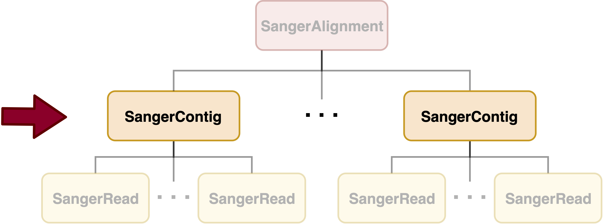
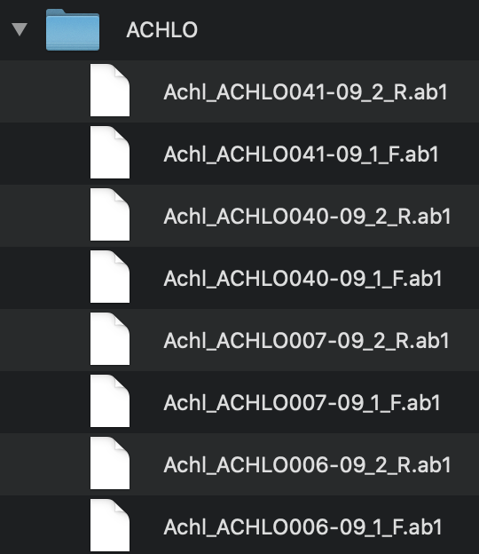
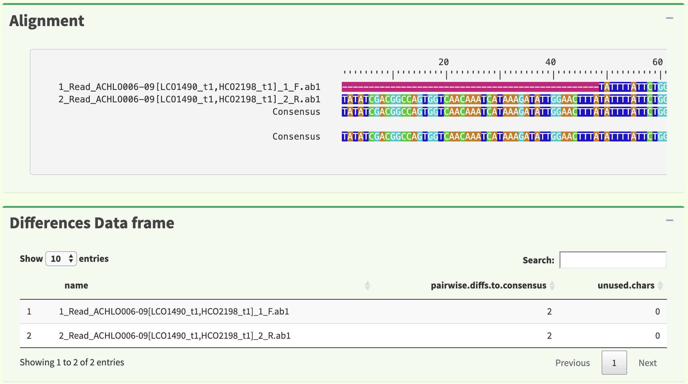
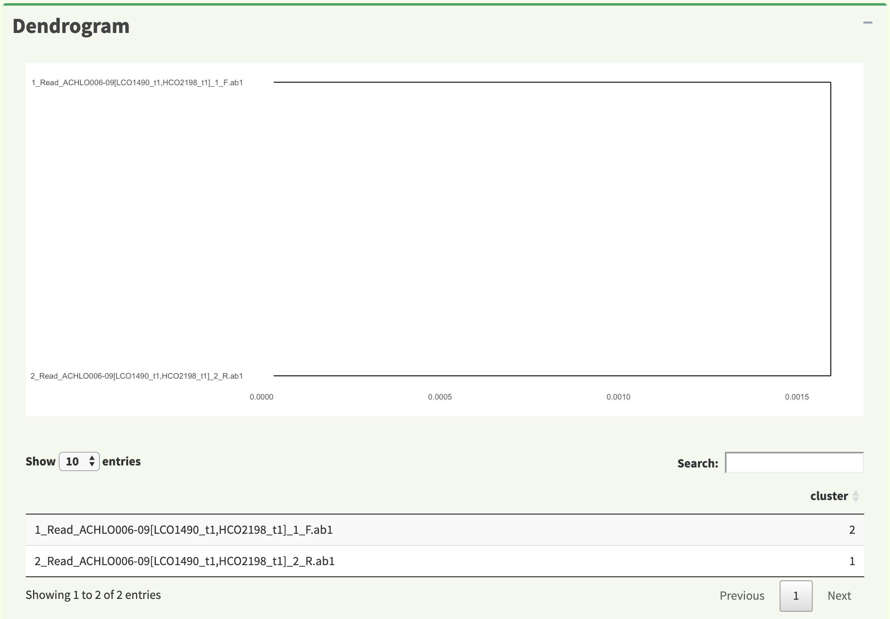
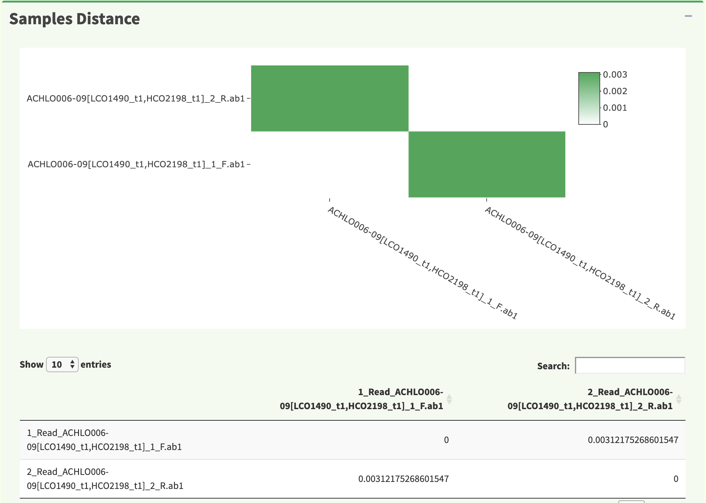
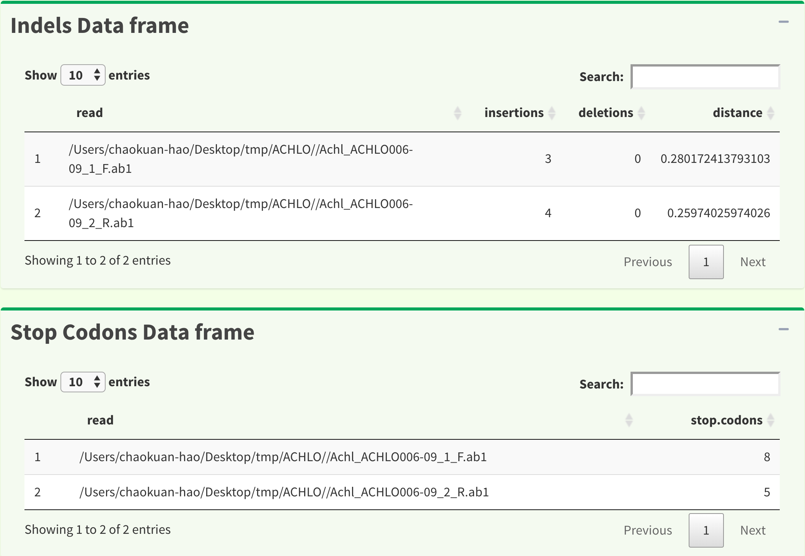
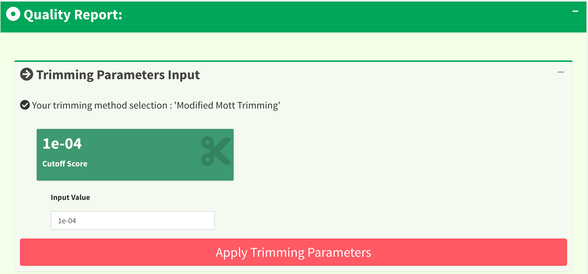
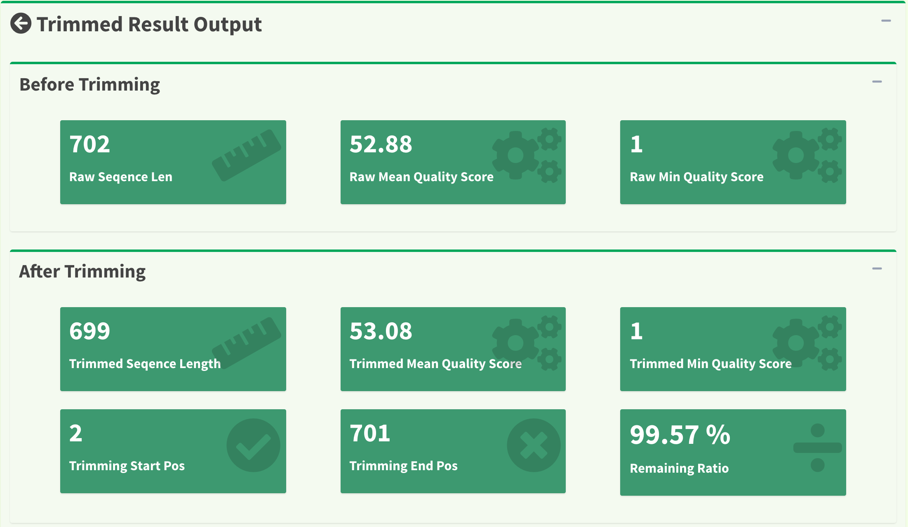
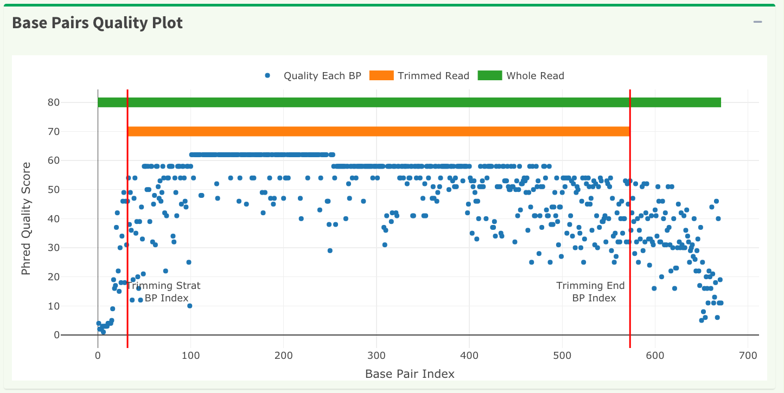
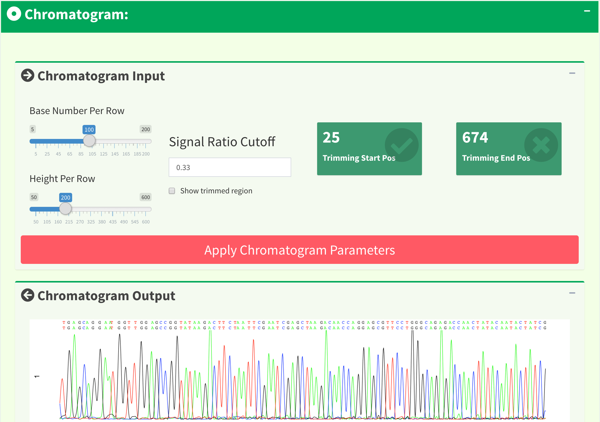

Advanced User Guide - *SangerContig* (**AB1**)
==============================================

*SangerContig* is the second level in sangeranalyseR showed in :ref:`Figure_1<SangerContig_hierarchy>` which corresponds to a contig in Sanger sequencing. Among slots inside it, there are two lists, forward and reverse read list, storing *SangerRead* in the corresponding direction. In this section, we are going to go through details about sangeranalyseR data analysis in *SangerContig* level from **AB1** file input.

.. _SangerContig_hierarchy:

   Figure 1. Hierarchy of classes in sangeranalyseR, *SangerContig* level.

|

Preparing *SangerContig* **AB1** input
--------------------------------------

The main input file format to create *SangerRead* instance is **AB1**. Before starting the analysis, users need to prepare all **AB1** files inside one directory. It is the parent directory and all **AB1** files must be in the first layer of it; in other words, there should not be any directory containing any **AB1** files inside the parent directory. Because sangeranalyseR will group **AB1** files based on their direction automatically, users have to follow the file naming regulations below:

.. note::

    *  All the input files must have **.ab1** as its file extension
    *  All the input files must have the same contig name in its filename.
    *  Forward or reverse direction also has to be specified in the filename.

There are four parameters, :code:`parentDirectory`, :code:`contigName`, :code:`suffixForwardRegExp` and :code:`suffixReverseRegExp`,that users need to provide so that program can automatically match correct **AB1** files and divide them into forward and reverse direction.

.. note::

  * :code:`parentDirectory`: The root directory that contains all the **AB1** files. It can be absolute or relative path. We suggest users to put only target **AB1** files inside this directory without other unrelated files.
  * :code:`contigName`: The value of this parameter is a regular expression that matches filenames that are going to be included in the *SangerContig* level analysis. :code:`grepl` function in R is used.
  * :code:`suffixForwardRegExp`: The value of this parameter is a regular expression that matches all filenames in forward direction. :code:`grepl` function in R is used to select forward reads from all **AB1** files.
  * :code:`suffixReverseRegExp`: The value of this parameter is a regular expression that matches all filenames in reverse direction. :code:`grepl` function in R is used to select reverse reads from all **AB1** files.

Here, we have an example:

.. _SangerContig_file_structure:

   Figure 2. *SangerContig* filename regulation.

:ref:`Figure_2<SangerContig_file_structure>` shows the file naming regulation and hierarchy. In this example, :code:`ACHLO` is the parent directory that contains all **AB1** files. They must be in the first layer of the directory.

sangeranalyseR will first match the :code:`contigName` to exclude unrelated files and then separate the forward and reverse reads by matching :code:`suffixForwardRegExp` and :code:`suffixReverseRegExp`. Therefore, it is important to make sure all target **AB1** files share the same :code:`contigName` and carefully select :code:`suffixForwardRegExp` and :code:`suffixReverseRegExp`. The bad file naming and wrong regex matching might accidentally include reverse reads into the forward read list or vice versa, which will make the program generate totally wrong results. Therefore, users should have a consistent naming strategy. In this example, :code:`"_[0-9]*_F.ab1$"`, :code:`"_[0-9]*_R.ab1$"` for matching forward and reverse reads are highly suggested and are used as default. Moreover, it is a good habit to index your reads in the same contig group because there might be more than one read that are in the forward or reverse direction.

.. _sangeranalyseR_filename_convention_SangerContig:
.. figure::  ../image/sangeranalyseR_filename_convention.png
   :align:   center
   :scale:   25 %

   Figure 3. Suggested **AB1** file naming regulation - *SangerContig*.

:ref:`Figure_3<sangeranalyseR_filename_convention_SangerContig>` shows the suggested **AB1** file naming regulation. Users are strongly recommended to follow this file naming regulation and use the default :code:`suffixForwardRegExp` : ":code:`_[0-9]*_F.ab1$`" and :code:`suffixReverseRegExp` : ":code:`_[0-9]*_R.ab1$`" to reduce any chance of error.

|

Creating *SangerContig* instance from **AB1**
---------------------------------------------

After preparing the input directory, we can create the *SangerContig* S4 instance by running :code:`SangerContig` constructor function or :code:`new` method. The constructor function is a wrapper for :code:`new` method and it makes instance creation more intuitive. Most parameters in the constructor have their own default values. In the constructor below, we list important parameters.

.. code-block:: R

    sangerContig <- SangerContig(inputSource            = "ABIF",
                                 parentDirectory        = "./tmp/",
                                 contigName             = "ACHLO006-09[LCO1490_t1.HCO2198_t1]",
                                 suffixForwardRegExp    = "[0-9]*_F.ab1",
                                 suffixReverseRegExp    = "[0-9]*_R.ab1",
                                 TrimmingMethod         = "M1",
                                 M1TrimmingCutoff       = 0.0001,
                                 M2CutoffQualityScore   = NULL,
                                 M2SlidingWindowSize    = NULL,
                                 baseNumPerRow          = 100,
                                 heightPerRow           = 200,
                                 signalRatioCutoff      = 0.33,
                                 showTrimmed            = TRUE,
                                 refAminoAcidSeq        = "",
                                 minReadsNum            = 2,
                                 minReadLength          = 20,
                                 minFractionCall        = 0.5,
                                 maxFractionLost        = 0.5,
                                 geneticCode            = GENETIC_CODE,
                                 acceptStopCodons       = TRUE,
                                 readingFrame           = 1,
                                 processorsNum          = NULL)

In this example, :code:`contigName` is set to :code:`"ACHLO006-09[LCO1490_t1.HCO2198_t1]"`, so only :code:`"ACHLO006-09[LCO1490_t1.HCO2198_t1]_1_F.ab1"` and :code:`"ACHLO006-09[LCO1490_t1.HCO2198_t1]_2_R.ab1"` will be selected to align to a contig.

The inputs of :code:`SangerContig` constructor function and :code:`new` method are same. For more details about *SangerContig* inputs & slots definition, please refer to `sangeranalyseR reference manual (need update) <http://packages.python.org/an_example_pypi_project/>`_. The created *SangerContig* instance, :code:`sangerContig`, is used as the input for the following functions.

|

Updating *SangerContig* quality trimming parameters
---------------------------------------------------

In the previous :ref:`Creating *SangerContig* instance from **AB1**` part, the constructor function will apply the quality trimming parameters to all reads. After creating the SangerContig S4 instance, users can change the trimming parameters by running :code:`updateQualityParam` function which will update all reads with the new trimming parameters and redo reads alignment. If users want to do quality trimming read by read instead of all at once, please read :ref:`Launching *SangerContig* Shiny app` page.

.. code-block:: R

   newSangerContig <- updateQualityParam(sangerContig,
                                         TrimmingMethod       = "M2",
                                         M1TrimmingCutoff     = NULL,
                                         M2CutoffQualityScore = 29,
                                         M2SlidingWindowSize  = 15)

|

Launching *SangerContig* Shiny app
----------------------------------

We create an interactive local Shiny app for users to go into each *SangerRead* in *SangerContig* instance. Users only need to run one function, :code:`launchAppSC`, with previously created instance as input and the *SangerContig* Shiny app will pop up. Here, we will go through pages in the two levels, *SangerRead* and *SangerContig* pages.

.. code-block:: R

  launchAppSC(newSangerContig)

*SangerContig* page (SC app)
++++++++++++++++++++++++++++
*SangerContig* page is the initial page of *SangerContig* Shiny app. :ref:`Figure 4<SangerContig_shiny_SangerContig_page>` shows the overview page of the contig. Notice that there is a red "Re-calculate Contig" button. Users need to click the button after changing the quality trimming parameters in order to get the updated information. In SangerContig page, there are two expendable tabs, “Forward Reads” and “Reverse Reads” storing the corresponding reads on the left-hand side navigation panel in :ref:`Figure 4<SangerContig_shiny_SangerContig_page>`. See :ref:`*SangerRead* page (SC app)` for more details of the subpage.

.. _SangerContig_shiny_SangerContig_page:
.. figure::  ../image/SangerContig_shiny_SangerContig_page.png
   :align:   center
   :scale:   25 %

   Figure 4. *SangerContig* Shiny app initial page - *SangerContig* page.

The information provided in this page are input parameters and contig results including “genetic code table”, “reference amino acid sequence”, “reads alignment”, “difference data frame”, “dendrogram”, “sample distance heatmap”, “indels data frame”, and “stop codons data frame”.

:ref:`Figure 5<SangerContig_shiny_alignment_differenceDF>` shows reads alignment result and difference data frame. The alignment is generated by :code:`AlignSeqs` or :code:`AlignTranslation` function in `DECIPHER <https://bioconductor.org/packages/release/bioc/html/DECIPHER.html>`_ package.

.. _SangerContig_shiny_alignment_differenceDF:

   Figure 5. *SangerContig* page - reads alignment and difference data frame.

:ref:`Figure 6<SangerContig_shiny_dendrogram>` shows dendrogram result in both plot and in data frame. The results are generated by :code:`IdClusters` function in `DECIPHER <https://bioconductor.org/packages/release/bioc/html/DECIPHER.html>`_ package.

.. _SangerContig_shiny_dendrogram:

   Figure 6. *SangerContig* page - dendrogram.

:ref:`Figure 7<SangerContig_shiny_samples_distance>` shows distance between **AB1** files. The results are generated by :code:`DistanceMatrix` function in `DECIPHER <https://bioconductor.org/packages/release/bioc/html/DECIPHER.html>`_ package. The heatmap is generated by :code:`plot_ly` function in `plotly <https://plot.ly/r/>`_ package.

.. _SangerContig_shiny_samples_distance:

   Figure 7. *SangerContig* page - samples distance.

:ref:`Figure 8<SangerContig_shiny_indelsDF_stopcodonsDF>` shows insertions, deletions and stop codons data frame.

.. _SangerContig_shiny_indelsDF_stopcodonsDF:

   Figure 8. *SangerContig* page - indels and stop codons data frame.

*SangerRead* page (SC app)
++++++++++++++++++++++++++
Now, let's go to the next level which is also the lowest level, *SangerRead* page. *SangerRead* page contains all details of a read including its trimming and chromatogram inputs and results. All reads are in "forward" or "reverse" direction. In this example, there is one read in each direction and :ref:`Figure 9<SangerContig_shiny_SangerRead_page>` shows "1 Forward Read" page. This page provides basic information, quality trimming inputs, chromatogram plotting inputs etc. Primary/secondary sequences and quality Phred scores table in this figure are dynamic based on the :code:`signalRatioCutoff` value for base calling and the length of them are always same. Another thing to mention is that primary/secondary sequences and the sequences in the chromatogram in :ref:`Figure 14<SangerContig_shiny_chromatogram_panel>` below will always be same after trimming and their color codings for A/T/C/G are same as well.

.. _SangerContig_shiny_SangerRead_page:
.. figure::  ../image/SangerContig_shiny_SangerRead_page.png
   :align:   center
   :scale:   25 %

   Figure 9. *SangerContig* Shiny app - *SangerRead* page

In quality trimming steps, we removes fragment at both ends of sequencing reads with low quality score. It is important because trimmed reads will improves alignment results. :ref:`Figure 10<SangerContig_shiny_trimming_1>` shows the UI for Trimming Method 1 (M1): ‘Modified Mott Trimming’. This method is implemented in `Phred <http://www.phrap.org/phredphrapconsed.html>`_. Users can change the cutoff score and click “Apply Trimming Parameters" button to update the UI. The value of input must be between 0 and 1. If the input is invalid, the cutoff score will be set to default 0.0001.

.. _SangerContig_shiny_trimming_1:

   Figure 10. *SangerRead* page - Trimming Method 1 (M1): ‘Modified Mott Trimming’ UI.

:ref:`Figure 11<SangerContig_shiny_trimming_2>` shows another quality trimming method for users to choose from, Trimming Method 2 (M2): ‘Trimmomatics Sliding Window Trimming’. This method is implemented in `Trimmomatics <http://www.usadellab.org/cms/?page=trimmomatic>`_. Users can change the cutoff quality score as well as sliding window size and click “Apply Trimming Parameters" button to update the UI. The value of cutoff quality score must be between 0 and 60 (default 20); the value of sliding window size must be between 0 and 40 (default 10). If the inputs are invalid, their values will be set to default.

.. _SangerContig_shiny_trimming_2:
.. figure::  ../image/SangerContig_shiny_trimming_2.png
   :align:   center
   :scale:   45 %

   Figure 11. *SangerRead* page - Trimming Method 2 (M2): ‘Trimmomatics Sliding Window Trimming’ UI.

:ref:`Figure 12<SangerContig_shiny_trimmed_before_after>` shows the quality report before and after trimming. After clicking the “Apply Trimming Parameters” button in :ref:`Figure 10<SangerContig_shiny_trimming_1>` or :ref:`Figure 11<SangerContig_shiny_trimming_2>`, the values of these information boxes will be updated to the latest values.

.. _SangerContig_shiny_trimmed_before_after:

   Figure 12. *SangerRead* page - read quality report before / after trimming.

In :ref:`Figure 13<SangerContig_shiny_bp_quality_plot>`, the x-axis is the index of the base pairs; the y-axis is the Phred quality score. The green horizontal bar at the top is the raw read region and the orange horizontal bar represents the remaining read region. Both :ref:`Figure 13<SangerContig_shiny_bp_quality_plot>` timming plot and :ref:`Figure 14<SangerContig_shiny_chromatogram_panel>` chromatogram will be updated once users change the quality trimming parameters and click the “Apply Trimming Parameters" button in :ref:`Figure 14<SangerContig_shiny_chromatogram_panel>`.

.. _SangerContig_shiny_bp_quality_plot:

   Figure 13. *SangerContig* page - quality trimming plot.

If we only see primary and secondary sequences in the table, we will loose some variations. Chromatogram is very helpful to check the peak resolution. :ref:`Figure 14<SangerContig_shiny_chromatogram_panel>` shows the panel of plotting chromatogram. Users can change four parameters: :code:`Base Number Per Row`, :code:`Height Per Row`, :code:`Signal Ratio Cutoff`, and :code:`Show Trimmed Region`. Among them, :code:`Signal Ratio Cutoff` is a key parameter. If its value is default value 0.33, it indicates that the lower peak should be at least 1/3rd as high as the higher peak for it count as a secondary peak.

.. _SangerContig_shiny_chromatogram_panel:

   Figure 14. *SangerContig* page - chromatogram panel.

Here is an example of applying new chromatogram parameters. We click “Show Trimmed Region” to set its value from :code:`FALSE` to :code:`TRUE` and click the "Apply Chromatogram Parameters" button. :ref:`Figure 15<SangerContig_plotting_popup>` shows the loading notification popup during base calling and chromatogram plotting.

.. _SangerContig_plotting_popup:
.. figure::  ../image/SangerContig_plotting_popup.png
   :align:   center
   :scale:   45 %

   Figure 15. *SangerContig* page - loading notification popup during replotting chromatogram.

After replotting the chromatogram, we can see that trimmed region is showed in red striped region. :ref:`Figure 16<SangerContig_shiny_chromatogram>` shows part of the the chromatogram (1 bp ~ 240 bp). Moreover, chromatogram will be replotted when trimmed positions or chromatogram parameters are updated.

.. _SangerContig_shiny_chromatogram:
.. figure::  ../image/SangerContig_shiny_chromatogram.png
   :align:   center
   :scale:   45 %

   Figure 16. *SangerContig* page - chromatogram with trimmed region showed.

To let users browse the trimmed primary/secondary sequences without finding “Trimming Start Point” and “Trimming End Point” by themselves, we provide the final trimmed primary/secondary sequences that will be used for reads alignment with quality scores in table format in :ref:`Figure 17<SangerContig_shiny_trimmed_sequences>`. Frameshift amino acid sequences are also provided.

.. _SangerContig_shiny_trimmed_sequences:
.. figure::  ../image/SangerContig_shiny_trimmed_sequences.png
   :align:   center
   :scale:   45 %

   Figure 17. *SangerContig* page - trimmed primary/secondary sequences and Phred quality score in table format.

We have updated the trimming and chromatogram parameters for each read. Now, we need to click “Re-calculate contig” button to do alignment again. Last but not least, we can save all data into a new ‘SangerContig’ S4 instance by clicking “Save S4 Instance button”. New S4 instance will be saved in **Rda** format. Users can run :code:`readRDS` function to load it into current R environment. :ref:`Figure 18<SangerContig_shiny_save_popup>` shows some hints in the save notification popup.

.. _SangerContig_shiny_save_popup:
.. figure::  ../image/SangerContig_shiny_save_popup.png
   :align:   center
   :scale:   40 %

   Figure 18. *SangerContig* page - saving notification popup.

|

Writing *SangerContig* FASTA files :sub:`(AB1)`
-----------------------------------------------
Users can write the *SangerContig* instance to **FASTA** files. There are four options for users to choose from in :code:`selection` parameter.

* :code:`reads_unalignment`: Writing reads into a single **FASTA** file (only trimmed without alignment).
* :code:`reads_alignment`: Writing reads alignment and contig read to a single **FASTA** file.
* :code:`contig`: Writing the contig to a single **FASTA** file.
* :code:`all`: Writing reads, reads alignment, and the contig into three different files.

Below is the one-line function that users need to run. This function mainly depends on :code:`writeXStringSet` function in `Biostrings <https://bioconductor.org/packages/release/bioc/html/Biostrings.html>`_ R package. Users can set the compression level through :code:`writeFastaSA` function.

.. code-block:: R

   writeFastaSC(newSangerContig,
                outputDir         = tempdir(),
                compress          = FALSE,
                compression_level = NA,
                selection         = "all")

Users can download the output FASTA file of this example through the following three links:

* `reads_unalignment FASTA file <https://howardchao.github.io/sangeranalyseR_report/SangerContig/AB1/ACHLO006-09[LCO1490_t1,HCO2198_t1]_reads_unalignment.fa>`_
* `reads_alignment FASTA file <https://howardchao.github.io/sangeranalyseR_report/SangerContig/AB1/ACHLO006-09[LCO1490_t1,HCO2198_t1]_reads_alignment.fa>`_
* `contig FASTA file <https://howardchao.github.io/sangeranalyseR_report/SangerContig/AB1/ACHLO006-09[LCO1490_t1,HCO2198_t1]_contig.fa>`_

|

Generating *SangerContig* report :sub:`(AB1)`
---------------------------------------------
Last but not least, users can save *SangerContig* instance into a report after the analysis. The report will be generated in **HTML** by knitting **Rmd** files.

Users can set :code:`includeSangerRead` parameter to decide to which level the *SangerContig* report will go. Moreover, after the reports are generated,
users can easily navigate through reports in different levels within the **HTML** file.

One thing to pay attention to is that if users have many reads, it will take quite a long time to write out all reports. If users only want to generate the contig result, remember to set :code:`includeSangerRead` to :code:`FALSE` in order to save time.

.. code-block:: R

   generateReportSC(newSangerContig,
                    outputDir           = tempdir(),
                    includeSangerRead   = TRUE)

`SangerRead_Report_ab1.html <https://howardchao.github.io/sangeranalyseR_report/SangerContig/AB1/ACHLO006-09[LCO1490_t1,HCO2198_t1]/SangerContig_Report.html>`_ is the generated *SangerContig* report html of this example. Users can access to '*Basic Information*', '*SangerContig Input Parameters*', '*Contig Sequence*' and '*Contig Results*' sections inside this report. Furthermore, users can check all forward and reverse *SangerRead* html reports which belong to this *SangerContig*.
