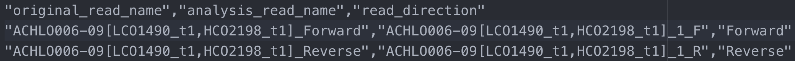
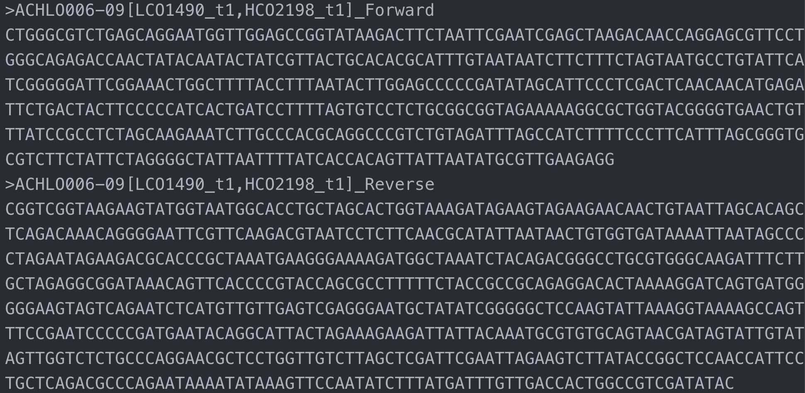

Advanced User Guide - *SangerContig* (**FASTA**)
================================================

*SangerContig* is in the intermediate level of sangeranalyseR (:ref:`Figure_1<SangerContig_hierarchy_fasta>`), and each *SangerContig* instance corresponds to a contig in a Sanger sequencing experiment. Among its slots, there are two lists, forward and reverse read list, storing *SangerRead* in the corresponding direction. In this section, we are going to go through details about sangeranalyseR data analysis in *SangerContig* level with **FASTA** file input.

.. _SangerContig_hierarchy_fasta:
.. figure::  ../image/SangerContig_hierarchy.png
   :align:   center
   :scale:   20 %

   Figure 1. Hierarchy of classes in sangeranalyseR, *SangerContig* level.

|

Preparing *SangerContig* **FASTA** input
+++++++++++++++++++++++++++++++++++++++++

In :ref:`Advanced User Guide - *SangerContig* (**AB1**)`, we demonstrated how to use **AB1** input files to create *SangerContig* instance. Here, we explain another input format - the **FASTA** input. Before starting the analysis, users need to prepare one **FASTA** file, which must end with **.fa** or **.fasta**, containing sequences of all reads. Inside the **FASTA** file, the strings starting with ">" before each read are the read names, and sangeranalyseR will group reads based on the "contig name" and "read direction" in their names automatically. There are two ways of group reads which are **"regular expression matching"** and **"CSV file matching"**, and following are instructions of how to prepare your **FASTA** input file.

(1) "regular expression matching" *SangerContig* inputs (**FASTA**)
---------------------------------------------------------------------

For regular expression matching method, users have to follow the read-naming regulations below:

.. note::

    *  All reads in the same contig group must include the same contig name in their read names.
    *  Forward or reverse direction also has to be specified in their read names.

There are four parameters, :code:`FASTA_File`, :code:`contigName`, :code:`REGEX_SuffixForward` and :code:`REGEX_SuffixReverse`, that define the grouping rule to let sangeranalyseR automatically match correct reads in **FASTA** file and divide them into forward and reverse directions.

.. note::

  * :code:`FASTA_File`: this is the path to **FASTA** file that contains sequences of all reads, and it can be either an absolute or relative path. 
  * :code:`contigName`: this is a regular expression that matches read names that are going to be included in the *SangerContig* analysis. :code:`grepl` function in R is used.
  * :code:`REGEX_SuffixForward`: this is a regular expression that matches all read names in forward direction. :code:`grepl` function in R is used.
  * :code:`REGEX_SuffixReverse`: this is a regular expression that matches all read names in reverse direction. :code:`grepl` function in R is used.

If you don't know what regular expression is, don't panic - it's just a way of recognising text. Please refer to :ref:`What is a regular expression?` for more details. Here is an example of how it works in sangeranalseR:

No doubt read names in the original **FASTA** file will not follow the naming regulation; however, it is highly not recommended to change the name directly in the raw **FASTA** file. Therefore, we provide a feature to let users do read names mapping conversion by a **CSV** file showed in :ref:`Figure_2<SangerContig_read_names_conversion>`. The first column is "original_read_name" which are the read names in the raw **FASTA** file, and the second column is "analysis_read_name" which are the read names that follow the naming regulation. The read names will be mapped onto the names in "original_read_name" without changing the raw **FASTA** file. :code:`namesConversionCSV` is the parameter that stores the path to this **CSV** file.

.. _SangerContig_read_names_conversion:

   Figure 2. *SangerContig* **CSV** file - read names conversion.

Here, we have an example:

.. _SangerContig_fasta_input:

   Figure 3. *SangerContig* **FASTA** input file.

:ref:`Figure_3<SangerContig_fasta_input>` shows the **FASTA** input file and the read names in it will be mapped onto the **CSV** file showed in :ref:`Figure_2<SangerContig_read_names_conversion>`. sangeranalyseR will first match the :code:`contigName` to exclude unrelated reads and then separate the forward and reverse reads by matching :code:`REGEX_SuffixForward` and :code:`REGEX_SuffixReverse`. Therefore, it is important to make sure all target reads share the same :code:`contigName` and carefully select :code:`REGEX_SuffixForward` and :code:`REGEX_SuffixReverse`. The bad file-naming and wrong regex matching might accidentally include reverse reads into the forward read list or vice versa, which will make the program generate totally wrong results. Therefore, users should have a consistent naming strategy. In this example, ":code:`__[0-9]+_F`", ":code:`__[0-9]+_R`" for matching forward and reverse reads are highly suggested. It is a good habit to index your reads in the same contig group because there might be more than one read that are in the forward or reverse direction.

.. _sangeranalyseR_filename_convention_SangerContig_fasta:
.. figure::  ../image/sangeranalyseR_filename_convention_fasta.png
   :align:   center
   :scale:   25 %

   Figure 4. Suggested read naming regulation in **FASTA** file - *SangerContig*.

:ref:`Figure_4<sangeranalyseR_filename_convention_SangerContig_fasta>` shows the suggested read naming regulation which is used in the "analysis_read_name" column in **CSV** file (:ref:`Figure_2<SangerContig_read_names_conversion>`). Users are strongly recommended to follow this file-naming regulation and use :code:`REGEX_SuffixForward` : ":code:`__[0-9]+_F`" and :code:`REGEX_SuffixReverse` : ":code:`__[0-9]+_R`" to reduce any chance of error.

(2) "CSV file matching" *SangerContig* inputs (**FASTA**)
----------------------------------------------------------

|

Creating *SangerContig* instance from **FASTA**
++++++++++++++++++++++++++++++++++++++++++++++++++

After preparing the input directory, we can create the *SangerContig* S4 instance by running :code:`SangerContig` constructor function or :code:`new` method. The constructor function is a wrapper for :code:`new` method and it makes instance creation more intuitive. 

Most parameters in the constructor have their own default values; however, since the **FASTA** file input method is for those who do not want to do quality trimming and base calling for each *SangerRead* in *SangerContig*, it does not contain quality trimming and chromatogram input parameters and results in *SangerRead* slots. In the constructor below, we list important parameters.

.. code-block:: R

   sangerContigFa <- SangerContig(inputSource           = "FASTA",
                                  FASTA_File         = "Achl_ACHLO006-09.fa",
                                  namesConversionCSV    = "names_conversion_1.csv",
                                  contigName            = "Achl_ACHLO006-09",
                                  REGEX_SuffixForward   = "__[0-9]+_F",
                                  REGEX_SuffixReverse   = "__[0-9]+_R",
                                  refAminoAcidSeq       = "SRQWLFSTNHKDIGTLYFIFGAWAGMVGTSLSILIRAELGHPGALIGDDQIYNVIVTAHAFIMIFFMVMPIMIGGFGNWLVPLMLGAPDMAFPRMNNMSFWLLPPALSLLLVSSMVENGAGTGWTVYPPLSAGIAHGGASVDLAIFSLHLAGISSILGAVNFITTVINMRSTGISLDRMPLFVWSVVITALLLLLSLPVLAGAITMLLTDRNLNTSFFDPAGGGDPILYQHLFWFFGHPEVYILILPGFGMISHIISQESGKKETFGSLGMIYAMLAIGLLGFIVWAHHMFTVGMDVDTRAYFTSATMIIAVPTGIKIFSWLATLHGTQLSYSPAILWALGFVFLFTVGGLTGVVLANSSVDIILHDTYYVVAHFHYVLSMGAVFAIMAGFIHWYPLFTGLTLNNKWLKSHFIIMFIGVNLTFFPQHFLGLAGMPRRYSDYPDAYTTWNIVSTIGSTISLLGILFFFFIIWESLVSQRQVIYPIQLNSSIEWYQNTPPAEHSYSELPLLTN")

In this example, :code:`contigName` is set to :code:`"Achl_ACHLO006-09"`, so only :code:`"Achl_ACHLO006-09_1_F.ab1"` and :code:`"Achl_ACHLO006-09_2_R.ab1"` reads will be selected from **FASTA** file to align into a contig.

The inputs of :code:`SangerContig` constructor function and :code:`new` method are same. For more details about *SangerContig* inputs and slots definition, please refer to `sangeranalyseR reference manual (need update) <http://packages.python.org/an_example_pypi_project/>`_.

|

Writing *SangerContig* FASTA files :sub:`(FASTA)`
++++++++++++++++++++++++++++++++++++++++++++++++++
Users can write the *SangerContig* instance to **FASTA** files. There are four options for users to choose from in :code:`selection` parameter.

* :code:`reads_unalignment`: Writing reads into a single **FASTA** file.
* :code:`reads_alignment`: Writing reads alignment and the aligned contig to a single **FASTA** file.
* :code:`contig`: Writing the contig to a single **FASTA** file.
* :code:`all`: Executing the three options mentioned above and writing *SangerContig* instance into three different files.

Below is the one-line function that users need to run. This function mainly depends on :code:`writeXStringSet` function in `Biostrings <https://bioconductor.org/packages/release/bioc/html/Biostrings.html>`_ R package. Users can set the compression level through :code:`writeFasta` function.

.. code-block:: R

   writeFasta(sangerContigFa,
              outputDir         = tempdir(),
              compress          = FALSE,
              compression_level = NA,
              selection         = "all")

Users can download the output **FASTA** file of this example through the following three links:

* `reads_unalignment FASTA file <https://howardchao.github.io/sangeranalyseR_report/SangerContig/FASTA/ACHLO006-09[LCO1490_t1,HCO2198_t1]_reads_unalignment.fa>`_
* `reads_alignment FASTA file <https://howardchao.github.io/sangeranalyseR_report/SangerContig/FASTA/ACHLO006-09[LCO1490_t1,HCO2198_t1]_reads_alignment.fa>`_
* `contig FASTA file <https://howardchao.github.io/sangeranalyseR_report/SangerContig/FASTA/ACHLO006-09[LCO1490_t1,HCO2198_t1]_contig.fa>`_

|

Generating *SangerContig* report :sub:`(FASTA)`
++++++++++++++++++++++++++++++++++++++++++++++++++
Last but not least, users can save *SangerContig* instance into a report after the analysis. The report will be generated in **HTML** by knitting **Rmd** files.

Users can set :code:`includeSangerRead` parameter to decide to which level the *SangerContig* report will go. Moreover, after the reports are generated, users can easily navigate through reports in different levels within the **HTML** file.

One thing to pay attention to is that if users have many reads, it would take quite a long time to write out all reports. If users only want to generate the contig result, remember to set :code:`includeSangerRead` to :code:`FALSE` in order to save time.

.. code-block:: R

   generateReport(sangerContigFa,
                  outputDir           = tempdir(),
                  includeSangerRead   = TRUE)

Users can access to '*Basic Information*', '*SangerContig Input Parameters*', '*Contig Sequence*' and '*Contig Results*' sections inside the generated `SangerContig html report of this example <https://howardchao.github.io/sangeranalyseR_report/SangerContig/FASTA/ACHLO006-09[LCO1490_t1,HCO2198_t1]/SangerContig_Report.html>`_. Furthermore, users can also navigate through html reports of all forward and reverse *SangerRead* in this *SangerContig* report.

-----

|
|

A Reproducible Example (*SangerContig*, **FASTA**)
++++++++++++++++++++++++++++++++++++++++++++++++++

1. Preparing *SangerContig* **FASTA** input
---------------------------------------------
The data of this example is in the sangeranalyseR package; thus, you can simply get its path from the library.

.. code-block:: R

      rawDataDir <- system.file("extdata", package = "sangeranalyseR")
      fastaFN <- file.path(rawDataDir, "fasta", "SangerContig", "Achl_ACHLO006-09.fa")

|

2. Creating *SangerContig* instance from **FASTA**
----------------------------------------------------
Run the following on-liner to create the *SangerContig* object.

.. code-block:: R

   # using `constructor` function to create SangerRead instance
   my_sangerContigFa <- SangerContig(inputSource           = "FASTA",
                                     processMethod         = "REGEX",
                                     FASTA_File            = fastaFN,
                                     contigName            =  "Achl_ACHLO006-09",
                                     REGEX_SuffixForward   = "_[0-9]*_F$",
                                     REGEX_SuffixReverse   = "_[0-9]*_R$",
                                     refAminoAcidSeq       = "SRQWLFSTNHKDIGTLYFIFGAWAGMVGTSLSILIRAELGHPGALIGDDQIYNVIVTAHAFIMIFFMVMPIMIGGFGNWLVPLMLGAPDMAFPRMNNMSFWLLPPALSLLLVSSMVENGAGTGWTVYPPLSAGIAHGGASVDLAIFSLHLAGISSILGAVNFITTVINMRSTGISLDRMPLFVWSVVITALLLLLSLPVLAGAITMLLTDRNLNTSFFDPAGGGDPILYQHLFWFFGHPEVYILILPGFGMISHIISQESGKKETFGSLGMIYAMLAIGLLGFIVWAHHMFTVGMDVDTRAYFTSATMIIAVPTGIKIFSWLATLHGTQLSYSPAILWALGFVFLFTVGGLTGVVLANSSVDIILHDTYYVVAHFHYVLSMGAVFAIMAGFIHWYPLFTGLTLNNKWLKSHFIIMFIGVNLTFFPQHFLGLAGMPRRYSDYPDAYTTWNIVSTIGSTISLLGILFFFFIIWESLVSQRQVIYPIQLNSSIEWYQNTPPAEHSYSELPLLTN")

   # using `new` method to create SangerRead instance
   my_sangerContigFa <- new("SangerContig",
                            inputSource           = "FASTA",
                            processMethod         = "REGEX",
                            FASTA_File            = fastaFN,
                            contigName            = "Achl_ACHLO006-09",
                            REGEX_SuffixForward   = "_[0-9]*_F$",
                            REGEX_SuffixReverse   = "_[0-9]*_R$",
                            refAminoAcidSeq       = "SRQWLFSTNHKDIGTLYFIFGAWAGMVGTSLSILIRAELGHPGALIGDDQIYNVIVTAHAFIMIFFMVMPIMIGGFGNWLVPLMLGAPDMAFPRMNNMSFWLLPPALSLLLVSSMVENGAGTGWTVYPPLSAGIAHGGASVDLAIFSLHLAGISSILGAVNFITTVINMRSTGISLDRMPLFVWSVVITALLLLLSLPVLAGAITMLLTDRNLNTSFFDPAGGGDPILYQHLFWFFGHPEVYILILPGFGMISHIISQESGKKETFGSLGMIYAMLAIGLLGFIVWAHHMFTVGMDVDTRAYFTSATMIIAVPTGIKIFSWLATLHGTQLSYSPAILWALGFVFLFTVGGLTGVVLANSSVDIILHDTYYVVAHFHYVLSMGAVFAIMAGFIHWYPLFTGLTLNNKWLKSHFIIMFIGVNLTFFPQHFLGLAGMPRRYSDYPDAYTTWNIVSTIGSTISLLGILFFFFIIWESLVSQRQVIYPIQLNSSIEWYQNTPPAEHSYSELPLLTN")

.. container:: toggle

    .. container:: header

        Following is the R shell output that you will get.
    .. code-block::

         INFO [2021-29-06 18:13:55] ========================================================
         INFO [2021-29-06 18:13:55] ================ Creating 'SangerContig' ===============
         INFO [2021-29-06 18:13:55] ========================================================
         INFO [2021-29-06 18:13:55]   >> Contig Name: 'Achl_ACHLO006-09'
         INFO [2021-29-06 18:13:55]   >> You are using Regular Expression Method to group reads in FASTA file (No CSV file)!
         INFO [2021-29-06 18:13:55] >> Your contig name is Achl_ACHLO006-09
         SUCCESS [2021-29-06 18:13:56] --------------------------------------------------------
         SUCCESS [2021-29-06 18:13:56] -------- 'SangerRead' S4 instance is created !! --------
         SUCCESS [2021-29-06 18:13:56] --------------------------------------------------------
         SUCCESS [2021-29-06 18:13:56]    >> 'Achl_ACHLO006-09_1_F' is created (Forward Read; FASTA).
         SUCCESS [2021-29-06 18:13:57] --------------------------------------------------------
         SUCCESS [2021-29-06 18:13:57] -------- 'SangerRead' S4 instance is created !! --------
         SUCCESS [2021-29-06 18:13:57] --------------------------------------------------------
         SUCCESS [2021-29-06 18:13:57]    >> 'Achl_ACHLO006-09_2_R' is created (Reverse Read; FASTA).
         INFO [2021-29-06 18:13:57]    >> The number of reads detected: 2
         INFO [2021-29-06 18:13:57] Correcting frameshifts in reads using amino acidreference sequence
         Assessing frameshifts in nucleotide sequences:
         |=============================================================================| 100%

         Time difference of 0.22 secs
         SUCCESS [2021-29-06 18:14:07] ==========================================================
         SUCCESS [2021-29-06 18:14:07] ======== 'SangerContig' S4 instance is created !! ========
         SUCCESS [2021-29-06 18:14:07] ==========================================================
         INFO [2021-29-06 18:14:07]    >> 2 read(s) created from FASTA file.
         INFO [2021-29-06 18:14:07]      >> 1 reads assigned to 'forward reads' according to 'regular expression'.
         INFO [2021-29-06 18:14:07]      >> 1 reads assigned to 'reverse reads' according to 'regular expression'.
         DEBUG [2021-29-06 18:14:07]    >> For more information, please run 'object'
         DEBUG [2021-29-06 18:14:07]    >> Run 'object@objectResults@readResultTable' to check the results of each Sanger reads

|

3. Writing *SangerContig* FASTA files :sub:`(FASTA)`
----------------------------------------------------

The following function can write the *SangerContig* object into FASTA files. You just need to tell it where with the :code:`outputDir` argument.
.. code-block:: R

   writeFasta(my_sangerContigFa)

.. container:: toggle

     .. container:: header

        Following is the R shell output that you will get.

     .. code-block::

         INFO [2021-29-06 18:16:32] Your input is 'SangerContig' S4 instance
         INFO [2021-29-06 18:16:32] >>> outputDir : /private/var/folders/33/7v38jdjd2874jcxb6l71m00h0000gn/T/RtmpRAPaMV
         INFO [2021-29-06 18:16:32] Start to write 'Achl_ACHLO006-09' to FASTA format ...
         INFO [2021-29-06 18:16:32] >> Writing alignment to FASTA ...
         INFO [2021-29-06 18:16:32] >> Writing all single reads to FASTA ...
         INFO [2021-29-06 18:16:32] >> Writing consensus read to FASTA ...
         INFO [2021-29-06 18:16:32] Finish writing 'Achl_ACHLO006-09' to FASTA format

|

And you will get three FASTA files:

(1) :download:`Achl_RBNII384-13_reads_unalignment.fa <../files/SangerContig_ab1/Achl_RBNII384-13_reads_unalignment.fa>`
(2) :download:`Achl_RBNII384-13_reads_alignment.fa <../files/SangerContig_ab1/Achl_RBNII384-13_reads_alignment.fa>`
(3) :download:`Achl_RBNII384-13_contig.fa <../files/SangerContig_ab1/Achl_RBNII384-13_contig.fa>`

|

4. Generating *SangerContig* report :sub:`(FASTA)`
---------------------------------------------------

Last but not least, generate an Rmarkdown report to store all the sequence information.

.. code-block:: R

   generateReport(my_sangerContigFa)

-----

|
|
