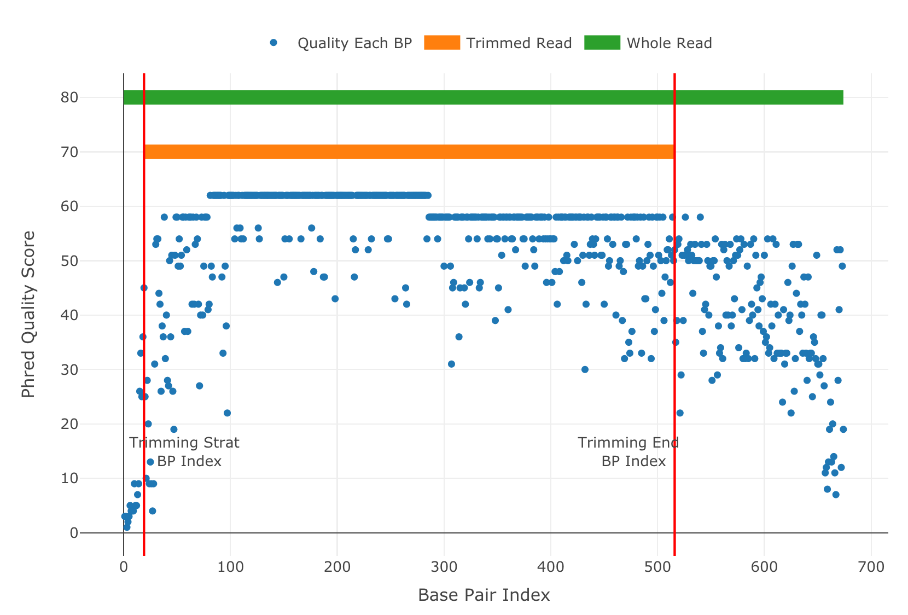

Advanced User Guide - *SangerRead*
==================================

*SangerRead* is the lowest level in sangeranalyseR showed in :ref:`Figure_1<SangerRead_hierarchy>` which corresponds to a single ABIF file in Sanger sequencing. It extends *sangerseq* S4 class from sangerseqR and contains quality trimming as well as chromatogram input parameters and results. In this section, we are going to go through detailed sangeranalyseR data analysis steps in *SangerRead level*.

.. _SangerRead_hierarchy:
.. figure::  ../image/SangerRead_hierarchy.png
   :align:   center
   :scale:   20 %

   Figure 1. Hierarchy of classes in sangeranalyseR, *SangerRead* level.

*SangerRead* input file preparation
-----------------------------------
Users can choose to input **ab1** or **FASTA** as their input file format.

**ab1** file
++++++++++++
The main input file format to create *SangerRead* instance is **ab1**. Before starting the analysis, users need to prepare one target **ab1** file. The only hard regulation of the filename is that the input file must have **.ab1** as its file extension. There are some suggestions about file naming:

.. note::

    * **ab1** file should be indexed for better consistency.
    * Forward or reverse direction should be specified in the filename.

:ref:`Figure_2<SangerRead_file_structure>` shows the suggested file naming strategy. The filename should contain four main parts: **"Contig name"**, **"Index number"**, **"Direction"** and **"ab1 file extension"**.

* **"Contig name"** :  :code:`RBNII397-13[C_LepFolF,C_lepFolR]`
* **"Index number"** :  :code:`1`
* **"Direction"** :  :code:`F`
* **"ab1 file extension"** :  :code:`.ab1`

.. _SangerRead_file_structure:
.. figure::  ../image/SangerRead_file_structure.png
   :align:   center
   :scale:   80 %

   Figure 2. *SangerRead* filename regulation.

In *SangerRead* section, it is not compulsory to follow the file naming regulation because users can directly specify the filename in input (see :ref:`*SangerRead* instance creation`); however, in the *SangerContig* and *SangerAlignment*, sangeranalyseR will automatically group files therefore it is compulsory to have systematic file naming strategy. For more details, please read :ref:`Advanced User Guide - *SangerContig*` and :ref:`Advanced User Guide - *SangerAlignment*`.

.. _sangeranalyseR_filename_convention_SangerRead:
.. figure::  ../image/sangeranalyseR_filename_convention.png
   :align:   center
   :scale:   25 %

   Figure 3. Suggested **ab1** file naming convention - *SangerRead*.

:ref:`Figure_3<sangeranalyseR_filename_convention_SangerRead>` shows the suggested **ab1** file naming convention. Users are strongly recommended to follow this file naming convention and use the default :code:`suffixForwardRegExp` : ":code:`_[0-9]*_F.ab1$`" and :code:`suffixReverseRegExp` : ":code:`_[0-9]*_R.ab1$`" to reduce any chance of error.

FASTA file
++++++++++

|

*SangerRead* instance creation
------------------------------

After preparing the *SangerRead* input file, the next step is to create the *SangerRead* S4 instance by running :code:`SangerRead` constructor function or :code:`new` method. The constructor function is a wrapper for :code:`new` method which makes instance creation more intuitive. The inputs include **Basic Parameters**, **Trimming Parameters** and **Chromatogram Parameters** and most of them have their own default values. In the constructor below, we list all possible parameters.

.. code-block:: R

   sangerRead <- SangerRead(inputSource           = "ABIF",
                            readFeature           = "Forward Read",
                            readFileName          = "RBNII397-13[C_LepFolF,C_LepFolR]_1_F.ab1",
                            geneticCode           = GENETIC_CODE,
                            TrimmingMethod        = "M1",
                            M1TrimmingCutoff      = 0.0001,
                            M2CutoffQualityScore  = NULL,
                            M2SlidingWindowSize   = NULL,
                            baseNumPerRow         = 100,
                            heightPerRow          = 200,
                            signalRatioCutoff     = 0.33,
                            showTrimmed           = TRUE)

*SangerRead* inputs & slots definition
++++++++++++++++++++++++++++++++++++++
The inputs of :code:`SangerRead` constructor function and :code:`new` method are same. For more details, please refer to `sangeranalyseR reference manual (need update) <http://packages.python.org/an_example_pypi_project/>`_.

|

*SangerRead* trimmed read visualization
---------------------------------------
Before going to :ref:`Writing *SangerRead* FASTA files` and :ref:`Generating *SangerRead* report` parts, it is suggested to visualize the trimmed *SangerRead*. :ref:`Figure_4 <SangerRead_qualityBasePlot>` shows the quality score for each base pairs and the trimming start/end points of the sequence.

.. _SangerRead_qualityBasePlot:

   Figure 4. *SangerRead* trimmed read visualization.

.. code-block:: R

   qualityBasePlot(singleRead)

|

*SangerRead* quality trimming parameters updating
-------------------------------------------------
In the previous :ref:`*SangerRead* instance creation` part, the constructor function apply the quality trimming parameters to all reads. After creating the *SangerRead* S4 instance, users can change the trimming parameters by running :code:`updateQualityParam` function which will change the *QualityReport* instance inside the *SangerRead* and update frameshift amino acid sequences.

.. code-block:: R

   newSangerRead <- updateQualityParam(sangerRead,
                                       TrimmingMethod       = "M2",
                                       M1TrimmingCutoff     = NULL,
                                       M2CutoffQualityScore = 29,
                                       M2SlidingWindowSize  = 15)

|

Writing *SangerRead* FASTA files
--------------------------------
Users can write the *SangerRead* instance to **FASTA** files. The trimmed read sequence will be written into a **FASTA** file. Below is the one-line function that users need to run. This function mainly depends on :code:`writeXStringSet` function in `Biostrings <https://bioconductor.org/packages/release/bioc/html/Biostrings.html>`_ R package. Users can set the compression level through :code:`writeFastaSA` function.

.. code-block:: R

   writeFastaSR(newSangerRead,
                outputDir         = tempdir(),
                compress          = FALSE,
                compression_level = NA)

|

Generating *SangerRead* report
------------------------------
Last but not least, users can save *SangerRead* instance into a report after the analysis. The report will be generated in **HTML** by knitting **Rmd** files. The results in the report are static.

.. code-block:: R

   generateReportSA(sangerAlignment,
                    outputDir           = tempdir(),
                    includeSangerContig = TRUE,
                    includeSangerRead   = TRUE)
