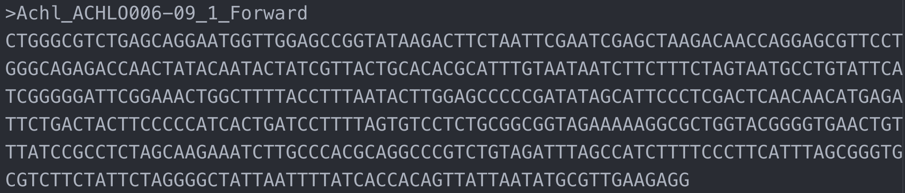

Advanced User Guide - *SangerRead* (**FASTA**)
==============================================

*SangerRead* is the lowest level in sangeranalyseR showed in :ref:`Figure_1<SangerRead_hierarchy_fasta>` which corresponds to a single read in Sanger sequencing. In this section, we are going to go through detailed sangeranalyseR data analysis steps in *SangerRead level* from **FASTA** file input.

.. _SangerRead_hierarchy_fasta:
.. figure::  ../image/SangerRead_hierarchy.png
   :align:   center
   :scale:   20 %

   Figure 1. Hierarchy of classes in sangeranalyseR, *SangerRead* level.

|

Preparing *SangerRead* **FASTA** input
--------------------------------------
We design the **FASTA** file input for those who do not want to do quality trimming and base calling for their *SangerRead*; therefore, it does not contain quality trimming and chromatogram input parameters and results in its slots. Before starting the analysis, users need to prepare one target **FASTA** file. The only hard regulation of the filename is that file extension must be **.fasta** or **.fa**.

|

Creating *SangerRead* instance from **FASTA**
---------------------------------------------

After preparing the *SangerRead* input **FASTA** file, the next step is to create the *SangerRead* S4 instance by running :code:`SangerRead` constructor function or :code:`new` method. The constructor function is a wrapper for :code:`new` method which makes instance creation more intuitive. Most of the input parameters have their own default values. In the constructor below, we list important parameters. The filename is assigned to :code:`readFileName`. Inside **FASTA** file, the string in the first line after ">" is the name of the read. Users need to assign the read name to :code:`fastaReadName` which is used to match the target read in **FASTA** input file. :ref:`Figure 2<SangerRead_fasta_input_file>` is a valid **FASTA** file and the value of :code:`fastaReadName` is :code:`ACHLO006-09[LCO1490_t1,HCO2198_t1]_Forward.ab1`.

.. code-block:: R

   sangerReadFfa <- new("SangerRead",
                        inputSource          = "FASTA",
                        readFeature          = "Forward Read",
                        readFileName         = "ACHLO006-09[LCO1490_t1,HCO2198_t1]_1_F.fa",
                        fastaReadName        = "ACHLO006-09[LCO1490_t1,HCO2198_t1]_Forward.ab1",
                        geneticCode          = GENETIC_CODE)

.. _SangerRead_fasta_input_file:

   Figure 2. *SangerRead* **FASTA** input file.

The inputs of :code:`SangerRead` constructor function and :code:`new` method are same. For more details about *SangerRead* inputs & slots definition, please refer to `sangeranalyseR reference manual (need update after upload function manul) <http://packages.python.org/an_example_pypi_project/>`_.

|

Writing *SangerRead* FASTA files :sub:`(FASTA)`
-----------------------------------------------
Users can write the *SangerRead* instance to **FASTA** files. Because the **FASTA** input does not support quality trimming and base calling, in this example, the sequence of the written **FASTA** file will be same as the input **FASTA** file. Moreover, users can set the compression level through the one-line function :code:`writeFastaSA` which mainly depends on :code:`writeXStringSet` function in `Biostrings <https://bioconductor.org/packages/release/bioc/html/Biostrings.html>`_ R package.

.. code-block:: R

   writeFastaSR(sangerReadFfa,
                outputDir         = tempdir(),
                compress          = FALSE,
                compression_level = NA)

|

Generating *SangerRead* report :sub:`(FASTA)`
---------------------------------------------
Last but not least, users can save *SangerRead* instance into a report after the analysis. The report will be generated in **HTML** by knitting **Rmd** files. The results in the report are static.

.. code-block:: R

   generateReportSR(sangerReadFfa,
                    outputDir           = tempdir())

`SangerRead_Report_ab1.html <https://howardchao.github.io/sangeranalyseR_report/ACHLO006-09[LCO1490_t1,HCO2198_t1]_1_F/SangerRead_Report_fasta.html>`_ is the generated report html of this example. Users can access to 'Basic Information', 'DNA Sequence' and 'Amino Acids Sequence' sections inside the report. 
