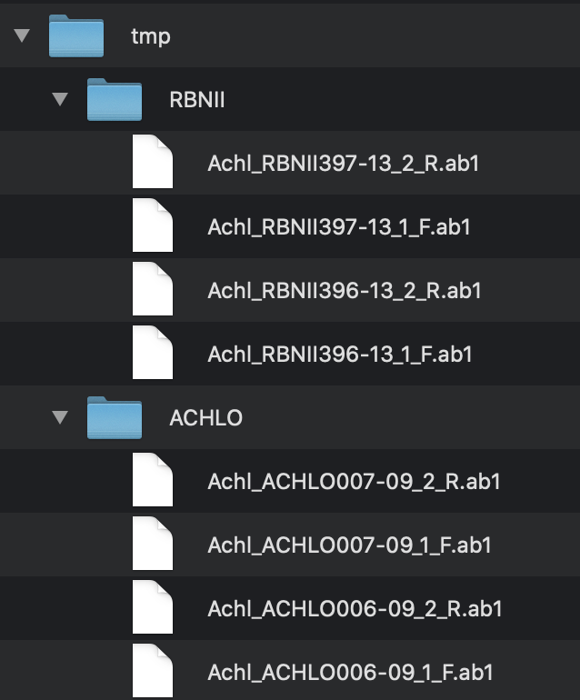
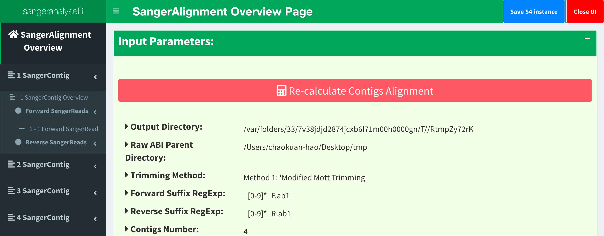
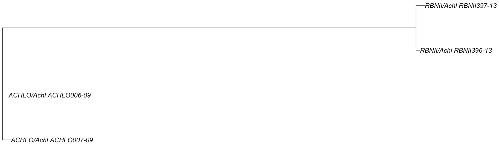

Beginners Guide
===============

If you haven't already, please follow the steps in the :ref:`Installation` page to install and load sangeranalyseR.

This guide is for users who are starting with :code:`.ab1` files. If you are starting with **FASTA** files, please read through this guide then follow the slightly different path for those starting with FASTA data here: :ref:`Advanced User Guide - *SangerAlignment* (**FASTA**)`.

|

Step 1: Preparing your input files
----------------------------------

sangeranalyseR takes as input a group of **.ab1** files, which it then groups together into contigs. Once the individual contigs are built, all the contigs are aligned and a simple phylogenetic tree is made. This section explains how you should organize your files before running sangeranalyseR.

First, prepare a directory and put all your **.ab1** files inside it (there can be other files in there too, sangeranalyseR will ignore anything without a `.ab1` file extension). Files can be organised in as many sub-folders as you like. sangeranalyseR will recursively search all the directories inside :code:`parentDirectory` and find all files that end with **.ab1**.

Second, give sangeranalyseR the information it needs to group reads into contigs. To do this, sangeranalyseR needs two pieces of information about each read: the direction of the read (forward or reverse), and the contig that it should be grouped into. There are two ways you can give sangeranalyseR this information:

* using the file name itself
* using a three-column csv file

We'll cover both approaches using the following example. Imagine you have sequenced four contigs with a forward and reverse read, all from the same species, but from different locations. In this case you might have arranged your data something like :ref:`Figure_1<SangerAlignment_file_structure_beginner>`, below.

.. _SangerAlignment_file_structure_beginner:

   Figure 1. Input ab1 files inside the parent directory, :code:`./tmp/`.

When using the filenames to group the reads, you'll need to specify three parameters: :code:`parentDirectory`, :code:`suffixForwardRegExp`, and :code:`suffixReverseRegExp`: 

* :code:`parentDirectory`: this is the directory that contains all the **.ab1** files. In this example, the reads are in the :code:`/tmp/` directory, so for convenience we'll just say that :code:`parentDirectory` should be :code:`/path/to/tmp/`. In your case, it should be the absolute path to the folder that contains your reads.

* :code:`suffixForwardRegExp`: This is a regular expression (if you don't know what this is, don't panic - it's just a way of recognising text that you will get the hang of fast), which tells sangeranalyseR how to use the end of a filename to determine a forward read. All the reads that are in forward direction have to contain this in their filename suffix. There are lots of ways to do this, but for this example, one uesful way to do it is :code:`_[0-9]+_F`. This regular expression just says that the forward suffix is an underscore, followed at least one digit from 0-9, followed by another underscore then 'F'. The regex does not have to match to the end of the file name, but it's important to realise is that whatever comes before the part of the filename captured by this regex is by default the contig name. So in this case the regex also determines that the contig name for the first read is 'Achl_RBNII397-13'.

* :code:`suffixReverseRegExp`: This is just the same as for the forward read, except that it determines the suffix for reverse reads. All the reads that are in reverse direction have to contain this in their filename suffix. In this example, its value is :code:`_[0-9]+_R`. I.e. all we've done is switch the 'F' in the forward read for an 'R' in the reverse read.

If you don't want to use the regex method, you can use the csv method instead. To use this method, just prepare an input **.csv** file with three columns:

* contig: the name of the contig that reads should be grouped into
* direction: "F" or "R" for forward and reverse reads, respectively
* reads: the full file name (just the name, not the path) of the read to be grouped

|

Step 2: Loading and analysing your data
---------------------------------------
After preparing the input files, you can create and align your contigs with just a single line of R code. In technical jargon, we are creating a *SangerAlignment* S4 instance.

It's important to note that this function is designed to be both *simple* and *flexible*. It's simple in that it has sensible defaults for all the usual things like trimming reads. But it's flexible in that you can change any and all of these defaults to suit your particular data and analyses. Here we just cover the simplest usage. The more flexible things are covered in the Advanced sections of the user guide.

So, let's create our contigs from our reads, and align them.

Here's how to do it using the regex method:

.. code-block:: R

   my_aligned_contigs <- SangerAlignment(parentDirectory     = "/path/to/tmp/",
                                         suffixForwardRegExp = "_[0-9]+_F",
                                         suffixReverseRegExp = "_[0-9]+_R")

Here's how to do it using the csv file method

.. code-block:: R

   my_aligned_contigs <- SangerAlignment(parentDirectory     = "/path/to/tmp/",
                                         namesConversionCSV  = "/path/to/csvfile")

:code:`my_aligned_contigs` is now a *SangerAlignment* S4 object which contains all of your reads, all the information on how they were trimmed, processed, and aligned, their chromatograms, and an alignment and phylogeny of all of your assembled contigs. The next section explains how to start digging into the details of that object.

|

Step 3: Exploring your data with the Shiny app
----------------------------------------------

sangeranalseR includes a Shiny app that allows you to see, interact with, and adjust the parameters of your aligned contigs. For example, you can adjust things like the trimming parameters, and see how that changes your reads and your contigs.

To launch the interactive Shiny app use the :code:`launchApp` function as follows

.. code-block:: R

   launchApp(my_aligned_contigs)

.. _SangerAlignment_shiny_app:

   Figure 2. *SangerAlignment* Shiny app user interface.

:ref:`Figure_2<SangerAlignment_shiny_app>` shows what the Shiny app looks like. On the left-hand side of :ref:`Figure_2<SangerAlignment_shiny_app>`, there is a navigation menu that you can click to get more detail on every contig and every read. You can explore this app to get a lot more detail and make adjustments to your data. (Note that sangeranalyseR doesn't allow for editing individual bases of reads though - that's just not something that R is good for).

|

Step 4: Outputting your aligned contigs
---------------------------------------
Once you're happy with your aligned contigs, you'll want to save them somewhere.

The following function can write the *SangerAlignment* object as a FASTA file. You just need to tell it where with the :code:`outputDir` argument. Here we just wrote the alignment to the same folder that contains our reads.

.. code-block:: R

   writeFasta(my_aligned_contigs, outputDir = "/path/to/tmp/")

|

Step 5: Generating an interactive report
----------------------------------------
Last but not least, it is useful to store all the results in a report for future reference. You can generate a detailed report by running the following one-line function. :ref:`Figure_3<SangerAlignment_alignment_result>` and :ref:`Figure_4<SangerAlignment_tree>`.

.. code-block:: R

   generateReport(my_aligned_contigs)

.. _SangerAlignment_alignment_result:
.. figure::  ../image/SangerAlignment_alignment_result.png
   :align:   center

   Figure 3. An alignment of all contigs in the *SangerAlignment* object.

.. _SangerAlignment_tree:

   Figure 4. A phylogenetic tree with contigs as the leaf nodes. This can help diagnose any issues with your contigs.

|

What's next ?
-------------
Now you've finished the :ref:`Beginners Guide`, you should have a good overview of how to use the package. To dig a lot deeper into what you can do and why you might bother, there are also a set of advanced guides that focus on the three levels at which you can analyse Sanger data in the sangeranalyseR package. You can analyse individual reads with the *SangerRead* object, individual contigs with the *SangerContig* object, and alignments of two or more contigs (as we focussed on in this intro) with teh *SangerAlignment* object.

If you want to start the analysis from **AB1** files, please choose the analysis level and read the following three links.

* :ref:`Advanced User Guide - *SangerRead* (**AB1**)`

* :ref:`Advanced User Guide - *SangerContig* (**AB1**)`

* :ref:`Advanced User Guide - *SangerAlignment* (**AB1**)`

If you want to start the analysis from **FASTA** files, please choose the analysis level and read the following three links.

* :ref:`Advanced User Guide - *SangerRead* (**FASTA**)`

* :ref:`Advanced User Guide - *SangerContig* (**FASTA**)`

* :ref:`Advanced User Guide - *SangerAlignment* (**FASTA**)`
