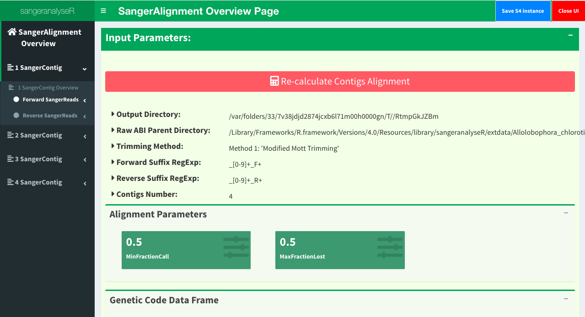

Quick Start Guide
=================

This page provides simple quick-start information for using sangeranalyseR with :code:`AB1` files. Please read the :ref:`Beginners Guide` page for more details on each step.

If you haven't already, please follow the steps in the :ref:`Installation` page to install and load sangeranalyseR.

|

Super-Quick Start (3 lines of code)
+++++++++++++++++++++++++++++++++++

The most minimal example gets the job done in three lines of code. More details below.

.. code-block:: R

   my_aligned_contigs <- SangerAlignment(ABIF_Directory      = "./my_data/",
                                         REGEX_SuffixForward = "_[0-9]*_F.ab1$",
                                         REGEX_SuffixReverse = "_[0-9]*_R.ab1$")

   writeFasta(my_aligned_contigs)

   generateReport(my_aligned_contigs)

|

Step 1: Prepare your input files
++++++++++++++++++++++++++++++++

Put all your :code:`AB1` files in a directory :code:`./my_data/`. The directory can be called anything.

Name your files according to the convention :code:`contig_index_direction.ab1`. E.g. :code:`Drosophila_COI_1_F.ab1` and :code:`Drosophila_COI_2_R.ab1` describes a forward and reverse read to assemble into one contig. You can have as many files and contigs as you like in one directory.

|

Step 2: Load and analyse your data
++++++++++++++++++++++++++++++++++

.. code-block:: R

   my_aligned_contigs <- SangerAlignment(ABIF_Directory      = "./my_data/",
                                         REGEX_SuffixForward = "_[0-9]*_F.ab1$",
                                         REGEX_SuffixReverse = "_[0-9]*_F.ab1$")

This command loads, trims, builds contigs, and aligns contigs. All of these are done with sensible default values, which can be changed. I

|

Step 3 (optional): Explore your data
++++++++++++++++++++++++++++++++++++

.. code-block:: R

   launchApp(my_aligned_contigs)

This launches an interactive Shiny app where you can view your analysis, change the default settings, etc.

|

Step 4: Output your aligned contigs
+++++++++++++++++++++++++++++++++++

.. code-block:: R

   writeFasta(my_aligned_contigs)

This will save your aligned contigs as a FASTA file.

|

Step 5 (optional): Generate an interactive report
+++++++++++++++++++++++++++++++++++++++++++++++++

.. code-block:: R

   generateReport(my_aligned_contigs)

This will save a detailed interactive HTML report that you can explore.

-----

|

A Reproducible Example
++++++++++++++++++++++

If you are still confused about how to run sangeranalyseR and want to check whether it produces the results that you want, then check this section for more details. Here we demonstrate a simple and reproducible example for using sangeranalyseR to generate a consensus read from 8 sanger ab1 files (4 contigs and each includes a forward and a reverse read).

1. Prepare your input files & loading
--------------------------------------

The data of this example is in the sangeranalyseR package; thus, you can simply get its path from the library.

.. code-block:: R

   rawDataDir <- system.file("extdata", package = "sangeranalyseR")
   parentDir <- file.path(rawDataDir, 'Allolobophora_chlorotica', 'ACHLO')

2. Load and analyse your data
-----------------------------

Run the following on-liner to create the sanger alignment object.

.. code-block:: R

   ACHLO_contigs <- SangerAlignment(ABIF_Directory     = parentDir,
                                    REGEX_SuffixForward = "_[0-9]*_F.ab1$",
                                    REGEX_SuffixReverse = "_[0-9]*_R.ab1$")

.. container:: toggle

    .. container:: header

        Following is the R shell output that you will get.
    .. code-block::

         INFO [2021-29-06 14:07:37] #################################################
         INFO [2021-29-06 14:07:37] #### Start creating SangerAlignment instance ####
         INFO [2021-29-06 14:07:37] #################################################
         INFO [2021-29-06 14:07:37]   >> You are using Regular Expression Method to group AB1 files!
         INFO [2021-29-06 14:07:37] ========================================================
         INFO [2021-29-06 14:07:37] ================ Creating 'SangerContig' ===============
         INFO [2021-29-06 14:07:37] ========================================================
         INFO [2021-29-06 14:07:37]   >> Contig Name: 'Achl_ACHLO006-09'
         SUCCESS [2021-29-06 14:07:39] --------------------------------------------------------
         SUCCESS [2021-29-06 14:07:39] -------- 'SangerRead' S4 instance is created !! --------
         SUCCESS [2021-29-06 14:07:39] --------------------------------------------------------
         SUCCESS [2021-29-06 14:07:39]    >> 'Achl_ACHLO006-09_1_F.ab1' is created (Forward Read; ABIF).
         SUCCESS [2021-29-06 14:07:40] --------------------------------------------------------
         SUCCESS [2021-29-06 14:07:40] -------- 'SangerRead' S4 instance is created !! --------
         SUCCESS [2021-29-06 14:07:40] --------------------------------------------------------
         SUCCESS [2021-29-06 14:07:40]    >> 'Achl_ACHLO006-09_2_R.ab1' is created (Reverse Read; ABIF).
         INFO [2021-29-06 14:07:40]    >> The number of reads detected: 2
         SUCCESS [2021-29-06 14:07:40] ==========================================================
         SUCCESS [2021-29-06 14:07:40] ======== 'SangerContig' S4 instance is created !! ========
         SUCCESS [2021-29-06 14:07:40] ==========================================================
         INFO [2021-29-06 14:07:40]    >> 2 read(s) created from ABIF file.
         INFO [2021-29-06 14:07:40]      >> 1 reads assigned to 'forward reads' according to 'regular expression'.
         INFO [2021-29-06 14:07:40]      >> 1 reads assigned to 'reverse reads' according to 'regular expression'.
         INFO [2021-29-06 14:07:41] ========================================================
         INFO [2021-29-06 14:07:41] ================ Creating 'SangerContig' ===============
         INFO [2021-29-06 14:07:41] ========================================================
         INFO [2021-29-06 14:07:41]   >> Contig Name: 'Achl_ACHLO007-09'
         SUCCESS [2021-29-06 14:07:41] --------------------------------------------------------
         SUCCESS [2021-29-06 14:07:41] -------- 'SangerRead' S4 instance is created !! --------
         SUCCESS [2021-29-06 14:07:41] --------------------------------------------------------
         SUCCESS [2021-29-06 14:07:41]    >> 'Achl_ACHLO007-09_1_F.ab1' is created (Forward Read; ABIF).
         SUCCESS [2021-29-06 14:07:42] --------------------------------------------------------
         SUCCESS [2021-29-06 14:07:42] -------- 'SangerRead' S4 instance is created !! --------
         SUCCESS [2021-29-06 14:07:42] --------------------------------------------------------
         SUCCESS [2021-29-06 14:07:42]    >> 'Achl_ACHLO007-09_2_R.ab1' is created (Reverse Read; ABIF).
         INFO [2021-29-06 14:07:42]    >> The number of reads detected: 2
         SUCCESS [2021-29-06 14:07:42] ==========================================================
         SUCCESS [2021-29-06 14:07:42] ======== 'SangerContig' S4 instance is created !! ========
         SUCCESS [2021-29-06 14:07:42] ==========================================================
         INFO [2021-29-06 14:07:42]    >> 2 read(s) created from ABIF file.
         INFO [2021-29-06 14:07:42]      >> 1 reads assigned to 'forward reads' according to 'regular expression'.
         INFO [2021-29-06 14:07:42]      >> 1 reads assigned to 'reverse reads' according to 'regular expression'.
         INFO [2021-29-06 14:07:42] ========================================================
         INFO [2021-29-06 14:07:42] ================ Creating 'SangerContig' ===============
         INFO [2021-29-06 14:07:42] ========================================================
         INFO [2021-29-06 14:07:42]   >> Contig Name: 'Achl_ACHLO040-09'
         SUCCESS [2021-29-06 14:07:43] --------------------------------------------------------
         SUCCESS [2021-29-06 14:07:43] -------- 'SangerRead' S4 instance is created !! --------
         SUCCESS [2021-29-06 14:07:43] --------------------------------------------------------
         SUCCESS [2021-29-06 14:07:43]    >> 'Achl_ACHLO040-09_1_F.ab1' is created (Forward Read; ABIF).
         SUCCESS [2021-29-06 14:07:44] --------------------------------------------------------
         SUCCESS [2021-29-06 14:07:44] -------- 'SangerRead' S4 instance is created !! --------
         SUCCESS [2021-29-06 14:07:44] --------------------------------------------------------
         SUCCESS [2021-29-06 14:07:44]    >> 'Achl_ACHLO040-09_2_R.ab1' is created (Reverse Read; ABIF).
         INFO [2021-29-06 14:07:44]    >> The number of reads detected: 2
         SUCCESS [2021-29-06 14:07:44] ==========================================================
         SUCCESS [2021-29-06 14:07:44] ======== 'SangerContig' S4 instance is created !! ========
         SUCCESS [2021-29-06 14:07:44] ==========================================================
         INFO [2021-29-06 14:07:44]    >> 2 read(s) created from ABIF file.
         INFO [2021-29-06 14:07:44]      >> 1 reads assigned to 'forward reads' according to 'regular expression'.
         INFO [2021-29-06 14:07:44]      >> 1 reads assigned to 'reverse reads' according to 'regular expression'.
         INFO [2021-29-06 14:07:44] ========================================================
         INFO [2021-29-06 14:07:44] ================ Creating 'SangerContig' ===============
         INFO [2021-29-06 14:07:44] ========================================================
         INFO [2021-29-06 14:07:44]   >> Contig Name: 'Achl_ACHLO041-09'
         SUCCESS [2021-29-06 14:07:45] --------------------------------------------------------
         SUCCESS [2021-29-06 14:07:45] -------- 'SangerRead' S4 instance is created !! --------
         SUCCESS [2021-29-06 14:07:45] --------------------------------------------------------
         SUCCESS [2021-29-06 14:07:45]    >> 'Achl_ACHLO041-09_1_F.ab1' is created (Forward Read; ABIF).
         SUCCESS [2021-29-06 14:07:45] --------------------------------------------------------
         SUCCESS [2021-29-06 14:07:45] -------- 'SangerRead' S4 instance is created !! --------
         SUCCESS [2021-29-06 14:07:45] --------------------------------------------------------
         SUCCESS [2021-29-06 14:07:45]    >> 'Achl_ACHLO041-09_2_R.ab1' is created (Reverse Read; ABIF).
         INFO [2021-29-06 14:07:45]    >> The number of reads detected: 2
         SUCCESS [2021-29-06 14:07:45] ==========================================================
         SUCCESS [2021-29-06 14:07:45] ======== 'SangerContig' S4 instance is created !! ========
         SUCCESS [2021-29-06 14:07:45] ==========================================================
         INFO [2021-29-06 14:07:45]    >> 2 read(s) created from ABIF file.
         INFO [2021-29-06 14:07:45]      >> 1 reads assigned to 'forward reads' according to 'regular expression'.
         INFO [2021-29-06 14:07:45]      >> 1 reads assigned to 'reverse reads' according to 'regular expression'.
         INFO [2021-29-06 14:07:45] Aligning consensus reads ... 
         INFO [2021-29-06 14:07:45] Before building!!
         INFO [2021-29-06 14:07:45] After building!!
         SUCCESS [2021-29-06 14:07:45] #############################################################
         SUCCESS [2021-29-06 14:07:45] ######## 'SangerAlignment' S4 instance is created !! ########
         SUCCESS [2021-29-06 14:07:45] #############################################################
         INFO [2021-29-06 14:07:45]   >> 4 contigs detected from 'regular expression'.
         INFO [2021-29-06 14:07:45]       >> Contig 'Achl_ACHLO006-09':
         INFO [2021-29-06 14:07:45]           >> 1 forward reads.
         INFO [2021-29-06 14:07:45]           >> 1 reverse reads.
         INFO [2021-29-06 14:07:45]       >> Contig 'Achl_ACHLO007-09':
         INFO [2021-29-06 14:07:45]           >> 1 forward reads.
         INFO [2021-29-06 14:07:45]           >> 1 reverse reads.
         INFO [2021-29-06 14:07:45]       >> Contig 'Achl_ACHLO040-09':
         INFO [2021-29-06 14:07:45]           >> 1 forward reads.
         INFO [2021-29-06 14:07:45]           >> 1 reverse reads.
         INFO [2021-29-06 14:07:46]       >> Contig 'Achl_ACHLO041-09':
         INFO [2021-29-06 14:07:46]           >> 1 forward reads.
         INFO [2021-29-06 14:07:46]           >> 1 reverse reads.
         INFO [2021-29-06 14:07:46]   >> 8 reads created from ABIF file.
         INFO [2021-29-06 14:07:46]   >> Reads are trimmed by 'M1 - Mott’s trimming algorithm'.
         DEBUG [2021-29-06 14:07:46]    >> For more information, please run 'object'.
         DEBUG [2021-29-06 14:07:46]    >> Run 'object@objectResults@readResultTable' to check the results of each Sanger reads

|

3. Explore your data
------------------------

Launch the Shiny app to check the visualized results.

.. code-block:: R

   launchApp(ACHLO_contigs)

.. container:: toggle

     .. container:: header

        Following is the R shell output that you will get.
     .. code-block::

      INFO [2021-29-06 14:07:46] Your input is 'SangerAlignment' S4 instance
      INFO [2021-29-06 14:07:46] >>> outputDir : /var/folders/33/7v38jdjd2874jcxb6l71m00h0000gn/T//RtmpRAPaMV

      Listening on http://127.0.0.1:7717
      INFO [2021-29-06 14:07:51] >>>>>>>> Inside 'Contigs Alignment Overview Page _'
      INFO [2021-29-06 14:07:51] ######## Reactive button clicked !!!
      INFO [2021-29-06 14:07:51] ######## Start re-aligning contigs
      INFO [2021-29-06 14:07:51] Aligning consensus reads ... 
      INFO [2021-29-06 14:07:51] Before building!!
      INFO [2021-29-06 14:07:52] After building!!
      INFO [2021-29-06 14:07:52] ######## Finish contigs re-alignment
      INFO [2021-29-06 14:07:52] file.exists(browseSeqHTML): TRUE
      INFO [2021-29-06 14:07:52] (browseSeqHTML): /var/folders/33/7v38jdjd2874jcxb6l71m00h0000gn/T//RtmpRAPaMV/_SangerAlignment_BrowseSeqs.html
      INFO [2021-29-06 14:07:56] @@@@@@@ 'close button' has been clicked

|

And a Shiny would popup as showed in Figure 1

  Figure 1. *SangerAlignment* Shiny dashboard.

4. Output your aligned contigs
---------------------------------

Write each contig and the aligned consensus read into FASTA files.

.. code-block:: R

   writeFasta(ACHLO_contigs)

.. container:: toggle

     .. container:: header

        Following is the R shell output that you will get.

     .. code-block::

      INFO [2021-29-05 17:23:00] Your input is 'SangerAlignment' S4 instance
      INFO [2021-29-05 17:23:00] >>> outputDir : /private/var/folders/33/7v38jdjd2874jcxb6l71m00h0000gn/T/RtmpGkJZBm
      INFO [2021-29-05 17:23:00] Start to write 'SangerAlignment' to FASTA format ...
      INFO [2021-29-05 17:23:00] >> Writing 'alignment' to FASTA ...
      INFO [2021-29-05 17:23:00] >> Writing 'contigs' to FASTA ...
      INFO [2021-29-05 17:23:00] >> Writing all single reads to FASTA ...
      INFO [2021-29-05 17:23:00] Finish writing 'SangerAlignment' to FASTA format

|

And you will get three FASTA files:

(1) :download:`Sanger_all_trimmed_reads.fa <../files/beginner/Sanger_all_trimmed_reads.fa>`
(2) :download:`Sanger_contigs_alignment.fa <../files/beginner/Sanger_contigs_alignment.fa>`
(3) :download:`Sanger_contigs_unalignment.fa <../files/beginner/Sanger_contigs_unalignment.fa>`

5. Generate an interactive report
---------------------------------

Last but not least, generate an Rmarkdown report to store all the sequence information.

.. code-block:: R

   generateReport(ACHLO_contigs)

-----

|

For more detailed analysis steps, please choose one the following topics :

* :ref:`Beginners Guide`

* :ref:`Advanced User Guide - *SangerRead* (**AB1**)`

* :ref:`Advanced User Guide - *SangerContig* (**AB1**)`

* :ref:`Advanced User Guide - *SangerAlignment* (**AB1**)`

* :ref:`Advanced User Guide - *SangerRead* (**FASTA**)`

* :ref:`Advanced User Guide - *SangerContig* (**FASTA**)`

* :ref:`Advanced User Guide - *SangerAlignment* (**FASTA**)`
