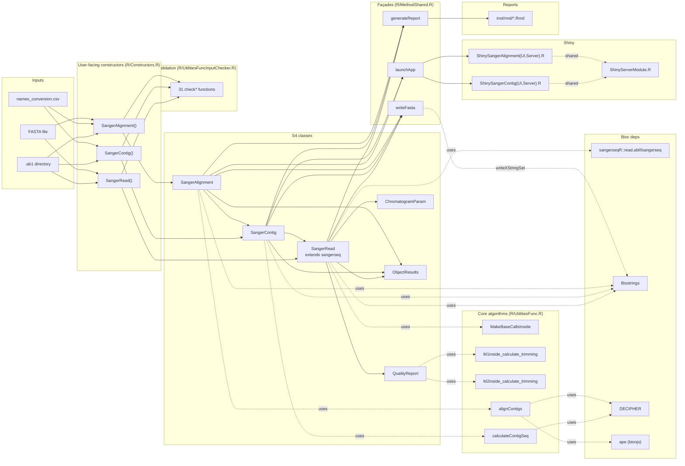

# sangeranalyseR — Phase 1 Comprehension Summary

Audit of `/Users/chaokuan-hao/Documents/R_packages/sangeranalyseR` on branch `devel` (Bioc 3.24, package version 1.21.1). Cross-referenced with the GitHub repo, the ReadTheDocs site, and the Bioconductor package page.

---

## 1. S4 class hierarchy

The package is built around three user-facing S4 classes that form a strict containment hierarchy. Encapsulation flows **upward**: each higher class owns lists of the lower class plus aggregate fields (consensus, alignment, tree) computed across its children.

```
SangerAlignment                  ← top: a set of contigs cross-aligned
├── contigList: list<SangerContig>
├── contigsConsensus:  DNAString          (across-contig consensus)
├── contigsAlignment:  DNAStringSet       (DECIPHER alignment of contigs)
└── contigsTree:       phylo (ape)        (BioNJ over contig distances)
        │
        └── SangerContig         ← middle: one assembled contig
            ├── forwardReadList: list<SangerRead>
            ├── reverseReadList: list<SangerRead>
            ├── contigSeq:       DNAString  (gap-free consensus of reads)
            ├── alignment:       DNAStringSet (DECIPHER read alignment)
            ├── differencesDF / indelsDF / stopCodonsDF / secondaryPeakDF
            ├── distanceMatrix + dendrogram   (DECIPHER distance + UPGMA)
                    │
                    └── SangerRead   ← leaf: a single read
                        ├── (extends sangerseqR::sangerseq)
                        ├── abifRawData:       abif|NULL  (sangerseqR raw)
                        ├── primarySeq[Raw]:   DNAString
                        ├── secondarySeq[Raw]: DNAString
                        ├── peakPosMatrix[Raw], peakAmpMatrix[Raw], traceMatrix
                        ├── primaryAASeqS1/S2/S3: AAString (3 frames)
                        ├── QualityReport:     QualityReport|NULL
                        └── ChromatogramParam: ChromatogramParam|NULL
```

### Helper (nested) classes

| Class                   | File                            | Purpose                                                                 |
| ----------------------- | ------------------------------- | ----------------------------------------------------------------------- |
| `QualityReport`         | `R/ClassQualityReport.R`        | Per-read Phred scores + M1/M2 trim positions + raw/trimmed score stats. |
| `ChromatogramParam`     | `R/ClassChromatogramParam.R`    | Display knobs for the chromatogram (`baseNumPerRow`, `signalRatioCutoff`, …). |
| `ObjectResults`         | `R/ClassObjectResults.R`        | Construction-result envelope: `creationResult`, `errorMessages`, `errorTypes`, `warningMessages`, `warningTypes`, `readResultTable`. Every Sanger* class carries one in slot `objectResults`. |

### Encapsulation as data moves up

- `SangerRead.initialize` reads one ABIF (or pulls one FASTA entry), runs `MakeBaseCallsInside`, builds a `QualityReport` (which performs M1/M2 trimming), translates 3 reading frames, and stores everything. Validation is collected into `ObjectResults` rather than thrown.
- `SangerContig.initialize` constructs many `SangerRead` children via `lapply(... new("SangerRead", printLevel=printLevel, ...))`, filters by `minReadLength` and `minReadsNum`, then calls `calculateContigSeq` to produce `contigSeq`, `alignment`, `differencesDF`, `distanceMatrix`, `dendrogram`, `indelsDF`, `stopCodonsDF`, `secondaryPeakDF`. `printLevel` is forwarded so child reads skip duplicate parameter validation.
- `SangerAlignment.initialize` discovers contig groups (REGEX on filenames or CSV map), constructs `SangerContig`s the same way, then calls `alignContigs` to align contig consensuses, build the cross-contig `contigsConsensus`, and run `bionjs` for `contigsTree`. Failed children are filtered with `Filter(Negate(is.null), …)` and their result rows are accumulated into the parent's `objectResults@readResultTable`.

### Two orthogonal axes shape every constructor

| Axis              | Values                | What changes                                                          |
| ----------------- | --------------------- | --------------------------------------------------------------------- |
| `inputSource`     | `"ABIF"` / `"FASTA"`  | Reader (`sangerseqR::read.abif` vs `seqinr::read.fasta`); whether base calls and quality exist; trimming runs only for ABIF. |
| `processMethod`   | `"REGEX"` / `"CSV"`   | How reads are grouped into contigs: filename suffix patterns vs. an explicit names-conversion CSV (`reads,direction,contig`). FASTA + REGEX still works (REGEX is matched against FASTA record names). |
| `TrimmingMethod`  | `"M1"` / `"M2"`       | M1 = modified Mott's algorithm (`M1TrimmingCutoff`, default `0.0001`); M2 = sliding window à la Trimmomatic (`M2CutoffQualityScore`, `M2SlidingWindowSize`). The unused method's parameters are forced to `NULL`. |

---

## 2. Key dependencies and how this package extends them

| Dependency      | Role in sangeranalyseR                                                                                  | How sangeranalyseR extends it |
| --------------- | ------------------------------------------------------------------------------------------------------ | ----------------------------- |
| **sangerseqR**  | Bioconductor primitive for ABIF parsing. `read.abif()` returns an `abif` object; `sangerseq()` wraps it as a `sangerseq` S4 with `traceMatrix`, `peakPosMatrix`, `peakAmpMatrix`, `primarySeq`, `secondarySeq`. | `SangerRead` **inherits** from `sangerseq` (`contains="sangerseq"`). It adds Phred-score-based base calling (`MakeBaseCallsInside` in `R/UtilitiesFunc.R`), quality-driven trimming (`QualityReport`), per-read AA translation, and Shiny/RMarkdown views. The package also reimplements `chromatogram()` as `chromatogram_overwrite` to fix coloring. |
| **Biostrings**  | DNA/AA string types and I/O: `DNAString`, `DNAStringSet`, `AAString`, `AAStringSet`, `reverseComplement`, `translate`, `subseq`, `writeXStringSet`, `GENETIC_CODE`. | Used pervasively as the canonical sequence type. Reverse reads are `reverseComplement`-ed before assembly (`calculateContigSeq`); FASTA writing routes through `writeXStringSet`. The package adds nothing to Biostrings — it is consumer-only. |
| **DECIPHER**    | Multiple alignment, consensus, frameshift correction, distance, tree: `AlignSeqs`, `AlignTranslation`, `ConsensusSequence`, `CorrectFrameshifts`, `DistanceMatrix`, `Treeline`, `RemoveGaps`, `BrowseSeqs`. | The whole assembly pipeline is a thin orchestrator on top of DECIPHER. The package picks `AlignTranslation` when an AA reference is given (in-frame alignment) and `AlignSeqs` otherwise; threads `processorsNum`; layers Sanger-specific post-processing (secondary-peak coincidence detection in `countCoincidentSp` / `oneAmbiguousColumn`). The recent commit `Fix DECIPHER Treeline import` migrated from an older API to `Treeline` and bumped DECIPHER's minimum version. |
| **pwalign**     | `compareStrings` (used in `nPairwiseDiffs` to compute pairwise differences vs. consensus). | Consumer-only. |
| **ape**         | `bionjs`, `dist.dna`, `as.DNAbin`, `read.tree`, `phylo` class. | Used to build `contigsTree` from contig distances. |
| **seqinr**      | `read.fasta` for the FASTA branch.                                                                     | Consumer-only.                |
| **Shiny stack** | `shiny`, `shinydashboard`, `shinyjs`, `shinyWidgets`, `shinycssloaders`, `plotly`, `DT`, `excelR`, `ggdendro`. | Two interactive apps (one per assembled class) for browsing reads, retrimming, and re-running the assembly. |
| **rmarkdown** + `knitr` + `BiocStyle` | Report rendering for `generateReport*`.                                                | Templates live in `inst/rmd/`. |
| **logger**      | All user-facing messaging.                                                                              | Consistent with the never-throw construction model: many failures are logged and surfaced via `objectResults` rather than `stop()`. |
| **parallel**    | `mclapply`, `detectCores`.                                                                              | Drives `processorsNum`-aware parallelism (`getProcessors` helper). |

---

## 3. File-to-function mapping (all paths under `R/`)

### Core data model — S4 class definitions

| File                            | Lines | Defines                                                                                  |
| ------------------------------- | ----: | ---------------------------------------------------------------------------------------- |
| `ClassObjectResults.R`          |    63 | `ObjectResults` (creation envelope).                                                     |
| `ClassChromatogramParam.R`      |    65 | `ChromatogramParam` + `ChromatogramParamORNULL` union.                                   |
| `ClassQualityReport.R`          |   160 | `QualityReport` + `QualityReportORNULL`. `initialize` runs M1/M2 trimming.               |
| `ClassSangerRead.R`             |   430 | `SangerRead` (extends `sangerseq`). `initialize` parses ABIF, base-calls, builds `QualityReport` + `ChromatogramParam`, computes 3-frame AA. |
| `ClassSangerContig.R`           |   914 | `SangerContig`. `initialize` builds child reads (4 inputSource × processMethod combos), filters, runs `calculateContigSeq`. |
| `ClassSangerAlignment.R`        |   616 | `SangerAlignment`. `initialize` discovers contig groups, builds child contigs, runs `alignContigs`. Also declares `setOldClass("phylo")` and `DNAString[Set]ORNULL` unions. |

### Generic dispatch and façade

| File                            | Role                                                                                              |
| ------------------------------- | ------------------------------------------------------------------------------------------------- |
| `AllGenerics.R`                 | `setGeneric` for `qualityBasePlot`, `updateQualityParam`, `MakeBaseCalls`, `writeFastaSR/SC/SA`, `launchAppSC/SA`, `readTable`, `generateReportSR/SC/SA`. |
| `Constructors.R`                | Thin wrappers `SangerRead()`, `SangerContig()`, `SangerAlignment()` over `new(...)`.              |
| `MethodShared.R`                | Polymorphic façades: `launchApp`, `writeFasta`, `generateReport` — dispatch on `class(object)[1]` to the `*SR/*SC/*SA` generics. |

### Class-specific methods

| File                            | `setMethod` definitions                                                                          |
| ------------------------------- | ------------------------------------------------------------------------------------------------- |
| `MethodsQualityReport.R`        | `qualityBasePlot,QualityReport`; `updateQualityParam,QualityReport` (re-runs M1/M2 trim).         |
| `MethodSangerRead.R`            | `qualityBasePlot,SangerRead`; `updateQualityParam,SangerRead`; `MakeBaseCalls,SangerRead`; `writeFastaSR`; `generateReportSR`; `readTable,SangerRead`. |
| `MethodSangerContig.R`          | `updateQualityParam,SangerContig`; `launchAppSC`; `writeFastaSC`; `generateReportSC`; `readTable,SangerContig`. |
| `MethodSangerAlignment.R`       | `updateQualityParam,SangerAlignment` (cascades to children, then re-runs `alignContigs`); `launchAppSA`; `writeFastaSA`; `generateReportSA`. |

### Core algorithms (free functions in `UtilitiesFunc.R`, 948 lines)

| Function                              | What it does                                                                                                                                  |
| ------------------------------------- | --------------------------------------------------------------------------------------------------------------------------------------------- |
| `MakeBaseCallsInside`                 | Per-channel peak detection (`getpeaks`/`peakvalues`), primary/secondary base call using `signalRatioCutoff`, IUPAC ambiguity codes for ties.   |
| `M1inside_calculate_trimming`         | **M1**: modified Mott's algorithm (cumulative `M1TrimmingCutoff − errorProb`) — same approach as Phred/Phrap and Biopython's modified Mott.    |
| `M2inside_calculate_trimming`         | **M2**: sliding-window mean Phred ≥ `M2CutoffQualityScore` over window of size `M2SlidingWindowSize` — Trimmomatic-style.                     |
| `calculateContigSeq`                  | Reverse-complements R reads, optional `CorrectFrameshifts` against `refAminoAcidSeq`, optional stop-codon filtering, `AlignSeqs`/`AlignTranslation`, `ConsensusSequence`, `DistanceMatrix`, `Treeline` UPGMA, secondary-peak coincidence. |
| `alignContigs`                        | Same pipeline but operating on contig consensuses; builds `phylo` tree with `dist.dna` + `bionjs`.                                            |
| `getIndelDf`, `indelRow`, `nPairwiseDiffs`, `countCoincidentSp`, `oneAmbiguousColumn`, `countStopSodons`, `calculateAASeq` | Per-base / per-column statistics consumed by reports and the Shiny apps. |
| `QualityBasePlotly`, `chromatogramRowNum`, `vline`, `SetCharStyleList`, `SetAllStyleList` | Plot helpers (Plotly + chromatogram styling).                                  |
| `SangerReadInnerTrimming`             | Returns the trimmed primary DNA for one `SangerRead` (used in single-read contig fallback).                                                   |
| `chromatogram_overwrite`              | Public reimplementation of `sangerseqR::chromatogram` to fix base-color rendering (the only function exported from this file).                |
| `getProcessors`, `suppressPlotlyMessage` | Plumbing.                                                                                                                                   |
| `IUPAC_CODE_MAP`                      | Local copy of the IUPAC table used for secondary base resolution.                                                                              |

### Validation

`R/UtilitiesFuncInputChecker.R` (603 lines) — **31** `check*` validators, all of the form `check<X>(value, errors, errorTypes) -> list(errors, errorTypes)`. They never throw; they accumulate diagnostics that the constructors fold into `ObjectResults`. Examples: `checkInputSource`, `checkProcessMethod`, `checkABIF_Directory`, `checkFASTA_File`, `checkREGEX_SuffixForward/Reverse`, `checkCSV_NamesConversion`, `checkAb1FastaCsv`, `checkTrimParam`, `checkBaseNumPerRow`, `checkSignalRatioCutoff`, `checkReadFileNameExist`, `checkTargetFastaName`, `checkGreplForward/Reverse`, `checkCSVConvForward/Reverse`, `checkQualityPhredScores`, etc.

### Shiny UI

| File                              | Lines | Role                                                                                       |
| --------------------------------- | ----: | ------------------------------------------------------------------------------------------ |
| `ShinySangerContigUI.R`           |   158 | UI layout for the SangerContig app (dashboard, sidebar, panels).                            |
| `ShinySangerContigServer.R`       | 1,834 | Server-side reactives: per-read trimming controls, alignment view, secondary-peak table, regenerated reports/FASTA. |
| `ShinySangerAlignmentUI.R`        |   162 | UI layout for the SangerAlignment app.                                                      |
| `ShinySangerAlignmentServer.R`    | 2,349 | Server logic for the SangerAlignment app, with nested SangerContig sub-views.               |
| `ShinyServerModule.R`             |   906 | Shared modules and helpers consumed by both server files (per-read panels, plot helpers).   |

There is **no Shiny app for `SangerRead`** — `launchApp` only dispatches to `*SC` and `*SA`.

### RMarkdown report templates (`inst/rmd/`)

`SangerRead_Report_ab1.Rmd`, `SangerRead_Report_fasta.Rmd`, `SangerContig_Report.Rmd`, `SangerAlignment_Report.Rmd`. Rendered through `rmarkdown::render` by the `generateReport*` methods.

### Misc

| File                                | Role                                                                          |
| ----------------------------------- | ----------------------------------------------------------------------------- |
| `sangeranalyseR_package.R`          | `@importFrom` declarations for the package roxygen page.                      |
| `sangeranalyseR_show_method.R`      | `setMethod("show", ...)` for SangerRead/Contig/Alignment/QualityReport.        |
| `LoadMessage.R`                     | Startup message helpers.                                                      |
| `data.R`                            | roxygen for `data(qualityReportData)`, `data(sangerReadFData)`, `data(sangerContigData)`, `data(sangerAlignmentData)` — pre-built fixtures used in examples and tests. |

`Collate:` order in `DESCRIPTION` is significant: helper classes load before the classes that reference them (e.g., `ClassQualityReport.R` before `ClassSangerRead.R`), and `AllGenerics.R` precedes anything that calls `setMethod`.

---

## 4. Data lifecycle of a single `.ab1` file

End-to-end trace from a raw chromatogram on disk to a position in `contigsConsensus`. Function/file references are inline so each step is greppable.

```mermaid
flowchart TD
    A0[".ab1 file on disk<br/>e.g. Achl_ACHLO006-09_1_F.ab1"]:::input
    A1["sangerseqR::read.abif()<br/>R/ClassSangerRead.R:200"]
    A2["sangerseqR::sangerseq()<br/>R/ClassSangerRead.R:204<br/>traceMatrix, peakPosMatrixRaw,<br/>peakAmpMatrixRaw, primarySeq, secondarySeq, PCON.2"]
    A3["MakeBaseCallsInside()<br/>R/UtilitiesFunc.R:362<br/>per-channel peaks, signalRatioCutoff,<br/>IUPAC secondary base, qualityPhredScores"]
    A4["new('QualityReport')<br/>R/ClassQualityReport.R<br/>runs M1 or M2 trim →<br/>trimmedStartPos, trimmedFinishPos"]
    A5["new('ChromatogramParam')<br/>R/ClassChromatogramParam.R"]
    A6["calculateAASeq()<br/>R/UtilitiesFunc.R:546<br/>3 reading frames"]
    A7["SangerRead instance<br/>+ ObjectResults(creationResult)"]:::object

    B1["SangerContig.initialize<br/>R/ClassSangerContig.R<br/>lapply(forwardFiles, new('SangerRead', ...))<br/>same for reverse"]
    B2["filter by minReadLength,<br/>then minReadsNum"]
    B3["calculateContigSeq()<br/>R/UtilitiesFunc.R:182"]
    B3a["reverseComplement reverse reads<br/>(Biostrings)<br/>+ trim using QualityReport positions"]
    B3b["optional CorrectFrameshifts()<br/>(DECIPHER) if refAminoAcidSeq != ''"]
    B3c["optional stop-codon filter<br/>(acceptStopCodons = FALSE)"]
    B3d["AlignSeqs() / AlignTranslation()<br/>(DECIPHER)"]
    B3e["ConsensusSequence()<br/>(DECIPHER)<br/>minFractionCall, maxFractionLost"]
    B3f["RemoveGaps() → contigSeq<br/>+ DistanceMatrix + Treeline UPGMA<br/>+ countCoincidentSp"]
    B4["SangerContig instance<br/>contigSeq, alignment, distanceMatrix,<br/>dendrogram, differencesDF, indelsDF,<br/>stopCodonsDF, secondaryPeakDF"]:::object

    C1["SangerAlignment.initialize<br/>R/ClassSangerAlignment.R<br/>group by REGEX or CSV<br/>lapply(contigNames, new('SangerContig', ...))"]
    C2["alignContigs()<br/>R/UtilitiesFunc.R:46<br/>AlignSeqs/AlignTranslation,<br/>ConsensusSequence,<br/>dist.dna + bionjs (ape)"]
    C3["SangerAlignment instance<br/>contigList, contigsAlignment,<br/>contigsConsensus, contigsTree"]:::object

    D1["writeFasta() →<br/>writeXStringSet (Biostrings)"]:::output
    D2["generateReport() →<br/>rmarkdown::render(inst/rmd/*.Rmd)"]:::output
    D3["launchApp() →<br/>shiny.appobj"]:::output

    A0 --> A1 --> A2 --> A3 --> A4
    A2 --> A5
    A3 --> A6
    A4 --> A7
    A5 --> A7
    A6 --> A7
    A7 --> B1 --> B2 --> B3
    B3 --> B3a --> B3b --> B3c --> B3d --> B3e --> B3f --> B4
    B4 --> C1 --> C2 --> C3
    C3 --> D1
    C3 --> D2
    C3 --> D3

    classDef input fill:#fff7d6,stroke:#c0a000;
    classDef object fill:#dff0ff,stroke:#3060a0;
    classDef output fill:#e2f5e2,stroke:#3a8a3a;
```



### Step-by-step (with code anchors)

1. **Disk → in-memory ABIF.** `read.abif(readFileName)` (`R/ClassSangerRead.R:200`) returns an `abif` object stored in `SangerRead@abifRawData`. `sangerseq(abifRawData)` (line 204) gives `traceMatrix`, `peakPosMatrixRaw`, `peakAmpMatrixRaw`, `primarySeq`, `secondarySeq`, plus `PCON.2` per-base quality from the ABIF data block.
2. **Base calling.** `MakeBaseCallsInside(traceMatrix, peakPosMatrixRaw, abifRawData@data$PCON.2, signalRatioCutoff, readFeature, printLevel)` (`R/UtilitiesFunc.R:362`) re-derives primary/secondary bases per peak window. Bases below `signalRatioCutoff` of the strongest channel are dropped; ties become IUPAC ambiguity codes. Returns `qualityPhredScores`, `peakPosMatrix`, `peakAmpMatrix`, `primarySeq`, `secondarySeq`.
3. **Quality + trimming.** `new("QualityReport", qualityPhredScores=..., TrimmingMethod=..., M1TrimmingCutoff=..., M2CutoffQualityScore=..., M2SlidingWindowSize=...)` runs either `M1inside_calculate_trimming` or `M2inside_calculate_trimming` (`R/UtilitiesFunc.R:578` / `:647`) and stores `trimmedStartPos`, `trimmedFinishPos`, `rawSeqLength`, `trimmedSeqLength`, raw/trimmed mean and min Phred, `remainingRatio`.
4. **Display params + AA.** `new("ChromatogramParam", ...)`; `calculateAASeq(primarySeq, trimmedStartPos, trimmedFinishPos, geneticCode)` translates frames 1/2/3 (Biostrings `translate`).
5. **`SangerRead` finalized.** `callNextMethod` builds the S4, attaching an `ObjectResults` envelope. Errors are logged and reflected in `objectResults@creationResult` and `objectResults@readResultTable` rather than thrown.
6. **Contig assembly.** `SangerContig.initialize` (`R/ClassSangerContig.R:160`) groups files (REGEX or CSV → `contigName`), builds child reads in parallel-friendly `lapply`, drops reads shorter than `minReadLength`, fails the contig if `< minReadsNum` reads survive, then calls **`calculateContigSeq`** (`R/UtilitiesFunc.R:182`):
   - reverse reads are `reverseComplement`-ed then trimmed using their `QualityReport` positions (`R/UtilitiesFunc.R:199–210`);
   - optional `CorrectFrameshifts` (DECIPHER) when an AA reference is supplied (line 237);
   - optional stop-codon filter when `acceptStopCodons = FALSE` (line 279);
   - `AlignSeqs` or `AlignTranslation` (DECIPHER, lines 308/311);
   - `ConsensusSequence` with `minFractionCall` / `maxFractionLost` (line 316);
   - `DistanceMatrix` + `Treeline` UPGMA (lines 333/336);
   - `countCoincidentSp` for ambiguity columns (line 346);
   - `RemoveGaps` → final `contigSeq` (line 343).
7. **Cross-contig alignment.** `SangerAlignment.initialize` (`R/ClassSangerAlignment.R`) discovers contigs (REGEX/CSV), builds children, and calls **`alignContigs`** (`R/UtilitiesFunc.R:46`): assemble a `DNAStringSet` of contig consensuses → `AlignSeqs`/`AlignTranslation` → `ConsensusSequence` → `bionjs` over `dist.dna` (ape) for `contigsTree`. Stored as `contigsAlignment`, `contigsConsensus`, `contigsTree`.
8. **Outputs.** Same object is consumed three ways:
   - `writeFasta()` → `writeFastaSA/SC/SR` → `Biostrings::writeXStringSet` (with optional gzip);
   - `generateReport()` → `rmarkdown::render` over `inst/rmd/*.Rmd`;
   - `launchApp()` → Shiny app (`launchAppSC` or `launchAppSA`).

Re-trimming flows top-down through `updateQualityParam`: SangerAlignment cascades to its `contigList`, each contig cascades to its forward/reverse `SangerRead` lists, each `QualityReport` reruns M1/M2; the Contig and Alignment levels then re-invoke `calculateContigSeq` and `alignContigs` to recompute consensus and tree.

---

## Architectural map (one-glance summary)



---

## Key files cheat-sheet

| Concern              | File                                                     |
| -------------------- | --------------------------------------------------------- |
| User constructors    | `R/Constructors.R`                                        |
| S4 classes           | `R/Class*.R` (six files)                                  |
| S4 generics          | `R/AllGenerics.R`                                         |
| Class methods        | `R/Method{SangerRead,SangerContig,SangerAlignment,sQualityReport}.R` |
| Polymorphic façades  | `R/MethodShared.R` (`launchApp` / `writeFasta` / `generateReport`) |
| Base calling + trimming + assembly | `R/UtilitiesFunc.R` (`MakeBaseCallsInside`, `M1/M2inside_calculate_trimming`, `calculateContigSeq`, `alignContigs`) |
| Validators           | `R/UtilitiesFuncInputChecker.R` (31 `check*` functions)   |
| Shiny apps           | `R/ShinySangerContig{UI,Server}.R`, `R/ShinySangerAlignment{UI,Server}.R`, `R/ShinyServerModule.R` |
| Report templates     | `inst/rmd/{SangerRead_Report_ab1,SangerRead_Report_fasta,SangerContig_Report,SangerAlignment_Report}.Rmd` |
| Test fixtures        | `data/{qualityReportData,sangerReadFData,sangerContigData,sangerAlignmentData}.RData` |
| Sample raw data      | `inst/extdata/{Allolobophora_chlorotica,Drosophila_melanogaster,ab1,fasta}/` |
| Tests                | `tests/testthat/{helper-,test-}*.R` (note: `tests/testthat.R` has the runner line commented out — use `devtools::test()`) |
| Build/install collation | `DESCRIPTION` `Collate:` (load order matters because of S4 inheritance) |
