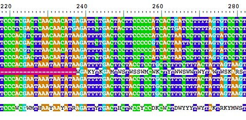
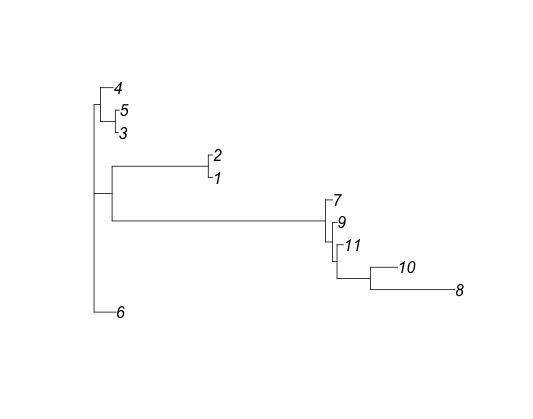
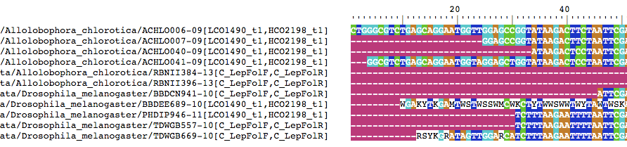

sangeranalyseR
==============
This package impelements functions to analyse Sanger sequencing reads, especially those from the ABI platform, in R.

Typical functions include:

* detecting secondary peaks in chromatograms
* merging forward and reverse sequences
* performing multiple alignments
* estimating and annotating phylogenies

-----

# Installation

### Dependencies

sangeranalyseR relies heavily on packages from CRAN and Bioconductor. If you don't already have the packages listed below, the following code will fetch them for you:

```
# CRAN packages
install.packages("parallel")
install.packages("ape")
install.packages("reshape2")
install.packages("phangorn")
install.packages("stringi")
install.packages("stringr")

# Bioconductor packages
source("https://bioconductor.org/biocLite.R")
biocLite("DECIPHER")
biocLite("Biostrings")
biocLite("sangerseqR")
```

The easiest way to install sangeranalyseR is to install it straight from GitHub:

### Installing from GitHub using devtools
Run the following code from your R console:

```
install.packages("devtools")
library(devtools)
install_github("roblanf/sangeranalyseR")
library(sangeranalyseR)
```

### Install from zip file

A zipped version of the package is available at https://github.com/roblanf/sangeranalyseR/archive/master.zip.  To install from the zip file, download a copy of it to your system.  Once it's finished downloading, type the following (where PATH is the path to the zip file):

```
install.packages("devtools")
library(devtools)
install_local("PATH")
library(sangeranalyseR)
```

-----

# Using sangeranalyseR

To demonstrate the basics of using this package, I have put together some test data that comprises .ab1 sequencing files from two species. The data are publically available from http://www.boldsystems.org/, and are provided in the ```/test_data``` folder in this reposotory.

To follow along with this tutorial, download the test data to your machine, and enter the commands below, changing the file paths to the data files and folders where necessary (I'm using a mac and put the test data in a folder called ```test_data``` on my desktop).

Throughout, I'll call a single file a 'read'. When that file represents a final sequence, I'll call it a 'sequence'. I.e. all sequences comprise one or more reads, but not all reads are sequences (e.g. when a read is just one of a large set that will be merged into a single sequence).

## Analysing a single read

### Load your read

Let's start by analysing one read. To start with, we load the read as an abif s4 object, and also convert it to a sangerseq s4 object (both are from the sangerseqR package).


```
# change this to point to any of the test data files you downloaded
seq.filepath = "~/Desktop/test_data/Allolobophora_chlorotica/ACHLO006-09[LCO1490_t1,HCO2198_t1]_F.ab1"
seq.abif = read.abif(seq.filepath)
seq.sanger = sangerseq(seq.abif)
```

The difference between these two objects is that the abif object contains all the raw data produced by the sequencing machine, while the sangerseq object does not. The sangerseq object can also be created from an SCF file, which has different data to a .ab1 file. This package deals only with .ab1 files. The functions in this package are written in the most general format possible, which means that some take an abif object as input, and others take a sangerseq object as input.

### Trim low quality bases from your read

This package uses Mott's modified trimming algorithm to trim off low-quality bases from your read. This algorithm scans along your sequence in a sliding window, and removes low-quality bases from the start and end. For example, we can get the positions that we should trim our sequence like this:

```
trims = trim.mott(seq.abif)
trims
```

This gives us a list with two entries:

```
$start
[1] 17

$finish
[1] 478
```

these entries represent the start and finish positions of the trimmed sequence. To compare the trimmed and untrimmed sequence, we can do this:

```
seq.untrimmed = seq.abif@data$PBAS.2
seq.trimmed = substring(seq.untrimmed, trims$start, trims$finish)
seq.untrimmed
seq.trimmed
```

The two sequences should look like this:

```
[1] "NNNNNNNATATTTNATTNNGGGCGTCTGAGCAGGAATGGTTGGAGCCGGTATAAGACTTCTAATTCGAATCGAGCTAAGACAACCAGGAGCGTTCCTGGGCAGAGACCAACTATACAATACTATCGTTACTGCACACGCATTTGTAATAATCTTCTTTCTAGTAATGCCTGTATTCATCGGGGGATTCGGAAACTGGCTTTTACCTTTAATACTTGGAGCCCCCGATATAGCATTCCCTCGACTCAACAACATGAGATTCTGACTACTTCCCCCATCACTGATCCTTTTAGTGTCCTCTGCGGCGGTAGAAAAAGGCGCTGGTACGGGGTGAACTGTTTATCCGCCTCTAGCAAGAAATCTTGCCCACGCAGGCCCGTCTGTAGATTTAGCCATCTTTTCCCTTCATTTAGCGGGTGCGTCTTCTATTCTAGGGGCTATTAATTTTATCACCACAGTTATTAATATGCGTTGAAGAGGATTACGTCTTGAACGAATTCCCCTGTTTGTCTGAGCTGTGCTAATTACAGTTGTTCTTCTACTTCTATCTTTACCAGTGCTAGCAGGTGCCATTACCATACTTCTTACCGACCGAAACCTCAATACTTCATTCTTTGATCCTGCCGGTGGTGGAGACCCCATCCTCTACCAACACTTATTCTGATTTTTTGGTCACCCTGAANTTNAGTCNNNNNNGTTTCCNGNN"
[1] "TNNGGGCGTCTGAGCAGGAATGGTTGGAGCCGGTATAAGACTTCTAATTCGAATCGAGCTAAGACAACCAGGAGCGTTCCTGGGCAGAGACCAACTATACAATACTATCGTTACTGCACACGCATTTGTAATAATCTTCTTTCTAGTAATGCCTGTATTCATCGGGGGATTCGGAAACTGGCTTTTACCTTTAATACTTGGAGCCCCCGATATAGCATTCCCTCGACTCAACAACATGAGATTCTGACTACTTCCCCCATCACTGATCCTTTTAGTGTCCTCTGCGGCGGTAGAAAAAGGCGCTGGTACGGGGTGAACTGTTTATCCGCCTCTAGCAAGAAATCTTGCCCACGCAGGCCCGTCTGTAGATTTAGCCATCTTTTCCCTTCATTTAGCGGGTGCGTCTTCTATTCTAGGGGCTATTAATTTTATCACCACAGTTATTAATATGCGTTGAAGAGG"
```


You can control the severity of the trimming using the trim.cutoff argument. Smaller numbers indicate more severe trimming. E.g. using a cutoff of 0.1 will trim many fewer low quality bases than the default cutoff of 0.0001:

```
trims = trim.mott(seq.abif, cutoff = 0.1)
trims
```

The output shows that fewer bases have been removed:

```
$start
[1] 6

$finish
[1] 700
```

### Call secondary peaks in your sequence

Secondary peaks occur where there is more than one peak at a given position in the chromatogram. These can result from seuqencing heterozygous sequences, or from sequencing a pool of sequences from different individuals. A key parameter here is how you set the ratio for calling a secondary peak, i.e. proportionally how high should the lower peak be when compared to the higher peak? A sensible (and widely used) ratio is 0.33, indicating that the lower peak should be at least 1/3rd as high as the higher peak for it count as a secondary peak.

To find secondary peaks with default parameters, just do this:

```
sp = secondary.peaks(seq.sanger)
sp$secondary.peaks
sp$read
```

The function gives us a list of two things. The first (```sp$secondary.peaks```)is a data.frame called secondary.peaks, which shows the location and variants of each secondary peak, like this:

```
position primary.basecall secondary.basecall
1        1                C                  T
2      667                A                  C
3      691                C                  G
```

The second is a sangerseq s4 object that was used to call the secondary peaks. This is just the sangerseq object that was passed to the function, after having the makeBaseCalls() function from the sangerseqR package applied to it.

We can also ask the secondary.peaks function to draw a chromatogram, so you can easily verify yourself whether you think the secondary peaks are real or just sequencing noise. To do that, we just tell it where we want the files written. I'm choosing to write them to the same folder that contains the original sequencing data. Note that this will write two files - a PDF of the chromatogram, plus a .csv file of the secondary peak data frame shown above. I also specify a file prefix so that the files will have names that match the input sequence name.

```
sp = secondary.peaks(seq.sanger, output.folder = "~/Desktop/test_data/Allolobophora_chlorotica", file.prefix = "ACHLO006-09[LCO1490_t1,HCO2198_t1]_F")
```

The chromatogram highlights the locations of the secondary peaks with blue bars. In this case, it's clear that the secondary peaks occur in the low-quality seuqence near the end of the read, and are probably noise rather than true secondary peaks.


### Generate a detailed summary of your sequence

The chromatogram suggests that the secondary peaks we saw occurred in noisy low-quality parts of our sequence. We might not care much about this, and instead we might care more about secondary peaks that occur in the high-quality regions of our sequence. To look at this information, we can use the ```summarise.abi.file()``` function.

```
sa = summarise.abi.file(seq.abif)
sa$summary
```

This summary shows us a lot of information,

```
raw.length          trimmed.length              trim.start             trim.finish     raw.secondary.peaks trimmed.secondary.peaks        raw.mean.quality    trimmed.mean.quality         raw.min.quality     trimmed.min.quality
 702.00000               462.00000                16.00000               477.00000                 3.00000                 0.00000                52.80228                58.20779                 1.00000                13.00000
```

which you can understand in detail by looking at the documentation for the function with ```?summarise.abi.file```. For the purposes of this tutorial, it's worth noting that none of the 3 secondary peaks called in the raw sequence falls within the trimmed sequence. Looking back at the whole chromatogram, this suggests that the default trimming cutoff of 0.0001 OK here, because all of those secondayry peaks looked like noise in the chromatogram.

You can control exactly how trimming and secondary peak-calling is done by passing the appropriate arguments to the summarise.abi.file function. See ```?summarise.abi.file``` for details.


## Analysing lots of reads at once

Typically, in a sanger sequencing project we might generate 10s or 100s of sequencing reads. sangeranalyseR provides a convenient way to summarise all of these reads with the ```summarise.abi.folder``` function. For example, consider our test data. We have a single folder ```test_data``` which contains reads from two different species, each in its own folder. This kind of nested file organisation is both sensible and common. To get summaries of all of the reads in all of the folders, we can do this (you'll need to change the file path of course):


```
sf = summarise.abi.folder("~/Desktop/test_data")
sf$summaries
```

This gives us a data frame of summaries, one row for each read. Here it is:

```
                                                                                                  file.path              folder.name                                file.name raw.length trimmed.length trim.start trim.finish raw.secondary.peaks trimmed.secondary.peaks raw.mean.quality trimmed.mean.quality raw.min.quality trimmed.min.quality
1  /Users/robertlanfear/Desktop/test_data/Allolobophora_chlorotica/ACHLO006-09[LCO1490_t1,HCO2198_t1]_F.ab1 Allolobophora_chlorotica ACHLO006-09[LCO1490_t1,HCO2198_t1]_F.ab1        702            462         16         477                   3                       0         52.80228             58.20779               1                  13
2  /Users/robertlanfear/Desktop/test_data/Allolobophora_chlorotica/ACHLO006-09[LCO1490_t1,HCO2198_t1]_R.ab1 Allolobophora_chlorotica ACHLO006-09[LCO1490_t1,HCO2198_t1]_R.ab1        705            641         18         658                   4                       1         54.85106             57.27301               3                   6
3  /Users/robertlanfear/Desktop/test_data/Allolobophora_chlorotica/ACHLO007-09[LCO1490_t1,HCO2198_t1]_F.ab1 Allolobophora_chlorotica ACHLO007-09[LCO1490_t1,HCO2198_t1]_F.ab1        703            655         25         679                   1                       1         55.65861             57.74504               3                  15
4  /Users/robertlanfear/Desktop/test_data/Allolobophora_chlorotica/ACHLO007-09[LCO1490_t1,HCO2198_t1]_R.ab1 Allolobophora_chlorotica ACHLO007-09[LCO1490_t1,HCO2198_t1]_R.ab1        703            601         21         621                   4                       1         54.53901             57.67055               1                   6
5  /Users/robertlanfear/Desktop/test_data/Allolobophora_chlorotica/ACHLO040-09[LCO1490_t1,HCO2198_t1]_F.ab1 Allolobophora_chlorotica ACHLO040-09[LCO1490_t1,HCO2198_t1]_F.ab1        705            629         43         671                  15                       3         54.24965             57.77107               1                  10
6  /Users/robertlanfear/Desktop/test_data/Allolobophora_chlorotica/ACHLO040-09[LCO1490_t1,HCO2198_t1]_R.ab1 Allolobophora_chlorotica ACHLO040-09[LCO1490_t1,HCO2198_t1]_R.ab1        710            563         57         619                  14                       1         51.58873             57.14565               2                   7
7  /Users/robertlanfear/Desktop/test_data/Allolobophora_chlorotica/ACHLO041-09[LCO1490_t1,HCO2198_t1]_F.ab1 Allolobophora_chlorotica ACHLO041-09[LCO1490_t1,HCO2198_t1]_F.ab1        703            607         21         627                   1                       0         55.35277             58.27842               2                  14
8  /Users/robertlanfear/Desktop/test_data/Allolobophora_chlorotica/ACHLO041-09[LCO1490_t1,HCO2198_t1]_R.ab1 Allolobophora_chlorotica ACHLO041-09[LCO1490_t1,HCO2198_t1]_R.ab1        705            630         24         653                   6                       1         54.34043             57.33333               1                  12
9    /Users/robertlanfear/Desktop/test_data/Allolobophora_chlorotica/RBNII384-13[C_LepFolF,C_LepFolR]_F.ab1 Allolobophora_chlorotica   RBNII384-13[C_LepFolF,C_LepFolR]_F.ab1        680            594         18         611                   5                       0         53.30015             56.95791               2                   8
10   /Users/robertlanfear/Desktop/test_data/Allolobophora_chlorotica/RBNII384-13[C_LepFolF,C_LepFolR]_R.ab1 Allolobophora_chlorotica   RBNII384-13[C_LepFolF,C_LepFolR]_R.ab1        676            546         17         562                   8                       0         53.97640             57.86447               2                  11
11   /Users/robertlanfear/Desktop/test_data/Allolobophora_chlorotica/RBNII395-13[C_LepFolF,C_LepFolR]_F.ab1 Allolobophora_chlorotica   RBNII395-13[C_LepFolF,C_LepFolR]_F.ab1        671            446         21         466                   8                       1         46.89427             53.48206               1                  10
12   /Users/robertlanfear/Desktop/test_data/Allolobophora_chlorotica/RBNII395-13[C_LepFolF,C_LepFolR]_R.ab1 Allolobophora_chlorotica   RBNII395-13[C_LepFolF,C_LepFolR]_R.ab1        678            400         21         420                  23                      14         40.00292             44.26750               1                   4
13   /Users/robertlanfear/Desktop/test_data/Allolobophora_chlorotica/RBNII396-13[C_LepFolF,C_LepFolR]_F.ab1 Allolobophora_chlorotica   RBNII396-13[C_LepFolF,C_LepFolR]_F.ab1        666            502         10         511                   4                       0         51.93731             56.80279               1                  12
14   /Users/robertlanfear/Desktop/test_data/Allolobophora_chlorotica/RBNII396-13[C_LepFolF,C_LepFolR]_R.ab1 Allolobophora_chlorotica   RBNII396-13[C_LepFolF,C_LepFolR]_R.ab1        679            541         15         555                   7                       0         51.38653             56.56562               1                   8
15   /Users/robertlanfear/Desktop/test_data/Allolobophora_chlorotica/RBNII397-13[C_LepFolF,C_LepFolR]_F.ab1 Allolobophora_chlorotica   RBNII397-13[C_LepFolF,C_LepFolR]_F.ab1        674            498         19         516                  11                       1         49.76254             54.57028               1                   4
16   /Users/robertlanfear/Desktop/test_data/Allolobophora_chlorotica/RBNII397-13[C_LepFolF,C_LepFolR]_R.ab1 Allolobophora_chlorotica   RBNII397-13[C_LepFolF,C_LepFolR]_R.ab1        672            483         19         501                  13                       9         45.04713             48.62526               2                   5
17    /Users/robertlanfear/Desktop/test_data/Drosophila_melanogaster/BBDCN941-10[C_LepFolF,C_LepFolR]_F.ab1  Drosophila_melanogaster   BBDCN941-10[C_LepFolF,C_LepFolR]_F.ab1        687            451         27         477                  23                       1         48.37118             55.45011               1                   6
18    /Users/robertlanfear/Desktop/test_data/Drosophila_melanogaster/BBDCN941-10[C_LepFolF,C_LepFolR]_R.ab1  Drosophila_melanogaster   BBDCN941-10[C_LepFolF,C_LepFolR]_R.ab1        690            565         34         598                  19                       2         51.73227             56.44071               1                   5
19  /Users/robertlanfear/Desktop/test_data/Drosophila_melanogaster/BBDEE689-10[LCO1490_t1,HCO2198_t1]_F.ab1  Drosophila_melanogaster BBDEE689-10[LCO1490_t1,HCO2198_t1]_F.ab1        716            243         24         266                  25                       0         44.24302             57.60082               2                  18
20  /Users/robertlanfear/Desktop/test_data/Drosophila_melanogaster/BBDEE689-10[LCO1490_t1,HCO2198_t1]_R.ab1  Drosophila_melanogaster BBDEE689-10[LCO1490_t1,HCO2198_t1]_R.ab1        716            389         32         420                  20                       0         48.62570             59.15424               1                  12
21  /Users/robertlanfear/Desktop/test_data/Drosophila_melanogaster/PHDIP946-11[LCO1490_t1,HCO2198_t1]_F.ab1  Drosophila_melanogaster PHDIP946-11[LCO1490_t1,HCO2198_t1]_F.ab1        712            654         13         666                   3                       0         55.53156             57.97859               2                  14
22  /Users/robertlanfear/Desktop/test_data/Drosophila_melanogaster/PHDIP946-11[LCO1490_t1,HCO2198_t1]_R.ab1  Drosophila_melanogaster PHDIP946-11[LCO1490_t1,HCO2198_t1]_R.ab1        716            606         21         626                   6                       0         52.88842             56.83333               2                   9
23    /Users/robertlanfear/Desktop/test_data/Drosophila_melanogaster/TDWGB557-10[C_LepFolF,C_LepFolR]_F.ab1  Drosophila_melanogaster   TDWGB557-10[C_LepFolF,C_LepFolR]_F.ab1        685            343         32         374                  20                       5         51.21168             55.13411               1                   6
24    /Users/robertlanfear/Desktop/test_data/Drosophila_melanogaster/TDWGB557-10[C_LepFolF,C_LepFolR]_R.ab1  Drosophila_melanogaster   TDWGB557-10[C_LepFolF,C_LepFolR]_R.ab1        680            582         28         609                   5                       0         54.77059             58.13918               1                  13
25    /Users/robertlanfear/Desktop/test_data/Drosophila_melanogaster/TDWGB669-10[C_LepFolF,C_LepFolR]_F.ab1  Drosophila_melanogaster   TDWGB669-10[C_LepFolF,C_LepFolR]_F.ab1        680            553         23         575                   6                       1         52.00441             56.83183               2                  13
26    /Users/robertlanfear/Desktop/test_data/Drosophila_melanogaster/TDWGB669-10[C_LepFolF,C_LepFolR]_R.ab1  Drosophila_melanogaster   TDWGB669-10[C_LepFolF,C_LepFolR]_R.ab1        686            605         33         637                   8                       0         54.37263             58.22975               1                  18
```

For the most part, each row in this data frame is the same as you would get from a single call to ```analyse.abi.file```, except that here the data frame also contains the full file path, as well as the name of the read and the name of the folder that the read is in. This means we can easily make some simple plots to compare statistics, e.g.:

```
library(ggplot2)
ggplot(sf$summaries, aes(x = folder.name, y = raw.mean.quality)) + geom_boxplot()
```


```
ggplot(sf$summaries, aes(x = folder.name, y = trimmed.mean.quality)) + geom_boxplot()
```


```
ggplot(sf$summaries, aes(x = folder.name, y = trimmed.secondary.peaks)) + geom_boxplot()
```


```
ggplot(sf$summaries, aes(x = trimmed.mean.quality, y = trimmed.secondary.peaks)) + geom_point()
```


The first two plots show clearly that the trimming improves the per-base quality scores. The third plot shows that most sequences have very few secondary peaks in the trimmed sequence, although there are some (quite serious) outliers. The final plot shows that the secondary peaks tend to be called in the lower-quality seuqences.

## Merging reads into sequences

If you have more than one read for a particular sequence (e.g. forward and reverse reads), you might want to merge them together into a single consensus seuqence. In sangeranalseR this is done with the by aligning all of the input reads (there can be any number more than one), and then calling a consensus sequence from the resulting alignment.

There are many functions which do this for you in the sangeranalyseR package. This section covers how to use all of those functions.

### ```merge.reads```
The most basic function for merging reads (and in some ways the hardest to use) is the ```merge.reads``` function. I demonstrate it here so it's clear what it does. I suspect that you will most commonly use one of the wrapper functions described below, which makes merging reads more simple in most cases.

This function takes as input a DNAStringSet object (from the BioStrings package), so we have to make one of those from our reads first. In the following example, we do that for the first pair of reads from the ```/test_data/Drosophila_melanogaster``` folder. The key thing to note here is that all of our reads have to be in the same orientation, which usually means we have to reverse complement the reverse reads.


```
fwd = readsangerseq("~/Desktop/test_data/Drosophila_melanogaster/BBDCN941-10[C_LepFolF,C_LepFolR]_F.ab1")
rev = readsangerseq("~/Desktop/test_data/Drosophila_melanogaster/BBDCN941-10[C_LepFolF,C_LepFolR]_R.ab1")

fwd = primarySeq(fwd)
rev = primarySeq(rev)

# don't forget to reverse complement
rev = reverseComplement(rev)

# this gives us an unaligned set of the reads we wish to merge
reads = DNAStringSet(c(as.character(fwd), as.character(rev)))
names(reads) = c('fwd', 'rev')

merged.reads = merge.reads(reads)
names(merged.reads)
merged.reads
```

The output we get from merged.reads contains a lot of information. To see what it all means, you can use see the documentation with ```?merge.reads```. For now I'll cover just a few things. First, the thing you are probably most interested in is the consensus sequence, which you can get at with:

```
merged.reads$consensus
```

This is a DNAString object (from the BioStrings) package, that contains the consensus of the merged reads:

```
  659-letter "DNAString" instance
seq: NNNNNNNNNNNNNNNNNNNNNNGNTTGANCTGNNNNGTTGGAACATCTTTAAGAATTTTAATTCGAGCTGAATTA...GATCGAAATTTAAATACATCATTTTTNNNNNNNGCNNGAGGAGGNNNNNNNNNNNNNNNNNNNNNNNNNNNNNN
```

Another thing you might be interested in is looking at an alignment of your merged reads and the consensus sequence. The alignment is stored in ```merged.reads$alignment```, and you can view it using the ```BrowseSeqs()``` function from the DECIPHER package like this:

```
BrowseSeqs(merged.reads$alignment)
```


The output also contains a lot of statistics comparing the reads to each other, and to the consensus sequence, so that you can quickly determine if any erroneous reads crept in to your consensus. See the documentation for a full explanation. As an example, typing ```merged.reads$differeces``` gives you a data frame of differences between each read and the consensus, as well as the number of characters in each read that did not contribute to the consensus sequence:

```
  name pairwise.diffs.to.consensus unused.chars
1  fwd                          40           28
2  rev                          27           32
```


### ```merge.reads``` and correct frameshifts from chromatograms

People often sequence protein-coding genes, and in this case we often expect our reads to translate into a particular amino acid sequence. When this is the case, it can be useful to attempt to correct frameshift errors in our input reads, as part of the process of calling a consensus seuqence. The ```merge.reads``` function allows for this with the ```ref.aa.seq``` argument. This argument allows us to pass in, as a string, the expected amino acid sequence for all of the reads.

When you specify an ```ref.aa.seq```, the merge.reads function will use the ```CorrectFrameshifts``` function from the DECIPHER package to try and correct frameshifts in your input reads. It will then use a translation alignment to merge the reads (rather than a DNA alignment, which is the default when not correcting frameshifts), meaning that (as far as possible) your consensus sequence will be in frame with the first base being the first codon position. Below is an example, using the readset from the previous section. Note that the first few lines of the example just demonstrate how you can set the correct genetic code to use for your data.

```
# Our reference sequence is COI from Drosophila melanogaster
# Here's the protein sequence from GenBank
ref.seq = "SRQWLFSTNHKDIGTLYFIFGAWAGMVGTSLSILIRAELGHPGALIGDDQIYNVIVTAHAFIMIFFMVMPIMIGGFGNWLVPLMLGAPDMAFPRMNNMSFWLLPPALSLLLVSSMVENGAGTGWTVYPPLSAGIAHGGASVDLAIFSLHLAGISSILGAVNFITTVINMRSTGISLDRMPLFVWSVVITALLLLLSLPVLAGAITMLLTDRNLNTSFFDPAGGGDPILYQHLFWFFGHPEVYILILPGFGMISHIISQESGKKETFGSLGMIYAMLAIGLLGFIVWAHHMFTVGMDVDTRAYFTSATMIIAVPTGIKIFSWLATLHGTQLSYSPAILWALGFVFLFTVGGLTGVVLANSSVDIILHDTYYVVAHFHYVLSMGAVFAIMAGFIHWYPLFTGLTLNNKWLKSHFIIMFIGVNLTFFPQHFLGLAGMPRRYSDYPDAYTTWNIVSTIGSTISLLGILFFFFIIWESLVSQRQVIYPIQLNSSIEWYQNTPPAEHSYSELPLLTN"

# Choose your genetic code from this table
GENETIC_CODE_TABLE
inv.mito.code = getGeneticCode('SGC4', full.search = T)

# Now the easy bit: merge reads and correct frameshifts
merged.reads = merge.reads(reads, ref.aa.seq = ref.seq, genetic.code = inv.mito.code)

BrowseSeqs(merged.reads$alignment)
```

Note that the merged.reads object now includes an additional item called 'indels', which is a data frame describing how many indels were introduced into each read during the frameshift correction process. In this example, the frameshift correction process made no difference to the consensus, since there were no meaningful frameshifts in the input reads.

You should, of course, be careful about when you use reference sequences to correct frameshifts when merging reads. There's a chance that doing so might unintentionally hide some important biology. For example, if you had sequenced a pseudogene and there was one real frameshift in each of your reads, correcting the frameshifts would give you a consensus sequence without the frameshift.


### ```make.readset```

Constructing the readset to pass to the merge.reads function was a pain. We had to have all the filenames, reverse complement the right sequences, and then put them together. And we didn't even think about trimming the reads before merging them, which is something that many people will want to do in order to get a higher quality consensus sequence. The ```make.readset``` function makes all of this a lot easier. All we need is are lists of the forward and reverse seuqence names.

For example, to create a readset from the same two reads we used above, we would just do this:

```
# this time we just make lists of filenames
fwd = list("~/Desktop/test_data/Drosophila_melanogaster/BBDCN941-10[C_LepFolF,C_LepFolR]_F.ab1")
rev = list("~/Desktop/test_data/Drosophila_melanogaster/BBDCN941-10[C_LepFolF,C_LepFolR]_R.ab1")

rs = make.readset(fwd, rev)
rs$readset
```

Your output should look something like this:

```
  A DNAStringSet instance of length 2
    width seq                                                                                                                            names               
[1]   451 GAGCTGGATAGTTGGAACATCTTTAAGAATTTTAATTCGAGCTGAATTAGGACATCCTGGAG...TTCTTCAATTTTATGAGCTGTAAATTTTATTACAACTGTAATTAATATACGATCAACAGGA ~/Desktop/test_da...
[2]   565 ATTCGAGCTGAATTAGGACATCCTGGAGCATTAATTGGAGATGATCAAATTTATAATGTAAT...GCTATTACTATATTATTAACAGATCGAAATTTAAATACATCATTTTTTGACCAGCTGGACG ~/Desktop/test_da...
```

There are some important things to note here. First, the ```rev.fnames``` argument we pass to make.readset (the ```rev``` list in the above example) are just the sequences we want to reverse complement. Second, the default for ```make.readset``` is to trim the sequences using the ```trim.mott()``` function with default settings (see above). So the readset we get in this example will be different from the one in the previous example, even though the input reads are identical. Third, the ```make.readset()``` function automatically names the sequences with their full filepath, which can help keep track of things later. Finally, the function also returns summaries of the reads (which are generated using the ```summarise.abi.file``` function above) which you can access using ```rs$read.summaries```: 

```
                                                                           file.path             folder.name                              file.name raw.length trimmed.length trim.start trim.finish raw.secondary.peaks trimmed.secondary.peaks raw.mean.quality trimmed.mean.quality raw.min.quality trimmed.min.quality read.included.in.readset
1 ~/Desktop/test_data/Drosophila_melanogaster/BBDCN941-10[C_LepFolF,C_LepFolR]_F.ab1 Drosophila_melanogaster BBDCN941-10[C_LepFolF,C_LepFolR]_F.ab1        687            451         27         477                  23                       1         48.37118             55.45011               1                   6                     TRUE
2 ~/Desktop/test_data/Drosophila_melanogaster/BBDCN941-10[C_LepFolF,C_LepFolR]_R.ab1 Drosophila_melanogaster BBDCN941-10[C_LepFolF,C_LepFolR]_R.ab1        690            565         34         598                  19                       2         51.73227             56.44071               1                   5                     TRUE

```

Having made our readset, it's just one line to make our consensus sequeunce. We can then view the consensus alignment.

```
merged.reads = merge.reads(rs$readset)
merged.reads
BrowseSeqs(merged.reads$alignment)
```


#### Advanced readset building

1. Control the read trimming

You can control how the trimming works when building readsets, by passing additional arguments to make.readset, e.g.:

```
# we can make a readset without trimming the reads
rs.untrimmed = make.readset(fwd, rev, trim = FALSE)

# or we can trim the reads more conservatively than the default
rs.trimmed = make.readset(fwd, rev, trim.cutoff = 0.000001)
```

Note the difference in the consensus sequence when we use the default settings in ```make.readset```, because by default it trims the reads to remove low quality sequence.

2. Exclude reads with too many secondary peaks

You can also automatically exclude reads with too many secondary peaks when building your readset. You might want to do this if you had intended to sequence homozygous sequence (e.g. individual viruses, whose products you cloned before sending off). E.g.

```
# let's trim the reads and exlude those with > 1 secondary peak
rs.trimmed.filtered = make.readset(fwd, rev, trim.cutoff = 0.0001, max.secondary.peaks = 1)
rs.trimmed.filtered$readset
```

In the final case, note that the trimmed and filtered readset has only a single sequence, but the summary data frame contains data for all of the sequences. That way you can see the statistics on all of the reads, not just those that made it into the final set.

3. Exclude short reads

```
# here we trim the reads, and exclude those that are <500 bases long after trimming
rs.trimmed.filtered2 = make.readset(fwd, rev, trim.cutoff = 0.0001, min.length = 500)
rs.trimmed.filtered2$readset
```


### ```make.readsets```

Often, you will want to make many readsets sequences at once. This can be done with ```make.readsets``` as long as you have named your read files in a systematic way. ```make.readsets``` recursively scans all files in a parent folder (i.e. it looks in all of the subfolders and their subfolders, and so on) for .ab1 files, and then it groups them by name.

The grouping in ```make.readsets``` works as long as you have consistent suffixes for forward and reverse reads. For example, in the ```/test_data``` folder, you will see that for Drosophila we have the following reads:

```
BBDCN941-10[C_LepFolF,C_LepFolR]_F.ab1
BBDCN941-10[C_LepFolF,C_LepFolR]_R.ab1
BBDEE689-10[LCO1490_t1,HCO2198_t1]_F.ab1
BBDEE689-10[LCO1490_t1,HCO2198_t1]_R.ab1
PHDIP946-11[LCO1490_t1,HCO2198_t1]_F.ab1
PHDIP946-11[LCO1490_t1,HCO2198_t1]_R.ab1
TDWGB557-10[C_LepFolF,C_LepFolR]_F.ab1
TDWGB557-10[C_LepFolF,C_LepFolR]_R.ab1
TDWGB669-10[C_LepFolF,C_LepFolR]_F.ab1
TDWGB669-10[C_LepFolF,C_LepFolR]_R.ab1
```

These 10 reads comprise 5 groups, each of which has a forward (suffix '_F.ab1') and reverse (suffix '_R.ab1') read. This is the setup we need for ```make.readsets``` to work. Your suffixes could be anything you like, as long as they are consistent among all of the reads you are applying the function to. Each suffix must appear only at the end of the filename.

```make.readsets``` has all of the same options as its singular cousin ```make.readset```. The main difference is that you point ```make.readsets``` at a folder, instead of giving it lists of filenames. It will then search all the folders and subfolders of that folder and try to group the reads appropriately. As a simple example, let's try and make readsets of all of the reads in the ```/test_data``` folder.

```
# you might need to change this line
input.folder = "~/Desktop/test_data"

# it's important to include the '.ab1' on the suffixes
forward.suffix = "_F.ab1"
reverse.suffix = "_R.ab1"

rs = make.readsets(input.folder, forward.suffix, reverse.suffix)
rs$readsets
rs$read.summaries
```

```rs$readsets``` is a list of readsets:

```
$`/Users/robertlanfear/Desktop/test_data/Allolobophora_chlorotica/ACHLO006-09[LCO1490_t1,HCO2198_t1]`
  A DNAStringSet instance of length 2
    width seq                                                                                                               names               
[1]   462 TCTGGGCGTCTGAGCAGGAATGGTTGGAGCCGGTATAAGACTTCTAATTCGAATC...CTATTCTAGGGGCTATTAATTTTATCACCACAGTTATTAATATGCGTTGAAGAGG /Users/robertlanf...
[2]   641 TTTATATTTTATTCTGGGCGTCTGAGCAGGAATGGTTGGAGCCGGTATAAGACTT...CGAAACCTCAATACTTCATTCTTTGATCCTGCCGGTGGTGGAGACCCCATCCTCT /Users/robertlanf...

$`/Users/robertlanfear/Desktop/test_data/Allolobophora_chlorotica/ACHLO007-09[LCO1490_t1,HCO2198_t1]`
  A DNAStringSet instance of length 2
    width seq                                                                                                               names               
[1]   655 CTGAGCAGGAATGGTTGGAGCCGGTATAAGACTTCTAATTCGAATCGAGCTAAGA...TGGTGGAGACCCCATCCTCTACCAACACTTATTCTGATTTTTTGGTCACCCTGAG /Users/robertlanf...
[2]   601 GGAGCCGGTATAAGACTTCTAATTCGAATCGAGCTAAGACAACCAGGAGCGTTCC...GACCGAAACCTCAATACTTCATTCTTTGATCCTGCCGGTGGTGGAGACCCCATCC /Users/robertlanf...

$`/Users/robertlanfear/Desktop/test_data/Allolobophora_chlorotica/ACHLO040-09[LCO1490_t1,HCO2198_t1]`
  A DNAStringSet instance of length 2
    width seq                                                                                                               names               
[1]   629 GGGGGCTGGTATAAGACTCCTAATTCGAATTGAGCTAAGACAGCCGGGAGCATTT...GATCCTGCTGGAGGTGGAGATCCAATCCTATACCAACACTTATTCTGATTTTTTG /Users/robertlanf...
[2]   563 GTATAAGACTCCTAATTCGAATTGAGCTAAGACAGCCGGGAGCATTTCTAGGAAG...ATTAGCCGGTGCAATTACTATACTACTTACCGATCGAAATCGTAAATACCTCCTT /Users/robertlanf...

$`/Users/robertlanfear/Desktop/test_data/Allolobophora_chlorotica/ACHLO041-09[LCO1490_t1,HCO2198_t1]`
  A DNAStringSet instance of length 2
    width seq                                                                                                               names               
[1]   607 GGCGTCTGAGCAGGAATGGTAGGAGCTGGTATAAGACTCCTAATTCGAATTGAGC...ACTATATTACTTACCGATCGAAATCTAAATACCTCCTTCTTTGATCCTGCTGGGG /Users/robertlanf...
[2]   630 TACTTTATTTTAGGCGTCTGAGCAGGAATGGTAGGAGCTGGTATAAGACTCCTAA...TACCGATCGAAATCTAAATACCTCCTTCTTTGATCCTGCTGGGGGTGGAGATCCA /Users/robertlanf...

$`/Users/robertlanfear/Desktop/test_data/Allolobophora_chlorotica/RBNII384-13[C_LepFolF,C_LepFolR]`
  A DNAStringSet instance of length 2
    width seq                                                                                                               names               
[1]   594 GCGTCTGAGCAGGATAGTAGGGGCTGGTATAAGACTCCTAATTCGAATTGAGCTA...CCGGTGCAATTACTATACTACTTACCGATCGAAATCTAAATACCTCCTTCTTTGA /Users/robertlanf...
[2]   546 ATTTCTAGGAAGGGATCAACTCTATAACACTATTGTAACTGCTCACGCATTTGTA...TTACCGATCGAAATCTAAATACCTCCTTCTTTGACCCTGCTGGAGGCGGAGATCC /Users/robertlanf...

$`/Users/robertlanfear/Desktop/test_data/Allolobophora_chlorotica/RBNII395-13[C_LepFolF,C_LepFolR]`
  A DNAStringSet instance of length 2
    width seq                                                                                                               names               
[1]   446 GAGCACGATAGTAGGGGCTGGTATAAGACTCCTAATTCGAATTGAGCTAAGACAG...TCATCAATCTTGGGTGCCATTAATTTTATTACTACTGTTATTAACATACGATGAA /Users/robertlanf...
[2]   400 TCCCACGTCTTAACAACATAAGATTTTGACTCCTTCCCCCATCACTAATCCTTCT...TACTTACCGATCGAAAATCTAAATACCTCCCTCTTTGACCCTGCTGGAGGCGGAG /Users/robertlanf...

$`/Users/robertlanfear/Desktop/test_data/Allolobophora_chlorotica/RBNII396-13[C_LepFolF,C_LepFolR]`
  A DNAStringSet instance of length 2
    width seq                                                                                                               names               
[1]   502 GAGCATGATAGTAGGAGCCGGTATAAGGCTCCTAATTCGAATTGAGCTAAGACAA...AGGCTTACGACTTGAACGAATCCCATTATTCGTTTGAGCCGTTCTAATTACAGTG /Users/robertlanf...
[2]   541 TAGGGAGAGATCAACTTTATAACACTATTGTAACTGCTCACGCATTTGTAATAAT...TTACTGATCGAAATCTAAATACCTCCTTCTTTGACCCTGCTGGAGGTGGAGATCC /Users/robertlanf...

$`/Users/robertlanfear/Desktop/test_data/Allolobophora_chlorotica/RBNII397-13[C_LepFolF,C_LepFolR]`
  A DNAStringSet instance of length 2
    width seq                                                                                                               names               
[1]   498 GAGCACGATAGTAGGAGCCGGTATAAGGCTCCTAATTCGAATTGAGCTAAGACAA...GAAGAGGCTTACGACTTGAACGAATCCCATTATTCGTTTGAGCCGTTCTAATTAC /Users/robertlanf...
[2]   483 TTTCTTTCTAGTAATACCCGTATTTATTGGGGGGTTCGGTAATTGACTTCTGCCT...TACTTACTGATCGAAAATCTAAATACCTCCCTCTTTGACCCTGCTGGAGGTGGAG /Users/robertlanf...

$`/Users/robertlanfear/Desktop/test_data/Drosophila_melanogaster/BBDCN941-10[C_LepFolF,C_LepFolR]`
  A DNAStringSet instance of length 2
    width seq                                                                                                               names               
[1]   451 GAGCTGGATAGTTGGAACATCTTTAAGAATTTTAATTCGAGCTGAATTAGGACAT...AATTTTATGAGCTGTAAATTTTATTACAACTGTAATTAATATACGATCAACAGGA /Users/robertlanf...
[2]   565 ATTCGAGCTGAATTAGGACATCCTGGAGCATTAATTGGAGATGATCAAATTTATA...ACTATATTATTAACAGATCGAAATTTAAATACATCATTTTTTGACCAGCTGGACG /Users/robertlanf...

$`/Users/robertlanfear/Desktop/test_data/Drosophila_melanogaster/BBDEE689-10[LCO1490_t1,HCO2198_t1]`
  A DNAStringSet instance of length 2
    width seq                                                                                                               names               
[1]   243 TTTATTTTTGGAGCTTGAGCTGGAATAGTTGGAACATCTTTAAGAATTTTAATTC...AGTGCCTTTAATATTAGGTGCTCCTGATATAGCATTTCCACGAATAAATAATATA /Users/robertlanf...
[2]   389 AGATTTTGACTTCTACCTCCTGCTCTTTCTTTACTATTAGTAAGTAGAATAGTTG...ATCGAAATTTAAATACATCATTTTTTGACCCAGCGGGAGGAGGAGATCCTATTTT /Users/robertlanf...

$`/Users/robertlanfear/Desktop/test_data/Drosophila_melanogaster/PHDIP946-11[LCO1490_t1,HCO2198_t1]`
  A DNAStringSet instance of length 2
    width seq                                                                                                               names               
[1]   654 TTTATATTTTATTTTTGGAGCTTGAGCTGGAATAGTTGGAACATCTTTAAGAATT...CATCATTTTTTGACCCAGCGGGAGGAGGAGATCCTATTTTATACCAACATTTATT /Users/robertlanf...
[2]   606 TCTTTAAGAATTTTAATTCGAGCTGAATTAGGACATCCTGGAGCATTAATTGGAG...AAATACATCATTTTTTGACCCAGCGGGAGGAGGAGATCCTATTTTATACCAACAT /Users/robertlanf...

$`/Users/robertlanfear/Desktop/test_data/Drosophila_melanogaster/TDWGB557-10[C_LepFolF,C_LepFolR]`
  A DNAStringSet instance of length 2
    width seq                                                                                                               names               
[1]   343 GGTATAGTTGGACATCTTTAAGAATTTTAATTCGAGCTGAATTAGGACCTCTTGG...GGACAGGATGAACTGTTTATCCACCTCTATCCGCTGGAATTGCTCATGGTGGAGC /Users/robertlanf...
[2]   582 TCTTTAAGAATTTTAATTCGAGCTGAATTAGGACATCCTGGAGCATTAATTGGAG...TATATTATTAACAGATCGAAATTTAAATACATCATTTTTTGACCCAGCGGGAGGA /Users/robertlanf...

$`/Users/robertlanfear/Desktop/test_data/Drosophila_melanogaster/TDWGB669-10[C_LepFolF,C_LepFolR]`
  A DNAStringSet instance of length 2
    width seq                                                                                                               names               
[1]   553 GAGCTGGATAGTTGGAGCATCTTTAAGAATTTTAATTCGAGCTGAATTAGGACAT...TGCTTTATTATTATTATTATCACTTCCAGTACTAGCAGGAGCTATTACTATATTA /Users/robertlanf...
[2]   605 GAGCTTGAGCTGGAATAGTTGGAACATCTTTAAGAATTTTAATTCGAGCTGAATT...TACTATATTATTAACAGATCGAAATTTAAATACATCATTTTTTGACCCAGCGGGA /Users/robertlanf...
```


```rs$read.summaries``` includes the usual summary of each read, as well as information on the group to which that read belongs, and whether it was included in a readset (it might not be, if you are filtering reads out based on their length, the number of secondary peaks, etc). In the example above, we didn't filter out any reads. But here's an example where we filter out all reads with secondary peaks in the trimmed sequences:


```
rs = make.readsets(input.folder, forward.suffix, reverse.suffix, max.secondary.peaks = 0)

# for simplicity, let's look at it without the full file path:
rs$read.summaries[,-1]
```

The data frame looks like this

```
                folder.name                                file.name raw.length trimmed.length trim.start trim.finish raw.secondary.peaks trimmed.secondary.peaks raw.mean.quality trimmed.mean.quality raw.min.quality trimmed.min.quality read.included.in.readset                                                                                       readset.name
1  Allolobophora_chlorotica ACHLO006-09[LCO1490_t1,HCO2198_t1]_F.ab1        702            462         16         477                   3                       0         52.80228             58.20779               1                  13                     TRUE /Users/robertlanfear/Desktop/test_data/Allolobophora_chlorotica/ACHLO006-09[LCO1490_t1,HCO2198_t1]
2  Allolobophora_chlorotica ACHLO006-09[LCO1490_t1,HCO2198_t1]_R.ab1        705            641         18         658                   4                       1         54.85106             57.27301               3                   6                    FALSE /Users/robertlanfear/Desktop/test_data/Allolobophora_chlorotica/ACHLO006-09[LCO1490_t1,HCO2198_t1]
3  Allolobophora_chlorotica ACHLO007-09[LCO1490_t1,HCO2198_t1]_F.ab1        703            655         25         679                   1                       1         55.65861             57.74504               3                  15                    FALSE /Users/robertlanfear/Desktop/test_data/Allolobophora_chlorotica/ACHLO007-09[LCO1490_t1,HCO2198_t1]
4  Allolobophora_chlorotica ACHLO007-09[LCO1490_t1,HCO2198_t1]_R.ab1        703            601         21         621                   4                       1         54.53901             57.67055               1                   6                    FALSE /Users/robertlanfear/Desktop/test_data/Allolobophora_chlorotica/ACHLO007-09[LCO1490_t1,HCO2198_t1]
5  Allolobophora_chlorotica ACHLO040-09[LCO1490_t1,HCO2198_t1]_F.ab1        705            629         43         671                  15                       3         54.24965             57.77107               1                  10                    FALSE /Users/robertlanfear/Desktop/test_data/Allolobophora_chlorotica/ACHLO040-09[LCO1490_t1,HCO2198_t1]
6  Allolobophora_chlorotica ACHLO040-09[LCO1490_t1,HCO2198_t1]_R.ab1        710            563         57         619                  14                       1         51.58873             57.14565               2                   7                    FALSE /Users/robertlanfear/Desktop/test_data/Allolobophora_chlorotica/ACHLO040-09[LCO1490_t1,HCO2198_t1]
7  Allolobophora_chlorotica ACHLO041-09[LCO1490_t1,HCO2198_t1]_F.ab1        703            607         21         627                   1                       0         55.35277             58.27842               2                  14                     TRUE /Users/robertlanfear/Desktop/test_data/Allolobophora_chlorotica/ACHLO041-09[LCO1490_t1,HCO2198_t1]
8  Allolobophora_chlorotica ACHLO041-09[LCO1490_t1,HCO2198_t1]_R.ab1        705            630         24         653                   6                       1         54.34043             57.33333               1                  12                    FALSE /Users/robertlanfear/Desktop/test_data/Allolobophora_chlorotica/ACHLO041-09[LCO1490_t1,HCO2198_t1]
9  Allolobophora_chlorotica   RBNII384-13[C_LepFolF,C_LepFolR]_F.ab1        680            594         18         611                   5                       0         53.30015             56.95791               2                   8                     TRUE   /Users/robertlanfear/Desktop/test_data/Allolobophora_chlorotica/RBNII384-13[C_LepFolF,C_LepFolR]
10 Allolobophora_chlorotica   RBNII384-13[C_LepFolF,C_LepFolR]_R.ab1        676            546         17         562                   8                       0         53.97640             57.86447               2                  11                     TRUE   /Users/robertlanfear/Desktop/test_data/Allolobophora_chlorotica/RBNII384-13[C_LepFolF,C_LepFolR]
11 Allolobophora_chlorotica   RBNII395-13[C_LepFolF,C_LepFolR]_F.ab1        671            446         21         466                   8                       1         46.89427             53.48206               1                  10                    FALSE   /Users/robertlanfear/Desktop/test_data/Allolobophora_chlorotica/RBNII395-13[C_LepFolF,C_LepFolR]
12 Allolobophora_chlorotica   RBNII395-13[C_LepFolF,C_LepFolR]_R.ab1        678            400         21         420                  23                      14         40.00292             44.26750               1                   4                    FALSE   /Users/robertlanfear/Desktop/test_data/Allolobophora_chlorotica/RBNII395-13[C_LepFolF,C_LepFolR]
13 Allolobophora_chlorotica   RBNII396-13[C_LepFolF,C_LepFolR]_F.ab1        666            502         10         511                   4                       0         51.93731             56.80279               1                  12                     TRUE   /Users/robertlanfear/Desktop/test_data/Allolobophora_chlorotica/RBNII396-13[C_LepFolF,C_LepFolR]
14 Allolobophora_chlorotica   RBNII396-13[C_LepFolF,C_LepFolR]_R.ab1        679            541         15         555                   7                       0         51.38653             56.56562               1                   8                     TRUE   /Users/robertlanfear/Desktop/test_data/Allolobophora_chlorotica/RBNII396-13[C_LepFolF,C_LepFolR]
15 Allolobophora_chlorotica   RBNII397-13[C_LepFolF,C_LepFolR]_F.ab1        674            498         19         516                  11                       1         49.76254             54.57028               1                   4                    FALSE   /Users/robertlanfear/Desktop/test_data/Allolobophora_chlorotica/RBNII397-13[C_LepFolF,C_LepFolR]
16 Allolobophora_chlorotica   RBNII397-13[C_LepFolF,C_LepFolR]_R.ab1        672            483         19         501                  13                       9         45.04713             48.62526               2                   5                    FALSE   /Users/robertlanfear/Desktop/test_data/Allolobophora_chlorotica/RBNII397-13[C_LepFolF,C_LepFolR]
17  Drosophila_melanogaster   BBDCN941-10[C_LepFolF,C_LepFolR]_F.ab1        687            451         27         477                  23                       1         48.37118             55.45011               1                   6                    FALSE    /Users/robertlanfear/Desktop/test_data/Drosophila_melanogaster/BBDCN941-10[C_LepFolF,C_LepFolR]
18  Drosophila_melanogaster   BBDCN941-10[C_LepFolF,C_LepFolR]_R.ab1        690            565         34         598                  19                       2         51.73227             56.44071               1                   5                    FALSE    /Users/robertlanfear/Desktop/test_data/Drosophila_melanogaster/BBDCN941-10[C_LepFolF,C_LepFolR]
19  Drosophila_melanogaster BBDEE689-10[LCO1490_t1,HCO2198_t1]_F.ab1        716            243         24         266                  25                       0         44.24302             57.60082               2                  18                     TRUE  /Users/robertlanfear/Desktop/test_data/Drosophila_melanogaster/BBDEE689-10[LCO1490_t1,HCO2198_t1]
20  Drosophila_melanogaster BBDEE689-10[LCO1490_t1,HCO2198_t1]_R.ab1        716            389         32         420                  20                       0         48.62570             59.15424               1                  12                     TRUE  /Users/robertlanfear/Desktop/test_data/Drosophila_melanogaster/BBDEE689-10[LCO1490_t1,HCO2198_t1]
21  Drosophila_melanogaster PHDIP946-11[LCO1490_t1,HCO2198_t1]_F.ab1        712            654         13         666                   3                       0         55.53156             57.97859               2                  14                     TRUE  /Users/robertlanfear/Desktop/test_data/Drosophila_melanogaster/PHDIP946-11[LCO1490_t1,HCO2198_t1]
22  Drosophila_melanogaster PHDIP946-11[LCO1490_t1,HCO2198_t1]_R.ab1        716            606         21         626                   6                       0         52.88842             56.83333               2                   9                     TRUE  /Users/robertlanfear/Desktop/test_data/Drosophila_melanogaster/PHDIP946-11[LCO1490_t1,HCO2198_t1]
23  Drosophila_melanogaster   TDWGB557-10[C_LepFolF,C_LepFolR]_F.ab1        685            343         32         374                  20                       5         51.21168             55.13411               1                   6                    FALSE    /Users/robertlanfear/Desktop/test_data/Drosophila_melanogaster/TDWGB557-10[C_LepFolF,C_LepFolR]
24  Drosophila_melanogaster   TDWGB557-10[C_LepFolF,C_LepFolR]_R.ab1        680            582         28         609                   5                       0         54.77059             58.13918               1                  13                     TRUE    /Users/robertlanfear/Desktop/test_data/Drosophila_melanogaster/TDWGB557-10[C_LepFolF,C_LepFolR]
25  Drosophila_melanogaster   TDWGB669-10[C_LepFolF,C_LepFolR]_F.ab1        680            553         23         575                   6                       1         52.00441             56.83183               2                  13                    FALSE    /Users/robertlanfear/Desktop/test_data/Drosophila_melanogaster/TDWGB669-10[C_LepFolF,C_LepFolR]
26  Drosophila_melanogaster   TDWGB669-10[C_LepFolF,C_LepFolR]_R.ab1        686            605         33         637                   8                       0         54.37263             58.22975               1                  18                     TRUE    /Users/robertlanfear/Desktop/test_data/Drosophila_melanogaster/TDWGB669-10[C_LepFolF,C_LepFolR]
```

In the last example, you can see that many of the readsets are empty and many others contain just a single read, because we chose to exclude sequences with secondary peaks. You can control all of the read filtering as above.

### Automatically build many consensus sequences with make.consensus.seqs()

#### Introduction

```make.consensus.seqs``` goes one step further than ```make.readsets```, and merges each readset into a consensus sequence. The idea is that you choose your settings, point the function at the folder that contains all your reads, and get back a set of consensus sequences from all of the reads.

There are obviously pros and cons to this level of automation. The pros are convenience and replicability. In a single line of code, you can create a huge number of consensus sequences from your raw data, and get back not just the sequences but a detialed report on their construction. One con is that this is a one-size-fits-all approach: one collection of settings are applied to ALL the reads and ALL the consensus sequences. Another con is that running this function might take a long time if you have a lot of data, so you should try it out on a small subset of your data first. The function does its best to use all of your processors in a sensible way, but if you're trying to process thousands of reads on a small laptop, it's still going to take a long time.

Using this function requires some thought (and probably trial and error) in setting the parameters: you need to set parameters for pretty much every function described above. So before you start, it's worth examining your sequences with some of the previous functions, and deciding:

1. Are you going to use a reference sequence?
2. Are you going to correct frameshifts in the reads?
3. Are you going to exclude short sequences and those with secondary peaks or stop codons?
4. How are you going to trim your sequences?
5. What settings do you want to use to call your consensus sequence?

Making these decisions is non-trivial, and will depend on your project and your data. To make them, you should study the documentation of all the relevant functions. The ```make.consensus.seqs``` function includes relatively conservative defaults for most of the options, but these will not necessarily be sensible for your data.

#### Runing ```make.consensus.seqs```

Running ```make.consensus.seqs``` is not too different from just running ```make.readsets```, then running ```merge.reads``` on each of the readsets you get. What it adds is some sensible parallelisation, and the generation of automatic summary statistics for each of the consensus sequences generated.

At its simplest, i.e. ignoring all the advice to be careful that I gave above, you can run ```make.consensus.seqs``` specifying just three arguments. To be clear, we'll respecify them all:

```
input.folder = "~/Desktop/test_data"
forward.suffix = "_F.ab1"
reverse.suffix = "_R.ab1"

cs = make.consensus.seqs(input.folder, forward.suffix, reverse.suffix)
```

The function gives you a list of four things:

1. merged.reads: a list of all the merged reads. Each item in this list is the object you would get back from a single call to ```merge.reads```\cr

2. read.summaries: this is a large dataframe with one row per input read, which gives a lot of information about each read, whether it made it into a readset (or whether it was filtered out for some reason, e.g. its length), whether it made it into a consensus sequence (or whether it was filtered out due to e.g. stop codons)

3. consensus.summaries: this is another large dataframe with one row per consensus sequence, which gives you a lot of information about each consensus sequence

4. consensus.sequences: this is a DNAStringSet of all of the unaligned consensus sequences

5. consensus.alignment: this is a rough-and-ready alignment of your consensus sequences. You probably shouldn't rely on it for downstream analyses, since automated alignment (especially without human checking) is notoriously bad. However, it's good enough for a first look at your data.

6. consensus.tree: this is a rough-and-ready Neighbour Joining tree of your consensus sequences. As above, not good enough for downstream analyses, but useful for spotting issues in your sequences (e.g. unexpectedly identical sequences, or sequences that are drastically different)

You can access those in the usual way, with the $ sign, e.g. ```cs$consensus.sequences``` will give you something like this:

```
  A DNAStringSet instance of length 13
     width seq                                                                                                                                                                                    names               
 [1]   462 TCTGGGCGTCTGAGCAGGAATGGTTGGAGCCGGTATAAGACTTCTAATTCGAATCGAGCTAAGACAACCAGGAGCGTTCCTGGGCAGAGA...GCCATCTTTTCCCTTCATTTAGCGGGTGCGTCTTCTATTCTAGGGGCTATTAATTTTATCACCACAGTTATTAATATGCGTTGAAGAGG /Users/robertlanf...
 [2]   601 GGAGCCGGTATAAGACTTCTAATTCGAATCGAGCTAAGACAACCAGGAGCGTTCCTGGGCAGAGACCAACTATACAATACTATCGTTACT...AGTGCTAGCAGGTGCCATTACCATACTTCTTACCGACCGAAACCTCAATACTTCATTCTTTGATCCTGCCGGTGGTGGAGACCCCATCC /Users/robertlanf...
 [3]   562 GTATAAGACTCCTAATTCGAATTGAGCTAAGACAGCCGGGAGCATTTCTAGGAAGGGATCAACTCTATAACACTATTGTAACTGCTCACG...ATTACAGTGGTCCTTCTACTCTTATCCTTACCAGTATTAGCCGGTGCAATTACTATACTACTTACCGATCGAAATCTAAATACCTCCTT /Users/robertlanf...
 [4]   607 GGCGTCTGAGCAGGAATGGTAGGAGCTGGTATAAGACTCCTAATTCGAATTGAGCTAAGACAGCCGGGAGCATTCCTAGGAAGGGATCAG...ACTCCTATCCCTACCAGTGTTAGCCGGTGCAATTACTATATTACTTACCGATCGAAATCTAAATACCTCCTTCTTTGATCCTGCTGGGG /Users/robertlanf...
 [5]   525 ATTTCTAGGAAGGGATCAACTCTATAACACTATTGTAACTGCTCACGCATTTGTAATAATTTTCTTTCTAGTAATACCTGTATTTATTGG...GTGGTCCTTCTACTCTTATCTTTACCAGTATTAGCCGGTGCAATTACTATACTACTTACCGATCGAAATCTAAATACCTCCTTCTTTGA /Users/robertlanf...
 ...   ... ...
 [9]   417 ATTCGAGCTGAATTAGGACATCCTGGAGCATTAATTGGAGATGATCAAATTTATAATGTAATTGTAACTGCACATGCTTTTATTATAATT...CTATTTTTTCTCTACATTTAGCAGGAATTTCTTCAATTTTAKGAGCTGTAAATTTTATTACAACTGTAATTAATATACGATCAACAGGA /Users/robertlanf...
[10]   239 WKWATWKTTGRARMTKGAGCTGGRAYAGKWKGAACTSTTTAWSMAYYTYWATYCGCTGRAWTWGSWCATSSTGGAGCWTYARTTGKAGRW...TMMSTATTATWAYTGSTKKATTWKKAWWWTKATYASTKCCWKTAMTAKYAGGWGCTMYTRMTATAKYATTWMCACGAAWWWWWAATAYA /Users/robertlanf...
[11]   606 TCTTTAAGAATTTTAATTCGAGCTGAATTAGGACATCCTGGAGCATTAATTGGAGATGATCAAATTTATAATGTAATTGTAACTGCACAT...GAGCTATTACTATATTATTAACAGATCGAAATTTAAATACATCATTTTTTGACCCAGCGGGAGGAGGAGATCCTATTTTATACCAACAT /Users/robertlanf...
[12]   329 TCTTTAAGAATTTTAATTCGAGCTGAATTAGGACMTCYTGGAGCATTAATTGGAGATGATCAAATTTATAATGTAATTGTAACTGCACAT...CTATTAGTAAGTAGAATAGTTGAAAATGGAGCTGGGACAGGATGAACTGTTTATCCACCTCTATCCGCTGGAATTGCTCATGGTGGAGC /Users/robertlanf...
[13]   553 GAGCTGGATAGTTGGARCATCTTTAAGAATTTTAATTCGAGCTGAATTAGGACATCCTGGAGCATTAATTGGAGATGATCAAATTTATAA...GTATACCTTTATTTGTTTGATCAGTAGTTATTACTGCTTTATTATTATTATTATCACTTCCAGTACTAGCAGGAGCTATTACTATATTA /Users/robertlanf...

```

Of course, it would help if we made some more considered decisions before making the consensus seuqences. For example, we could use our reference amino acid sequence. We could also exclude reads with more than 5 secondary peaks. To do that, we would run the function as follows (noting that we are using a single reference sequence for two different species, which is not always a good idea...):

```
ref.seq = "SRQWLFSTNHKDIGTLYFIFGAWAGMVGTSLSILIRAELGHPGALIGDDQIYNVIVTAHAFIMIFFMVMPIMIGGFGNWLVPLMLGAPDMAFPRMNNMSFWLLPPALSLLLVSSMVENGAGTGWTVYPPLSAGIAHGGASVDLAIFSLHLAGISSILGAVNFITTVINMRSTGISLDRMPLFVWSVVITALLLLLSLPVLAGAITMLLTDRNLNTSFFDPAGGGDPILYQHLFWFFGHPEVYILILPGFGMISHIISQESGKKETFGSLGMIYAMLAIGLLGFIVWAHHMFTVGMDVDTRAYFTSATMIIAVPTGIKIFSWLATLHGTQLSYSPAILWALGFVFLFTVGGLTGVVLANSSVDIILHDTYYVVAHFHYVLSMGAVFAIMAGFIHWYPLFTGLTLNNKWLKSHFIIMFIGVNLTFFPQHFLGLAGMPRRYSDYPDAYTTWNIVSTIGSTISLLGILFFFFIIWESLVSQRQVIYPIQLNSSIEWYQNTPPAEHSYSELPLLTN"

cs = make.consensus.seqs(input.folder, forward.suffix, reverse.suffix, ref.aa.seq = ref.seq, max.secondary.peaks = 5)

```

Note that this gives us fewer consensus sequences: we lost some when we filtered out reads with more than five secondary peaks.

#### Exporting your consensus sequences
Once you have checked all of your sequences, and you're happy that this stage of the analysis is done, you can easily export them to proceed with your anlaysis using other software. For example, to save your unaligned sequences as a FASTA file (a good format for sequences of differing lengths), you can use the ```write.dna``` function from the ape package:

```
# these settings get us the standard FASTA format
write.dna(cs$consensus.sequences, file = "~/Desktop/test_data/consensus_sequences.fasta", format = 'fasta', nbcol = -1, colsep = "", colw = 10000000)
```


#### Taking a first look at your data
Because this functions automates a lot of things at once, it's important to take a close look at your consensus sequences before doing any further analysis. A few things will help here, for example:


```
# You could look at individual merged reads in detail
cs$merged.reads[[1]]

# Look at summaries of all the reads
cs$read.summaries

# Look at summaries of all the consensus sequences
cs$consensus.summaries

# Look at the actual sequences
cs$consensus.sequences

# Look at the aligned sequences
BrowseSeqs(cs$consensus.alignment)

# Look at the phylogeny (note, tip labels are rows in the summary data frame)
plot(cs$consensus.tree)
```

If you scan through the alignment, you should see that at least one consensus seuqence has issues. This deserves further inspection.




We can take a look at the summary of that sequence like this:

```
subset(cs$consensus.summaries, consensus.name == "/Users/robertlanfear/Desktop/test_data/Drosophila_melanogaster/BBDEE689-10[LCO1490_t1,HCO2198_t1]")
```


We can also look at the tree for these sequences using plot(cs$consensus.tree). The labels on the tree correspond to rows in the consensus summary data frame, so, by comparing it to the alignment you can see immediately that (as expected) the sequences cluster together by species.






