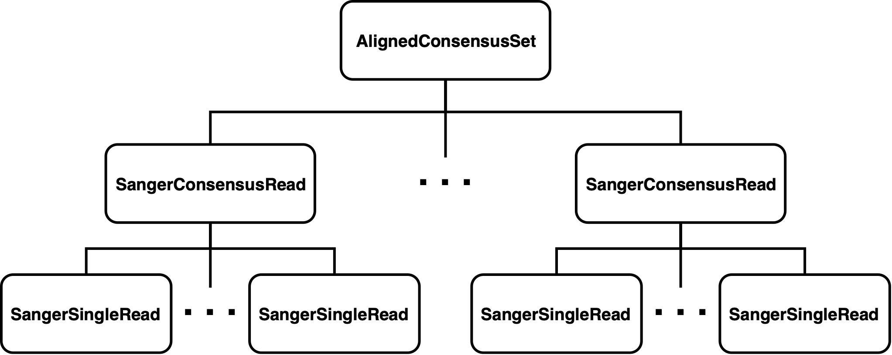
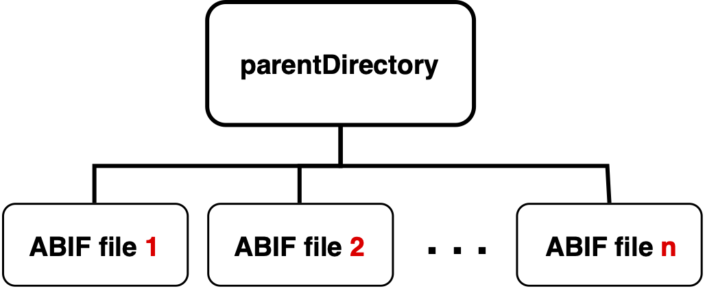
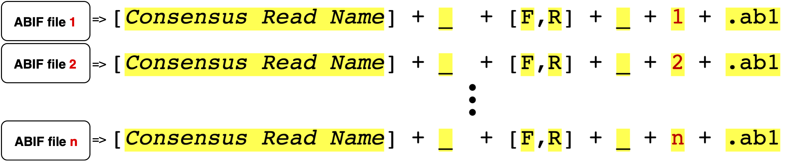

```{r style, echo=FALSE, results="asis", message=FALSE}
BiocStyle::markdown()
knitr::opts_chunk$set(tidy = FALSE,
                      warning = FALSE,
                      message = FALSE)
```

# Introduction

## Design Overview
The [sangeranalyseR](https://github.com/roblanf/sangeranalyseR) provides S4 classes for importing Sanger sequencing files into R environment. 

### S4 Classes
There are three main S4 classes in [sangeranalyseR](https://github.com/roblanf/sangeranalyseR) which are **'SangerSingleRead'**, **'SangerConsensusRead'** and **'AlignedConsensusSet'**. Each of them stores different level of input parameters and results in Sanger sequencing data analysis. Figure 1 shows the hierarchy of these three S4 classes.

```{r, out.width = "2000px",fig.cap="\\label{fig:figs} S4 class hierarchy", echo=FALSE}

```

* **'SangerSingleRead'** extends from 'sangerseq' class and stores raw data 'abif' class in [sangerseqR](https://bioconductor.org/packages/release/bioc/html/sangerseqR.html) as well as essential information including quality trimming and chromatogram parameters. It corresponds to a single ABIF file in Sanger sequencing. 

* **'SangerConsensusRead'** contains two lists of 'SangerSingleRead' which are forward and reverse read list as well as the alignment results. We call the aligned single reads "a consensus read". It corresponds to a contig in Sanger sequencing. In the following documentation, we will say "the reads in **'SangerConsensusRead'**" which means all the single reads that are in the specified consensus group.

* **'AlignedConsensusSet'** contains a list of 'SangerConsensusRead' and the alignment results for all consensus reads. We call the aligned consensus reads "an aligned-consensus read". It corresponds to a rebuild genome fragment in Sanger sequencing. In the following documentation, we will say "the consensus reads in **'AlignedConsensusSet'**" which means all the consensus reads from each consensus group.


### Interactive Shiny UI
We build two local interactive Shiny user interface for users to explore their created **'SangerConsensusRead'** and **'AlignedConsensusSet'**. Inside the Shiny UI, users can change the input parameters for quality trimming, chromatogram and rebuild consensus read etc. Information displayed on the UI is dynamic based on user input. Furthermore, all changed parameters and results can be saved to a new S4 instance and be exported as an *RDS* file.

## System Requirement
>>> After uploading to Bioconductor

## Installation
### Installing from GitHub using devtools
For now, users need to git clone the newest commit on the 'develop' branch on github. 
Press install button on RStudio to install sangeranalyseR.

### Installing from Bioconductor
>>> After uploading to Bioconductor


# S4 Classes
## SangerSingleRead
**"SangerSingleRead"** S4 class corresponds to a single ABIF file in Sanger sequencing. We will show how to create a **"SangerSingleRead"** instance and the slots in this class.

### ABIF Filename Regulation
Figure 2 below shows the filename regulation of input raw ABIF file which is going to be used as input to create **"SangerSingleRead"**. All raw ABIF files must be *forward* or *reverse* and the reason there is a [*Number Index*] in the suffix is that later we are going to create **"SangerConsensusRead"** S4 instance. There are no range restriction on [*Number Index*] here. But in **"SangerConsensusRead"** section, all reads in the same consensus group that are going to be aligned must be indexed properly. More details please refer to next section. 


```{r, out.width = "2000px", fig.cap="\\label{fig:figs} Filename regulation for 'SangerSingleRead'", echo=FALSE}
knitr::include_graphics("figure/SangerSingleRead_filename_regulation.png")
```

Here is an example of getting the absolute filename of a raw ABIF file. We will show the meaning of **[*Consensus Read Name*]**, **[*F,R*]** and **[*Number Index*]** with true data.
```{r}
inputFilesPath <- system.file("extdata/", package = "sangeranalyseR")

A_chloroticaFdReadFN <- file.path(inputFilesPath,                                                 
                                  "Allolobophora_chlorotica",
                                  "RBNII396-13[C_LepFolF,C_LepFolR]_F_1.ab1")
print(A_chloroticaFdReadFN)
```
In this example, the absolute filename is "RBNII396-13[C_LepFolF,C_LepFolR]_F_1.ab1" and it is a valid name. 

* The **[*Consensus Read Name*]** is *"RBNII396-13[C_LepFolF,C_LepFolR]"*
* The **[*F,R*]** is *"F"* 
* The **[*Number Index*]** is *"1"*.


### S4 Instance Creation Example
First, we load [sangeranalyseR](https://github.com/roblanf/sangeranalyseR) into R environment.
```{r}
library(sangeranalyseR)
```


Then, we can create **'SangerSingleRead'** S4 instance by running *"new"* function.
```{r}
singleReadNew <- new("SangerSingleRead",
                     readFeature           = "Forward Read",
                     readFileName          = A_chloroticaFdReadFN,
                     TrimmingMethod        = "M2",
                     M1TrimmingCutoff      = NULL,
                     M2CutoffQualityScore  = 40,
                     M2SlidingWindowSize   = 10,
                     baseNumPerRow         = 100,
                     heightPerRow          = 200,
                     signalRatioCutoff     = 0.33,
                     showTrimmed           = TRUE)
```

Moreover, we also create a constructor wrapper function for **'SangerSingleRead'**. The instance created by new and constructor functions are same. The constructor function makes creating **'SangerSingleRead'** S4 instance more intuitive.
```{r}
 singleReadCtor <- SangerSingleRead(readFeature           = "Forward Read",
                                    readFileName          = A_chloroticaFdReadFN,
                                    geneticCode           = GENETIC_CODE,
                                    TrimmingMethod        = "M2",
                                    M1TrimmingCutoff      = NULL,
                                    M2CutoffQualityScore  = 40,
                                    M2SlidingWindowSize   = 10,
                                    baseNumPerRow         = 100,
                                    heightPerRow          = 200,
                                    signalRatioCutoff     = 0.33,
                                    showTrimmed           = TRUE)
```

### Inputs Definition
The inputs of new and constructor methods are same. Both of their input parameters can be divied into three main categories: **"Basic Parameters"**, **"Quality Trimming Related Parameters"** and **"Chromatogram Related Parameters"**.

#### Basic Parameters
* **`readFeature`** : Specify whether the read is forward or reverse reads. The value must be *"Forward Read"* or *"Reverse Read"*.
* **`readFileName`** : The absolute filename of the ABIF file.
* **`geneticCode`** : Named character vector in the same format as GENETIC_CODE (the default), which represents the standard genetic code. This is the code with which the function will attempt to translate your DNA sequences. Users can get an appropriate vector with the getGeneticCode() function. The default is the standard code.

#### Quality Trimming Related Parameters
There are two read trimming methods for users to choose from. The Method 1 (M1) is *"Logarithmic Scale Trimming"* and the Method 2 (M2) is *"Logarithmic Scale Sliding Window Trimming"*. 

>>> Method 1 (M1) explanation (!!!!!!! Add !!!!!!!)

Method 2 (M2) is similar to "Trimmomatic"(Bolger et al.) SLIDINGWINDOW trimming method. We take the average logarithmic quality score in the sliding window size and if the average quality score is smaller than the cutoff quality score, then the first base pair of the sliding window will be the trimming start point.

* **`TrimmingMethod`** : Specify the read trimming method for this SangerSingleRead. The value must be *"M1"* (the default) or *'M2'*.
* **`M1TrimmingCutoff`** : The trimming cutoff for the Method 1. If `TrimmingMethod` is *"M1"*, then the default value is *"0.0001"*. Otherwise, the value must be *"NULL"*
* **`M2CutoffQualityScore`** : The trimming cutoff quality score for the Method 2. If `TrimmingMethod` is *"M2"*, then the default value is *"20"*. Otherwise, the value must be *"NULL"*. It works with `M2SlidingWindowSize`.
* **`M2SlidingWindowSize`** : The trimming sliding window size for the Method 2. If `TrimmingMethod` is *"M2"*, then the default value is *"5"*. Otherwise, the value must be *"NULL"*. It works with `M2CutoffQualityScore`.

#### Chromatogram Related Parameters

These parameters are used for drawing chromatogram in Shiny UI.

* **`baseNumPerRow`** : It defines maximum base pairs in each row. The default value is *"100"*
* **`heightPerRow`** : It defines the height of each row in chromatogram. The default value is *"200"*.
* **`signalRatioCutoff`** : The ratio of the height of a secondary peak to a primary peak. Secondary peaks higher than this ratio are annotated. Those below the ratio are excluded. The default value is *"0.33"*.
* **`showTrimmed`** : The logical value storing whether to show trimmed base pairs in chromatogram. The default value is *"TRUE"*.

### Slots in **'SangerSingleRead'**

**'SangerSingleRead'** inherits 'sangerseq' class. It contains all slots in 'sangerseq', so every function that uses 'sangerseq' as input can be replaced by **'SangerSingleRead'**. For example, we can use **'SangerSingleRead'** to run *"chromatogram"*, *'makeBaseCalls'* functions in [sangerseqR](https://bioconductor.org/packages/release/bioc/html/sangerseqR.html).
For inherited slots in **'SangerSingleRead'**, please refer to [sangerseqR reference manual](https://bioconductor.org/packages/release/bioc/manuals/sangerseqR/man/sangerseqR.pdf). Here, we show all the slots in **'SangerSingleRead'**


```{r }
slotNames(A_chloroticaSingleRead)
```

There are two special slots in **'SangerSingleRead'** which are S4 classes defined in this R package.

* **`QualityReport`** : Storing quality-related parameters and trimmed results.
* **`ChromatogramParam`** : Storing chromatogram-related parameters for Shiny UI.

We also show all the slots in **'QualityReport'** and **'ChromatogramParam'** class.
```{r }
slotNames(A_chloroticaSingleRead@QualityReport)
```

```{r }
slotNames(A_chloroticaSingleRead@ChromatogramParam)
```


## SangerConsensusRead
**"SangerConsensusRead"** S4 class corresponds to to a contig in Sanger sequencing. It contains all the single reads, the alignment results and the created consensus read etc. We will show how to create a **"SangerConsensusRead"** instance and the slots in this class.

### ABIF Filename Regulation & Input directory regulation

Before creating a **"SangerConsensusRead"** S4 instance, we need to prepare a  directory storing all raw ABIF files in the same consensus group with valid filenames. Figure 3 shows the directory hierarchy of **"SangerConsensusRead"**.

```{r, out.width = "600px", fig.cap="\\label{fig:figs}'SangerConsensusRead' directory hierarchy", echo=FALSE}

```
The `parentDirectory` stores the absolute file path. The only requirement of this file directory is that it must exist. As for the raw ABIF files in `parentDirectory`, users have to follow the regulation in Figure 4. The filename regulation for each raw ABIF files are same as filename regulation in **"SangerSingleRead"**; however, users have to pay attention to the [*Number Index*]. The [*Number Index*] of raw ABIF files must to be indexed in *1*, *2*, *3* ... order. Furthermore, all forward reads should be indexed first, and then reverse reads.

```{r, out.width = "2000px", fig.cap="\\label{fig:figs} Filename regulation for 'SangerConsensusRead'", echo=FALSE}

```

Now, after preparing valid directory, we start to define the parameters. First, we need to define the absolute parent directory, the consensus read name and suffix regular expression for forward as well as reverse read.
```{r}
rawDataDir <- system.file("extdata", package = "sangeranalyseR")
inputFilesParentDir <- file.path(rawDataDir, "Allolobophora_chlorotica")
consensusReadName <- "ACHLO006-09[LCO1490_t1,HCO2198_t1]"
suffixForwardRegExp <- "_[F]_[0-9]*.ab1"
suffixReverseRegExp <- "_[R]_[0-9]*.ab1"
```


### S4 Instance Creation Example


Now we create the **'SangerConsensusRead'** S4 instance by running *"new"* function. In this example, we provide a reference amino acids sequence and choose Method 1 (M1) *"Logarithmic Scale Trimming"* as our quality trimming approach.
```{r}
A_chloroticConsensusReadsRef <- 
                    new("SangerConsensusRead",
                        parentDirectory       = inputFilesParentDir,
                        consensusReadName    = consensusReadName,
                        suffixForwardRegExp   = suffixForwardRegExp,
                        suffixReverseRegExp   = suffixReverseRegExp,
                        refAminoAcidSeq       = "SRQWLFSTNHKDIGTLYFIFGAWAGMVGTSLSILIRAELGHPGALIGDDQIYNVIVTAHAFIMIFFMVMPIMIGGFGNWLVPLMLGAPDMAFPRMNNMSFWLLPPALSLLLVSSMVENGAGTGWTVYPPLSAGIAHGGASVDLAIFSLHLAGISSILGAVNFITTVINMRSTGISLDRMPLFVWSVVITALLLLLSLPVLAGAITMLLTDRNLNTSFFDPAGGGDPILYQHLFWFFGHPEVYILILPGFGMISHIISQESGKKETFGSLGMIYAMLAIGLLGFIVWAHHMFTVGMDVDTRAYFTSATMIIAVPTGIKIFSWLATLHGTQLSYSPAILWALGFVFLFTVGGLTGVVLANSSVDIILHDTYYVVAHFHYVLSMGAVFAIMAGFIHWYPLFTGLTLNNKWLKSHFIIMFIGVNLTFFPQHFLGLAGMPRRYSDYPDAYTTWNIVSTIGSTISLLGILFFFFIIWESLVSQRQVIYPIQLNSSIEWYQNTPPAEHSYSELPLLTN",
                        TrimmingMethod        = "M1",
                        M1TrimmingCutoff      = 0.0002,
                        M2CutoffQualityScore  = NULL,
                        M2SlidingWindowSize   = NULL,
                        baseNumPerRow         = 100,
                        heightPerRow          = 200,
                        signalRatioCutoff     = 0.33,
                        showTrimmed           = TRUE)
```


Same as the previous **'SangerSingleRead'**, we also create a constructor wrapper function for **'SangerConsensusRead'**. The instance created by new and constructor functions are same. In this example, we do not provide a reference amino acids sequence and choose Method 2 (M2) *"Logarithmic Scale Sliding Window Trimming"* as our quality trimming approach.
``` {r}
A_chloroticConsensusReadsNoRef <- 
                    SangerConsensusRead(
                        parentDirectory       = inputFilesParentDir,
                        consensusReadName    = consensusReadName,
                        suffixForwardRegExp   = suffixForwardRegExp,
                        suffixReverseRegExp   = suffixReverseRegExp,
                        TrimmingMethod        = "M2",
                        M1TrimmingCutoff      = NULL,
                        M2CutoffQualityScore  = 40,
                        M2SlidingWindowSize   = 10,
                        baseNumPerRow         = 100,
                        heightPerRow          = 200,
                        signalRatioCutoff     = 0.33,
                        showTrimmed           = TRUE)
```

### Inputs Definition
The inputs of new and constructor methods are same. Both of their input parameters can be divied into three main categories: **"Basic Parameters"**, **"Quality Trimming Related Parameters"** and **"Chromatogram Related Parameters"**. The **"Quality Trimming Related Parameters"** and **"Chromatogram Related Parameters"** are same as the input of **'SangerSingleRead'**. Please refer to the previous section. Here, we will only show "Basic Parameters".

#### Basic Parameters

* **`inputFilesParentDir`** : The absolute parent directory storing all raw ABIF files. There is no restrictions about this directory but the existance of this directory will be checked.
* **`consensusReadName`** : The consensus read name for the target reads that are going to be aligned into a consensus read.
* **`suffixForwardRegExp`** : The suffix regular expression for forward reads in **'SangerConsensusRead'**.
* **`suffixReverseRegExp`** : The suffix regular expression for reverse reads in **'SangerConsensusRead'**.

### Slots Definition

Here, we show all the slots in **'SangerConsensusRead'**. For more details about the meaning of each slot, please refer to sangeranalyseR reference manual.

```{r }
slotNames(A_chloroticConsensusReadsRef)
```


## AlignedConsensusSet
### ABIF Filename Regulation & Input directory regulation
Before creating a **"AlignedConsensusSet"** S4 instance, we need to prepare a directory storing all raw ABIF files. Figure 5 shows the directory hierarchy of **"AlignedConsensusSet"**. 

```{r, out.width = "2000px", fig.cap="\\label{fig:figs}'AlignedConsensusRead' directory hierarchy", echo=FALSE}
knitr::include_graphics("figure/AlignedConsensusRead_file_structure.png")
```

The `parentDirectory` is same as **"SangerConsensusRead"** which is the absolute file path storing all raw ABIF files. The difference is that raw ABIF files do not need to be in the first layer inside `parentDirectory`; in other words, it is allowed to have some middle directories separating the ABIF files. Figure 6 shows the  **"AlignedConsensusSet"** filename regulation and grouping strategy. The ABIF files with the same **[*Consensus Read Name*]** will be categorized into the same group and for each group, a **"SangerConsensusRead"** will be created. **"AlignedConsensusSet"** will be created by these **"SangerConsensusRead"**.

```{r, out.width = "2000px", fig.cap="\\label{fig:figs}'AlignedConsensusRead' filename regulation", echo=FALSE}
knitr::include_graphics("figure/AlignedConsensusRead_filename_regulation.png")
```

Here is an example. Users only need to define the `parentDirectory`, foward and reverse reads regular expression suffix, and program will recursively search all the root files inside the `parentDirectory` with the valid filename regulation. These three parameters are the important inputs for creating **"AlignedConsensusSet"**. 

```{r}
rawDataDir <- system.file("extdata", package = "sangeranalyseR")
inputFilesParentDir <- file.path(rawDataDir, "Allolobophora_chlorotica")
suffixForwardRegExp <- "_[F]_[0-9]*.ab1"
suffixReverseRegExp <- "_[R]_[0-9]*.ab1"
```

### S4 Instance Creation Example

After defining `parentDirectory`, `suffixForwardRegExp`, and `suffixReverseRegExp`, we can start to create the SangerAlginedConsensusSet. 
```{r eval=FALSE}
setOldClass("phylo")

SangerAlignedConsensusSet <- new("SangerAlignedConsensusSet",
                                parentDirectory       = inputFilesParentDir,
                                suffixForwardRegExp   = suffixForwardRegExp,
                                suffixReverseRegExp   = suffixReverseRegExp,
                                refAminoAcidSeq       = "SRQWLFSTNHKDIGTLYFIFGAWAGMVGTSLSILIRAELGHPGALIGDDQIYNVIVTAHAFIMIFFMVMPIMIGGFGNWLVPLMLGAPDMAFPRMNNMSFWLLPPALSLLLVSSMVENGAGTGWTVYPPLSAGIAHGGASVDLAIFSLHLAGISSILGAVNFITTVINMRSTGISLDRMPLFVWSVVITALLLLLSLPVLAGAITMLLTDRNLNTSFFDPAGGGDPILYQHLFWFFGHPEVYILILPGFGMISHIISQESGKKETFGSLGMIYAMLAIGLLGFIVWAHHMFTVGMDVDTRAYFTSATMIIAVPTGIKIFSWLATLHGTQLSYSPAILWALGFVFLFTVGGLTGVVLANSSVDIILHDTYYVVAHFHYVLSMGAVFAIMAGFIHWYPLFTGLTLNNKWLKSHFIIMFIGVNLTFFPQHFLGLAGMPRRYSDYPDAYTTWNIVSTIGSTISLLGILFFFFIIWESLVSQRQVIYPIQLNSSIEWYQNTPPAEHSYSELPLLTN",
                                geneticCode           = GENETIC_CODE,
                                TrimmingMethod        = "M2",
                                M1TrimmingCutoff      = NULL,
                                M2CutoffQualityScore  = 40,
                                M2SlidingWindowSize   = 10,
                                baseNumPerRow         = 100,
                                heightPerRow          = 200,
                                signalRatioCutoff     = 0.33,
                                showTrimmed           = TRUE)
```

### Inputs Definition
### Slots Definition

# Shiny App
## ShinySangerConsensusRead
### Example
* UI for **'SangerConsensusRead'** class: Users can access to each read and an overview page for consensus reads. 

launchAppConsensusRead 

## ShinySangerAlignedConsensusSet
### Example
* UI for **'AlignedConsensusSet'** class: Users can recursively access to all single reads, each overview page for consensus reads and 
launchAppAlignedConsensusSet


# Conclusion

# Session Information

# Reference
Bolger, A. M., Lohse, M., & Usadel, B. (2014). Trimmomatic: a flexible trimmer for Illumina sequence data. Bioinformatics, 30(15), 2114-2120.
