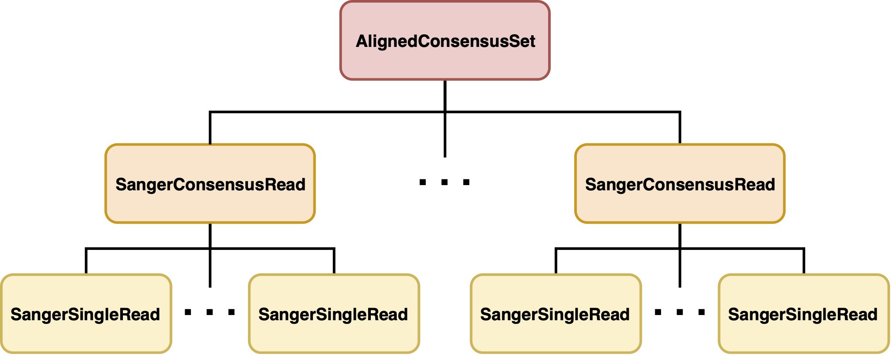
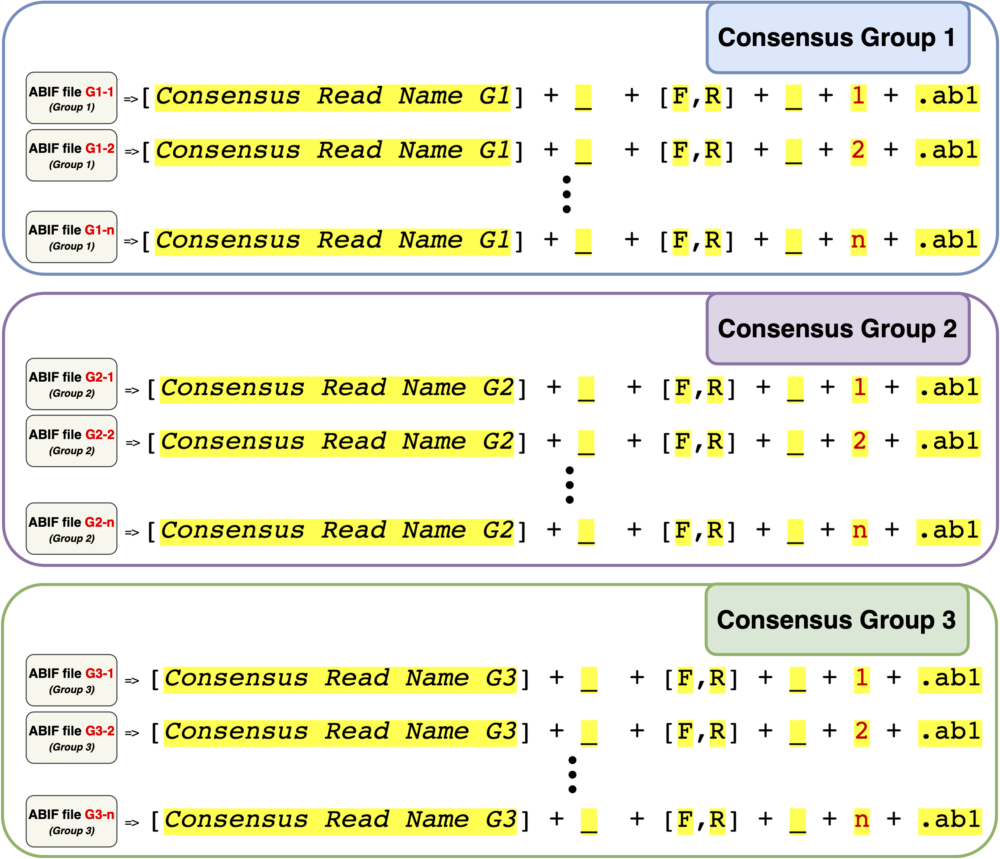
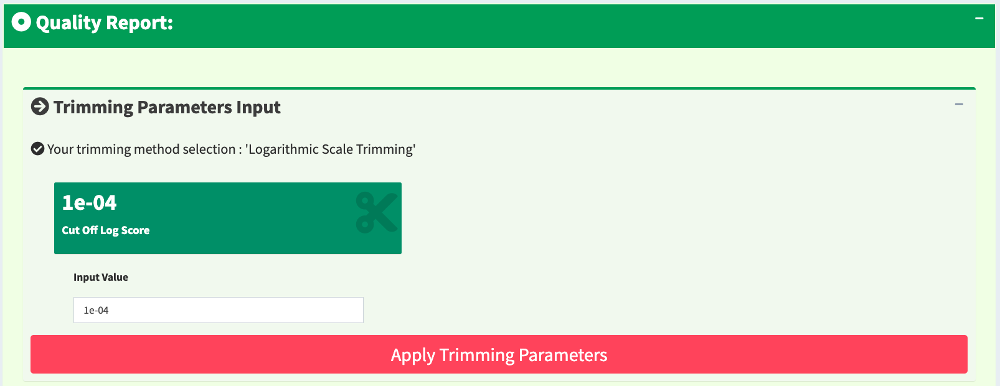
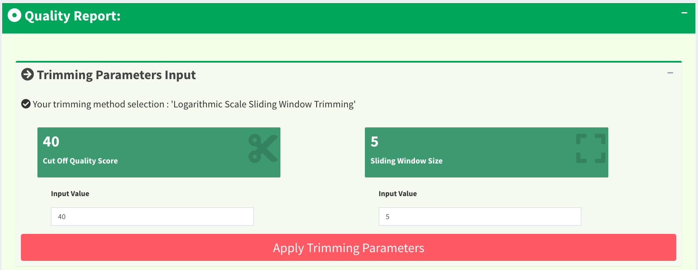
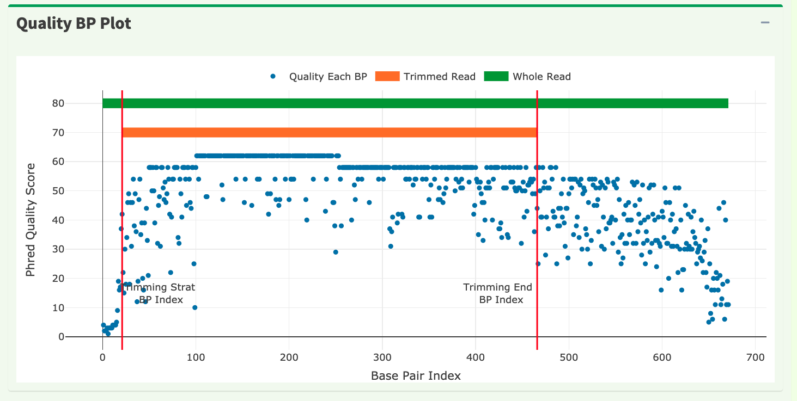
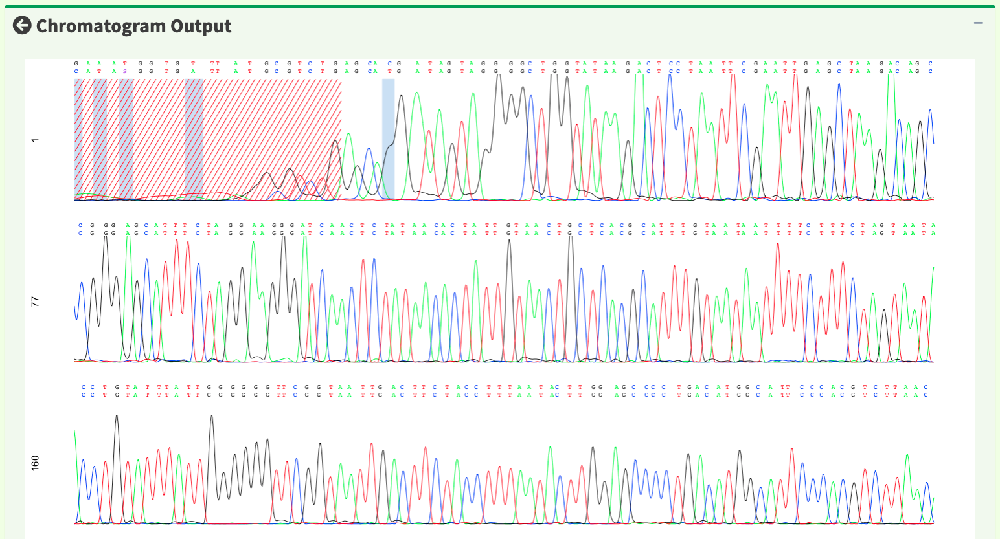
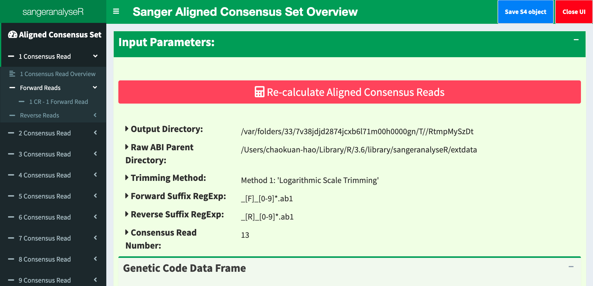
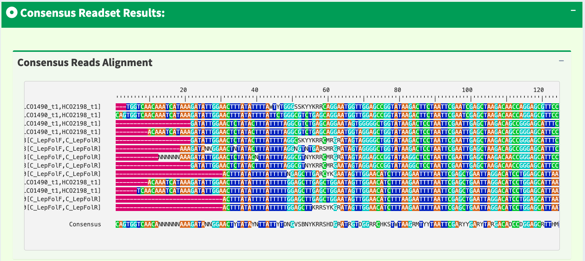

```{r style, echo=FALSE, results="asis", message=FALSE}
BiocStyle::markdown()
knitr::opts_chunk$set(tidy = FALSE,
                      warning = FALSE,
                      message = FALSE)
```

# Introduction
sangeranalyseR is an R package for analysing Sanger sequencing reads, especially those from the ABIF platform, in pure R environment. We create three main S4 R classes which are in hierarchy to store user inputs and data analysis results. Furthermore, in order to let users check and change some essential parameters of each read easily, we provide two local interactive Shiny apps that visualize the created S4 R instance.

## Design Overview
The [sangeranalyseR](https://github.com/roblanf/sangeranalyseR) provides S4 classes for importing Sanger sequencing files into R environment. 

### S4 Classes
There are three main S4 classes in [sangeranalyseR](https://github.com/roblanf/sangeranalyseR) which are **'SangerSingleRead'**, **'SangerConsensusRead'** and **'AlignedConsensusSet'**. Each of them stores different level of input parameters and results in Sanger sequencing data analysis. **Figure 1** shows the hierarchy of these three S4 classes.

```{r, out.width = "2000px",fig.cap="\\label{fig:figs} S4 class hierarchy", echo=FALSE}

```

* **'SangerSingleRead'** extends from 'sangerseq' class and stores raw data 'abif' class in [sangerseqR](https://bioconductor.org/packages/release/bioc/html/sangerseqR.html) as well as essential information including quality trimming and chromatogram parameters. It corresponds to a single ABIF file in Sanger sequencing. 

* **'SangerConsensusRead'** contains two lists of 'SangerSingleRead' which are forward and reverse read list as well as the alignment results. We call the aligned single reads "a consensus read". It corresponds to a contig in Sanger sequencing. In the following documentation, we will say "the reads in **'SangerConsensusRead'**" which means all the single reads that are in the specified consensus group.

* **'AlignedConsensusSet'** contains a list of 'SangerConsensusRead' and the alignment results for all consensus reads. We call the aligned consensus reads "an aligned-consensus read". It corresponds to a rebuild genome fragment in Sanger sequencing. In the following documentation, we will say "the consensus reads in **'AlignedConsensusSet'**" which means all the consensus reads from each consensus group.


### Interactive Shiny App
We build two local interactive Shiny app for users to explore their created **'SangerConsensusRead'** and **'AlignedConsensusSet'**. Inside the Shiny app, users can change the input parameters for quality trimming, chromatogram and rebuild consensus read etc. Information displayed on the UI is dynamic based on user input. Furthermore, all changed parameters and results can be saved to a new S4 instance and be exported as an *RDS* file.

## System Requirement
>>> After uploading to Bioconductor

## Installation
### Installing from GitHub using devtools
For now, users need to git clone the newest commit in the 'develop' branch on github. 
Press install button on RStudio to install sangeranalyseR.

### Installing from Bioconductor
>>> After uploading to Bioconductor


# S4 Classes
## SangerSingleRead
**"SangerSingleRead"** S4 class corresponds to a single ABIF file in Sanger sequencing. We will show how to create a **"SangerSingleRead"** instance and the slots in this class.

### ABIF Filename Regulation
**Figure 2** below shows the filename regulation of input raw ABIF file which is going to be used as input to create **"SangerSingleRead"**. All raw ABIF files must be *forward* or *reverse* and the reason there is a **[*Number Index*]** in the suffix is that later we are going to create **"SangerConsensusRead"** S4 instance. There are no range restriction on **[*Number Index*]** here. But in **"SangerConsensusRead"** section, all reads in the same consensus group that are going to be aligned must be indexed properly. More details please refer to next section. 


```{r, out.width = "2000px", fig.cap="\\label{fig:figs} Filename regulation for 'SangerSingleRead'", echo=FALSE}

```

Here is an example of getting the absolute filename of a raw ABIF file. We will show the meaning of **[*Consensus Read Name*]**, **[*F,R*]** and **[*Number Index*]** with true data.
```{r}
inputFilesPath <- system.file("extdata/", package = "sangeranalyseR")

A_chloroticaFdReadFN <- file.path(inputFilesPath,                                                 
                                  "Allolobophora_chlorotica",
                                  "RBNII396-13[C_LepFolF,C_LepFolR]_F_1.ab1")
print(A_chloroticaFdReadFN)
```
In this example, the absolute filename is "RBNII396-13[C_LepFolF,C_LepFolR]_F_1.ab1" and it is a valid name. 

* The **[*Consensus Read Name*]** is *"RBNII396-13[C_LepFolF,C_LepFolR]"*
* The **[*F,R*]** is *"F"* 
* The **[*Number Index*]** is *"1"*.


### S4 Instance Creation Example
First, we load [sangeranalyseR](https://github.com/roblanf/sangeranalyseR) into R environment.
```{r}
library(sangeranalyseR)
```


Then, we can create **'SangerSingleRead'** S4 instance by running *"new"* function.
```{r}
singleReadNew <- new("SangerSingleRead",
                     readFeature           = "Forward Read",
                     readFileName          = A_chloroticaFdReadFN,
                     TrimmingMethod        = "M2",
                     M1TrimmingCutoff      = NULL,
                     M2CutoffQualityScore  = 40,
                     M2SlidingWindowSize   = 10,
                     baseNumPerRow         = 100,
                     heightPerRow          = 200,
                     signalRatioCutoff     = 0.33,
                     showTrimmed           = TRUE)
```

Moreover, we also create a constructor wrapper function for **'SangerSingleRead'**. The instance created by new and constructor functions are same. The constructor function makes creating **'SangerSingleRead'** S4 instance more intuitive.
```{r}
 singleReadCtor <- SangerSingleRead(readFeature           = "Forward Read",
                                    readFileName          = A_chloroticaFdReadFN,
                                    geneticCode           = GENETIC_CODE,
                                    TrimmingMethod        = "M2",
                                    M1TrimmingCutoff      = NULL,
                                    M2CutoffQualityScore  = 40,
                                    M2SlidingWindowSize   = 10,
                                    baseNumPerRow         = 100,
                                    heightPerRow          = 200,
                                    signalRatioCutoff     = 0.33,
                                    showTrimmed           = TRUE)
```

### Inputs Definition
The inputs of new and constructor methods are same. Both of their input parameters can be divied into three main categories: **"Basic Parameters"**, **"Quality Trimming Related Parameters"** and **"Chromatogram Related Parameters"**.

#### Basic Parameters
* **`readFeature`** : Specify whether the read is forward or reverse reads. The value must be *"Forward Read"* or *"Reverse Read"*.
* **`readFileName`** : The absolute filename of the ABIF file.
* **`geneticCode`** : Named character vector in the same format as GENETIC_CODE (the default), which represents the standard genetic code. This is the code with which the function will attempt to translate your DNA sequences. Users can get an appropriate vector with the getGeneticCode() function. The default is the standard code.

#### Quality Trimming Related Parameters
There are two read trimming methods for users to choose from. The Method 1 (M1) is *"Logarithmic Scale Trimming"* and the Method 2 (M2) is *"Logarithmic Scale Sliding Window Trimming"*. 

>>> Method 1 (M1) explanation (!!!!!!! Add !!!!!!!)

Method 2 (M2) is similar to "Trimmomatic"(Bolger et al.) SLIDINGWINDOW trimming method. We take the average logarithmic quality score in the sliding window size and if the average quality score is smaller than the cutoff quality score, then the first base pair of the sliding window will be the trimming start point.

* **`TrimmingMethod`** : Specify the read trimming method for this SangerSingleRead. The value must be *"M1"* (the default) or *'M2'*.
* **`M1TrimmingCutoff`** : The trimming cutoff for the Method 1. If `TrimmingMethod` is *"M1"*, then the default value is *"0.0001"*. Otherwise, the value must be *"NULL"*
* **`M2CutoffQualityScore`** : The trimming cutoff quality score for the Method 2. If `TrimmingMethod` is *"M2"*, then the default value is *"20"*. Otherwise, the value must be *"NULL"*. It works with `M2SlidingWindowSize`.
* **`M2SlidingWindowSize`** : The trimming sliding window size for the Method 2. If `TrimmingMethod` is *"M2"*, then the default value is *"5"*. Otherwise, the value must be *"NULL"*. It works with `M2CutoffQualityScore`.

#### Chromatogram Related Parameters

These parameters are used for drawing chromatogram in Shiny app.

* **`baseNumPerRow`** : It defines maximum base pairs in each row. The default value is *"100"*
* **`heightPerRow`** : It defines the height of each row in chromatogram. The default value is *"200"*.
* **`signalRatioCutoff`** : The ratio of the height of a secondary peak to a primary peak. Secondary peaks higher than this ratio are annotated. Those below the ratio are excluded. The default value is *"0.33"*.
* **`showTrimmed`** : The logical value storing whether to show trimmed base pairs in chromatogram. The default value is *"TRUE"*.

### Slots in **'SangerSingleRead'**

**'SangerSingleRead'** inherits 'sangerseq' class. It contains all slots in 'sangerseq', so every function that uses 'sangerseq' as input can be replaced by **'SangerSingleRead'**. For example, we can use **'SangerSingleRead'** to run *"chromatogram"*, *'makeBaseCalls'* functions in [sangerseqR](https://bioconductor.org/packages/release/bioc/html/sangerseqR.html).
For inherited slots in **'SangerSingleRead'**, please refer to [sangerseqR reference manual](https://bioconductor.org/packages/release/bioc/manuals/sangerseqR/man/sangerseqR.pdf). Here, we show all the slots in **'SangerSingleRead'**


```{r }
slotNames(singleReadCtor)
```

There are two special slots in **'SangerSingleRead'** which are S4 classes defined in this R package.

* **`QualityReport`** : Storing quality-related parameters and trimmed results.
* **`ChromatogramParam`** : Storing chromatogram-related parameters for Shiny app.

We also show all the slots in **'QualityReport'** and **'ChromatogramParam'** class.
```{r }
slotNames(singleReadCtor@QualityReport)
```

```{r }
slotNames(singleReadCtor@ChromatogramParam)
```


## SangerConsensusRead
**"SangerConsensusRead"** S4 class corresponds to to a contig in Sanger sequencing. It contains all the single reads, the alignment results and the created consensus read etc. We will show how to create a **"SangerConsensusRead"** instance and the slots in this class.

### ABIF Filename Regulation & Input directory regulation

Before creating a **"SangerConsensusRead"** S4 instance, we need to prepare a  directory storing all raw ABIF files in the same consensus group with valid filenames. **Figure 3** shows the directory hierarchy of **"SangerConsensusRead"**.

```{r, out.width = "600px", fig.cap="\\label{fig:figs}'SangerConsensusRead' directory hierarchy", echo=FALSE}
knitr::include_graphics("figure/Figure_3_SangerConsensusRead_file_structure.png")
```
The `parentDirectory` stores the absolute file path. The only requirement of this file directory is that it must exist. As for the raw ABIF files in `parentDirectory`, users have to follow the regulation in **Figure 4**. The filename regulation for each raw ABIF files are same as filename regulation in **"SangerSingleRead"**; however, users have to pay attention to the [*Number Index*]. The **[*Number Index*]** of raw ABIF files must to be indexed in *1*, *2*, *3* ... order. Furthermore, all forward reads should be indexed first, and then reverse reads.

```{r, out.width = "2000px", fig.cap="\\label{fig:figs} Filename regulation for 'SangerConsensusRead'", echo=FALSE}
knitr::include_graphics("figure/Figure_4_SangerConsensusRead_filename_regulation.png")
```

Now, after preparing valid directory, we start to define the parameters. First, we need to define the absolute parent directory, the consensus read name and suffix regular expression for forward as well as reverse read.
```{r}
rawDataDir <- system.file("extdata", package = "sangeranalyseR")
inputFilesParentDir <- file.path(rawDataDir, "Allolobophora_chlorotica")
consensusReadName <- "ACHLO006-09[LCO1490_t1,HCO2198_t1]"
suffixForwardRegExp <- "_[F]_[0-9]*.ab1"
suffixReverseRegExp <- "_[R]_[0-9]*.ab1"
```


### S4 Instance Creation Example

Now we create the **'SangerConsensusRead'** S4 instance by running *"new"* function. In this example, we provide a reference amino acids sequence and choose Method 1 (M1) *"Logarithmic Scale Trimming"* as our quality trimming approach.
```{r}
consensusReadsRef <- new("SangerConsensusRead",
                         parentDirectory       = inputFilesParentDir,
                         consensusReadName    = consensusReadName,
                         suffixForwardRegExp   = suffixForwardRegExp,
                         suffixReverseRegExp   = suffixReverseRegExp,
                         refAminoAcidSeq       = "SRQWLFSTNHKDIGTLYFIFGAWAGMVGTSLSILIRAELGHPGALIGDDQIYNVIVTAHAFIMIFFMVMPIMIGGFGNWLVPLMLGAPDMAFPRMNNMSFWLLPPALSLLLVSSMVENGAGTGWTVYPPLSAGIAHGGASVDLAIFSLHLAGISSILGAVNFITTVINMRSTGISLDRMPLFVWSVVITALLLLLSLPVLAGAITMLLTDRNLNTSFFDPAGGGDPILYQHLFWFFGHPEVYILILPGFGMISHIISQESGKKETFGSLGMIYAMLAIGLLGFIVWAHHMFTVGMDVDTRAYFTSATMIIAVPTGIKIFSWLATLHGTQLSYSPAILWALGFVFLFTVGGLTGVVLANSSVDIILHDTYYVVAHFHYVLSMGAVFAIMAGFIHWYPLFTGLTLNNKWLKSHFIIMFIGVNLTFFPQHFLGLAGMPRRYSDYPDAYTTWNIVSTIGSTISLLGILFFFFIIWESLVSQRQVIYPIQLNSSIEWYQNTPPAEHSYSELPLLTN",
                         TrimmingMethod        = "M1",
                         M1TrimmingCutoff      = 0.0002,
                         M2CutoffQualityScore  = NULL,
                         M2SlidingWindowSize   = NULL,
                         baseNumPerRow         = 100,
                         heightPerRow          = 200,
                         signalRatioCutoff     = 0.33,
                         showTrimmed           = TRUE)
```


Same as the previous **'SangerSingleRead'**, we also create a constructor wrapper function for **'SangerConsensusRead'**. The instance created by new and constructor functions are same. In this example, we do not provide a reference amino acids sequence and choose Method 2 (M2) *"Logarithmic Scale Sliding Window Trimming"* as our quality trimming approach.
``` {r eval=FALSE}
consensusReadsNoRef <- SangerConsensusRead(
                              parentDirectory       = inputFilesParentDir,
                              consensusReadName    = consensusReadName,
                              suffixForwardRegExp   = suffixForwardRegExp,
                              suffixReverseRegExp   = suffixReverseRegExp,
                              TrimmingMethod        = "M2",
                              M1TrimmingCutoff      = NULL,
                              M2CutoffQualityScore  = 40,
                              M2SlidingWindowSize   = 10,
                              baseNumPerRow         = 100,
                              heightPerRow          = 200,
                              signalRatioCutoff     = 0.33,
                              showTrimmed           = TRUE)
```

### Inputs Definition
The inputs of new and constructor methods are same. Both of their input parameters can be divied into three main categories: **"Basic Parameters"**, **"Quality Trimming Related Parameters"** and **"Chromatogram Related Parameters"**. The **"Quality Trimming Related Parameters"** and **"Chromatogram Related Parameters"** are same as the input of **'SangerSingleRead'**. By default, all reads will use the same parameters and users can use the local Shiny app that we provide to explore and change these input parameters. The Shiny app will be discussed in next section.

For more input details, please refer to the **'SangerSingleRead'** section and sangeranalyseR reference manul. Here, we will only show the "Basic Parameters".

#### Basic Parameters

* **`inputFilesParentDir`** : The absolute parent directory storing all raw ABIF files. There is no restrictions about this directory but the existance of this directory will be checked.
* **`consensusReadName`** : The consensus read name for the target reads that are going to be aligned into a consensus read.
* **`suffixForwardRegExp`** : The suffix regular expression for forward reads in **'SangerConsensusRead'**.
* **`suffixReverseRegExp`** : The suffix regular expression for reverse reads in **'SangerConsensusRead'**.

### Slots Definition

Here, we show all the slots in **'SangerConsensusRead'**. For more details about the meaning of each slot, please refer to sangeranalyseR reference manual.

```{r }
slotNames(consensusReadsRef)
```


## AlignedConsensusSet

**"AlignedConsensusSet"** S4 class corresponds to a rebuild genome fragment in Sanger sequencing. It contains all the single reads, the alignment results and the created consensus read etc. We will show how to create a **"AlignedConsensusSet"** instance and the slots in this class.

### ABIF Filename Regulation & Input directory regulation
Before creating a **"AlignedConsensusSet"** S4 instance, we need to prepare a directory storing all raw ABIF files. **Figure 5** shows the directory hierarchy of **"AlignedConsensusSet"**. 

```{r, out.width = "2000px", fig.cap="\\label{fig:figs}'AlignedConsensusSet' directory hierarchy", echo=FALSE}
knitr::include_graphics("figure/Figure_5_AlignedConsensusSet_file_structure.png")
```

The `parentDirectory` is same as **"SangerConsensusRead"** which is the absolute file path storing all raw ABIF files. The difference is that raw ABIF files do not need to be in the first layer inside `parentDirectory`; in other words, it is allowed to have some middle directories separating the ABIF files. **Figure 6** shows the  **"AlignedConsensusSet"** filename regulation and grouping strategy. The ABIF files with the same **[*Consensus Read Name*]** will be categorized into the same group and for each group, a **"SangerConsensusRead"** will be created. **"AlignedConsensusSet"** will be created by these **"SangerConsensusRead"**.

```{r, out.width = "2000px", fig.cap="\\label{fig:figs}'AlignedConsensusSet' filename regulation", echo=FALSE}

```

Here is an example. Users only need to define the `parentDirectory`, foward and reverse reads regular expression suffix, and program will recursively search all the root ABIF files inside the `parentDirectory` with the valid filename regulation. These three parameters are the important inputs for creating **"AlignedConsensusSet"**. 

```{r}
inputFilesParentDir <- system.file("extdata", package = "sangeranalyseR")
suffixForwardRegExp <- "_[F]_[0-9]*.ab1"
suffixReverseRegExp <- "_[R]_[0-9]*.ab1"
```

### S4 Instance Creation Example

After defining `parentDirectory`, `suffixForwardRegExp`, and `suffixReverseRegExp`, we can create the **"AlignedConsensusSet"**.  
```{r echo = T, results = 'hide', eval= FALSE}
setOldClass("phylo")

alignedConsensusRef <- new("SangerAlignedConsensusSet",
                           parentDirectory       = inputFilesParentDir,
                           suffixForwardRegExp   = suffixForwardRegExp,
                           suffixReverseRegExp   = suffixReverseRegExp,
                           refAminoAcidSeq       = "SRQWLFSTNHKDIGTLYFIFGAWAGMVGTSLSILIRAELGHPGALIGDDQIYNVIVTAHAFIMIFFMVMPIMIGGFGNWLVPLMLGAPDMAFPRMNNMSFWLLPPALSLLLVSSMVENGAGTGWTVYPPLSAGIAHGGASVDLAIFSLHLAGISSILGAVNFITTVINMRSTGISLDRMPLFVWSVVITALLLLLSLPVLAGAITMLLTDRNLNTSFFDPAGGGDPILYQHLFWFFGHPEVYILILPGFGMISHIISQESGKKETFGSLGMIYAMLAIGLLGFIVWAHHMFTVGMDVDTRAYFTSATMIIAVPTGIKIFSWLATLHGTQLSYSPAILWALGFVFLFTVGGLTGVVLANSSVDIILHDTYYVVAHFHYVLSMGAVFAIMAGFIHWYPLFTGLTLNNKWLKSHFIIMFIGVNLTFFPQHFLGLAGMPRRYSDYPDAYTTWNIVSTIGSTISLLGILFFFFIIWESLVSQRQVIYPIQLNSSIEWYQNTPPAEHSYSELPLLTN",
                           geneticCode           = GENETIC_CODE,
                           TrimmingMethod        = "M2",
                           M1TrimmingCutoff      = NULL,
                           M2CutoffQualityScore  = 40,
                           M2SlidingWindowSize   = 10,
                           baseNumPerRow         = 100,
                           heightPerRow          = 200,
                           signalRatioCutoff     = 0.33,
                           showTrimmed           = TRUE)
```

### Inputs Definition
The inputs of new and constructor methods are same. Both of their input parameters can be divied into three main categories: **"Basic Parameters"**, **"Quality Trimming Related Parameters"** and **"Chromatogram Related Parameters"** which are same as **'SangerConsensusRead'**. By default, all **'SangerConsensusRead'** in **'AlignedConsensus'** will use the same trimming and chromatogram parameters. We provide Shiny app for users to explore and change these input parameters. Shiny app will be discussed in next section.

For more input details, please refer to **'SangerSingleRead'**, **'SangerConsensusRead'** and sangeranalyseR reference manul.

### Slots Definition
Here, we show all the slots in **'AlignedConsensusSet'**. For more details about the meaning of each slot, please refer to sangeranalyseR reference manual.
```{r , eval= FALSE}
slotNames(alignedConsensusRef)
```


# Shiny App

In sangeranalyseR, we create two interactive Shiny apps which are **'*SangerConsensusRead App*'** and **'*AlignedConsensusSet App*'** for users to check Sanger sequencing data results. These two Shiny apps can be run locally in current R environment. Users need to create a **'SangerConsensusRead'** or an **'AlignedConsensusSet'** S4 instance mentioned above first and use them as input to start the Shiny app. Inside the Shiny app, users can change the input parameters for quality trimming, base calling, chromatogram plotting etc. The results displayed in the app are dynamic based on user input. In this section, we are going to show how to run the Shiny apps.

## SangerConsensusRead App

To run **'*SangerConsensusRead App*'**, users have to create a **SangerConsensusRead** instance first. Notice that the input of this function is **"****SangerConsensusRead** instance in a list**"**.
Now, we execute the `launchAppConsensusRead` function and create a `RShinySCR` Shiny object.
```{r }
RShinySCR <- launchAppConsensusRead(list(consensusReadsRef))
```
Run the `RShinySCR` in R console to trigger the **'*SangerConsensusRead App*'**. There are two layers in **"SangerConsensusRead"** which are ***"Consensus Read Overview Page"*** and ***"Single Read Page"***

### "Consensus Read Overview Page"
```{r, out.width = "2000px", fig.cap="\\label{fig:figs} Initial page for 'SangerConsensusRead App'", echo=FALSE}
knitr::include_graphics("figure/Figure_7_.png")
```


**Figure 7** is the initial page of **'*SangerConsensusRead App*'** which is the **"Consensus Read Overview page"**. In this page, users can see basic information of this consensus read. Notice that there is a red "*Re-calculate consensus read button*". It is highly suggested to click the button before checking the results in order to get the updated information.

```{r, out.width = "2000px", fig.cap="\\label{fig:figs} 'Alignment' & 'Difference Data Frame' results", echo=FALSE}
knitr::include_graphics("figure/Figure_8_.png")
```

The information provided in this page includes : *"input parameters"*, *"genetic code table"*, *"reference amino acids sequence"*, *"reads alignment"*, *"difference data frame"*, *"dendrogram"*, *"sample distance heatmap"*, *"indels data frame"*, *"stop codons data frame"*. **Figure 8** shows part of the results in the **"Consensus Read Overview Page"**. The results are dynamic based on the trimming inputs getting from *"Single Read Page"*. 

### "Single Read Page"

All reads in **'SangerConsensusRead'** are in *forward* or *reverse* direction. In addition to **"Consensus Read Overview Page"**, there are also two expendable tabs, **"Forward Reads"** and **"Reverse Reads"** storing the corresponding reads in the left-hand side navigation panel. In this example, there are one read in each tab and **Figure 9** shows the **"1 Forward Read page"**. 

```{r, out.width = "2000px", fig.cap="\\label{fig:figs}Initial page for 'Single Read Page'", echo=FALSE}
knitr::include_graphics("figure/Figure_9_.png")
```
**Figure 9** is the initial page for **'Single Read Page'** which provides basic information, quality trimming inputs, chromatogram plotting inputs etc. Primary/secondary sequences and quality Phred scores table displayed in this figure are dynamic based on the `signalRatioCutoff` value for base calling and the length of them are always same. Another thing to mention is that primary/secondary sequences and the sequences in the chromatogram in **Figure 17** below are same and the color coding for **A**/**T**/**C**/**G** is same as well.

```{r, out.width = "2000px", fig.cap="\\label{fig:figs}Frameshift Amino Acids sequences for primary sequence", echo=FALSE}
knitr::include_graphics("figure/Figure_10_.png")
```
**Figure 10** shows the frameshift amino acids sequence translated from the primary sequence. Stop codons are highlighted in red. These three AA sequences are also dynamic based on the `signalRatioCutoff` value for base calling.

```{r, out.width = "2000px", fig.cap="\\label{fig:figs}Trimming Method 1 (M1): 'Logarithmic Scale Trimming' UI", echo=FALSE}

```
In quality trimming steps, we removes fragment at both ends of sequencing reads with low quality score. It is important because trimmed reads would improves alignment resutls. **Figure 11** shows the UI for Trimming Method 1 (M1): *'Logarithmic Scale Trimming'*. Users can change the cutoff score and click "*Apply Trimming Parameters button*" to update the UI. The value of input must be between 0 and 1. If the input is invalid, the cutoff score will be set to default `0.0001`.

```{r, out.width = "2000px", fig.cap="\\label{fig:figs}Trimming Method 2 (M2): 'Logarithmic Scale Sliding Window Trimming' UI", echo=FALSE}

```
**Figure 12** shows another quality trimming methods for users to choose from, Trimming Method 2 (M2): *'Logarithmic Scale Sliding Window Trimming'*. Users can change the cutoff quality score as well as sliding window size and click "*Apply Trimming Parameters button*" to update the UI. The value of cutoff quality score must be between 0 and 60 (default 20); the value of sliding window size must be between 0 and 20 (default 5). If the inputs are invalid, their values will be set to default.

```{r, out.width = "2000px", fig.cap="\\label{fig:figs}Trimmed quality results", echo=FALSE}
knitr::include_graphics("figure/Figure_13_.png")
```
**Figure 13** shows the quality report before trimming and after trimming. After clicking the "*Apply Trimming Parameters button*", the values of these information boxes will be updated to the latest values.

```{r, out.width = "2000px", fig.cap="\\label{fig:figs}Cumulative ration value", echo=FALSE}

```
In **Figure 14**, the x-axis is the index of the base pairs; the y-axis is the ratio to the raw read length. The green line is the trimmed read ration and the purple is the remaining read ration.

```{r, out.width = "2000px", fig.cap="\\label{fig:figs}Base pairs quality plot", echo=FALSE}
knitr::include_graphics("figure/Figure_15_.png")
```
In **Figure 15**, the x-axis is the index of the base pairs; the y-axis is the Phred quality score. The green horizontal bar at the top is the raw read region and the orange horizontal bar represents the trimmed read region. Both **Figure 15** and **Figure 16** will be updated once users change the input parameters and click the "*Apply Trimming Parameters button*".

```{r, out.width = "2000px", fig.cap="\\label{fig:figs}Chromatogram panel in 'Single Read Page'", echo=FALSE}
knitr::include_graphics("figure/Figure_16_.png")
```
If we only see primary and secondary sequences in the table, we will loose some variations. Chromatogram is very helpful to check the peak resolution. **Figure 15** shows the panel of plotting chromatogram. Users can change four parameters: *"Base Number Per Row"*, *"Height Per Row"*, *"Signal Ratio Cutoff"*, and *"Show Trimmed Region"*. Among them, *"Signal Ratio Cutoff"* is a key parameter. If its value is default value `0.33`, it indicates that the lower peak should be at least 1/3rd as high as the higher peak for it count as a secondary peak. 

```{r, out.width = "2000px", fig.cap="\\label{fig:figs}Loading notification popup during replotting chromatogram", echo=FALSE}
knitr::include_graphics("figure/Figure_17_.png")
```
Here is an example of applying new chromatogram parameters. We click *"Show Trimmed Region"* to set its value from `FALSE` to `TRUE`. **Figure 17** shows the loading notification popup during base calling and chromatogram plotting.

```{r, out.width = "2000px", fig.cap="\\label{fig:figs}Chromatogram with showing trimmed region", echo=FALSE}

```
After replotting the chromatogram, trimmed region is showed in red striped region. **Figure 18** shows part of the the chromatogram (1 bp ~ 240 bp). Moreover, chromatogram will be replotted when trimmed positions or chromatogram parameters are updated.

```{r, out.width = "2000px", fig.cap="\\label{fig:figs}Trimmed primary/secondary sequences and Phred quality score in Table format", echo=FALSE}
knitr::include_graphics("figure/Figure_19_.png")
```
To let user browse the trimmed primary/secondary sequences without finding **"Trimming start point"** and **"Trimming End point"** in **Figure 9** by themselves, we provide the final trimmed primary/secondary sequences that will be used for consensus read alignment in table format with quality scores in **Figure 19**.

```{r, out.width = "2000px", fig.cap="\\label{fig:figs}Save notification popup", echo=FALSE}
knitr::include_graphics("figure/Figure_20_.png")
```
We have updated the trimming and chromatogram parameters for each read. Now, we need to click "*Re-calculate consensus read button*" to do alignment again. Last but not least, we can save all data into a new **'SangerConsensusRead'** S4 instance by clicking "*Save S4 Object button*". New S4 instance would be saved in ***Rda*** format. Users can run `readRDS` function to load it into current R environment. **Figure 20** shows some hints in the save notification popup.

## AlignedConsensusSet App

To run **'*AlignedConsensusSet App*'**, users have to create a **AlignedConsensusSet** instance first. Notice that the input of this function is **"****AlignedConsensusSet** instance in a list**"**.
Now, we execute the `launchAppConsensusRead` function and create a `RShinySCR` Shiny object.

```{r eval= FALSE}
RShinyACS <- launchAppAlignedConsensusSet(list(alignedConsensusRef))
```

Run `RShinyACS` in R console to trigger the **'*AlignedConsensusSet App*'**. There are three layers in **"AlignedConsensusSet App"** which are ***"Aligned Consensus Set Overview Page"***, ***"Consensus Read Overview Page"*** and ***"Single Read Page"***.

### "Aligned Consensus Set Overview Page"

```{r, out.width = "2000px", fig.cap="\\label{fig:figs}Initial page for 'AlignedConsensusSet App'", echo=FALSE}

```
**Figure 21** is the initial page and the toppest layer of **'*AlignedConsensusSet App*'**. It provides basic information of **AlignedConsensusSet**, alignment result and classification tree. After updating all the trimmed reads, users need to remember to click "*Re-calculate Algined Consensus Reads button*" to do alignment again. From the left-hand side panel, we can clearly see the hierarchy of the **AlignedConsensusSet** S4 instance and easily access to all reads in it.

```{r, out.width = "2000px", fig.cap="\\label{fig:figs}Alignment result for all consensus reads from each 'SangerConsensusRead'", echo=FALSE}

```

```{r, out.width = "2000px", fig.cap="\\label{fig:figs}Classification Tree for each consensus group", echo=FALSE}
knitr::include_graphics("figure/Figure_23_.png")
```
Here we show alignment result in **Figure 22** and classification tree in **Figure 23**.

### "Consensus Read Overview Page"
This page is same as **"*Consensus Read Overview Page*"** in **'*SangerConsensusRead App*'**. Please refer to the previous to **'*SangerConsensusRead App*'** section.

### "Single Read Page"
This page is same as **"*Single Read Page*"** in **'*SangerConsensusRead App*'**. Please refer to the previous to **'*SangerConsensusRead App*'** section.

# Conclusion

# Session Information
```{r}
sessionInfo()
```

# Reference
Bolger, A. M., Lohse, M., & Usadel, B. (2014). Trimmomatic: a flexible trimmer for Illumina sequence data. Bioinformatics, 30(15), 2114-2120.

<style>
    body .main-container {
        max-width: 1000px;
    }
</style>
